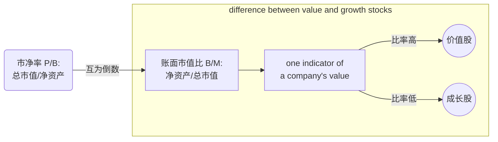

# 资产定价基础知识

#### Fama-French 三因子模型

$$
\bar{R}_{i,t}-r_f=\alpha_i+\beta_i(\bar{R}_{M,t}-r_f)+s_i R_t^{SMB}+h_i R_t^{HML}+e_{i,t}
$$

#### Fama-French 五因子模型

$$
\bar{R}_{i,t}-r_f=\alpha_i+\beta_i(\bar{R}_{M,t}-r_f)+s_i R_t^{SMB}+h_i R_t^{HML} + r_i R_t^{RMW}+c_i R_t^{CMA} +e_{i,t}
$$

<table>
  <th id="th1c" colspan="2">因子介绍</th>
  <tr>
    <td id="td1l">$SMB$: 市值因子</td>
    <td id="td1l">买多小股票、卖空大股票的零成本资产组合</td>
  </tr>
  <tr>
    <td id="td1l">$HML$: 账面市值比因子 $\qquad$</td>
    <td id="td1l">买多高BM ratio的股票，卖空低BM ratio的股票的零成本资产组合</td>
  </tr>
  <tr>
    <td id="td1l">$RMW$: 利润因子</td>
    <td id="td1l">买多高利润公司股票、卖空低利润公司股票的零成本资产组合</td>
  </tr>
  <tr>
    <td id="td3l">$CMA$: 投资因子</td>
    <td id="td3l">买多低资产增长率公司股票、卖空高资产增长率公司股票的零成本资产组合</td>
  </tr>
</table>

> $CMA_t$ is the difference between the returns on diversified portfolios of the stocks of low and high investment firms, which we call conservative and aggressive.

#### 因子择时

Factor timing（因子择时）是指根据市场中不同因子的表现，调整投资组合中各因子的权重或配置，以利用因子的相对强弱来获取额外的收益。
在投资中，因子是指能够解释资产收益率变化的共同特征或风险因素，例如市场风险、规模、价值、动量等。因子择时的目标是根据对不同因子表现的预测或评估，调整因子在投资组合中的权重，以寻求超额收益或降低风险。
例如，如果投资者预计市场将进入一个较为稳定的阶段，他们可能会增加规模因子的权重，因为较小的公司在稳定市场环境下表现较好。相反，如果预计市场将面临较大的不确定性和波动性，他们可能会增加市场风险因子的权重，以抵御可能的市场风险。
因子择时的关键在于对市场和因子的预测和评估。投资者可以使用各种技术和基本分析工具来分析因子的表现，并基于这些分析结果做出相应的调整。然而，需要注意的是，因子择时需要有可靠的数据和有效的模型来支持决策，并且在实践中并不总是能够产生一致的正收益。
因此，因子择时需要谨慎，并且需要基于充分的研究和测试。投资者应当充分了解因子的特性、市场环境和自身投资目标，以做出明智的因子配置和择时决策。

####