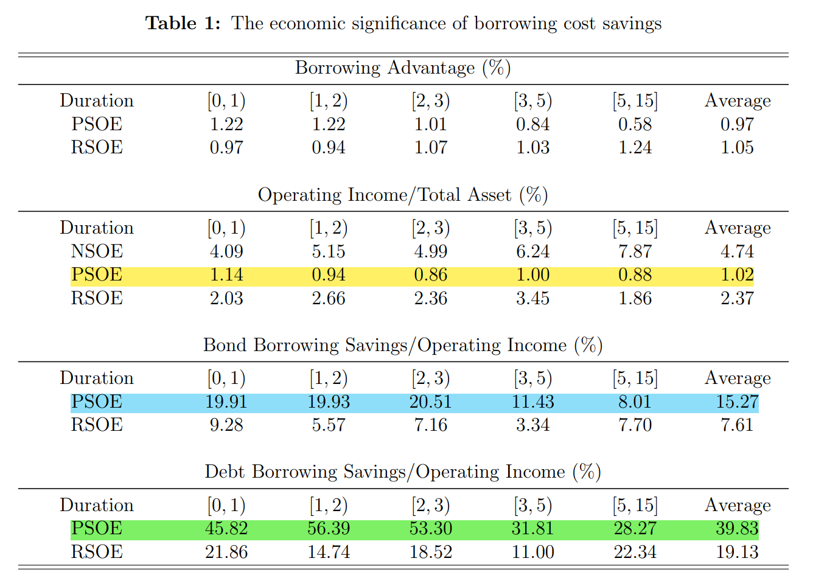
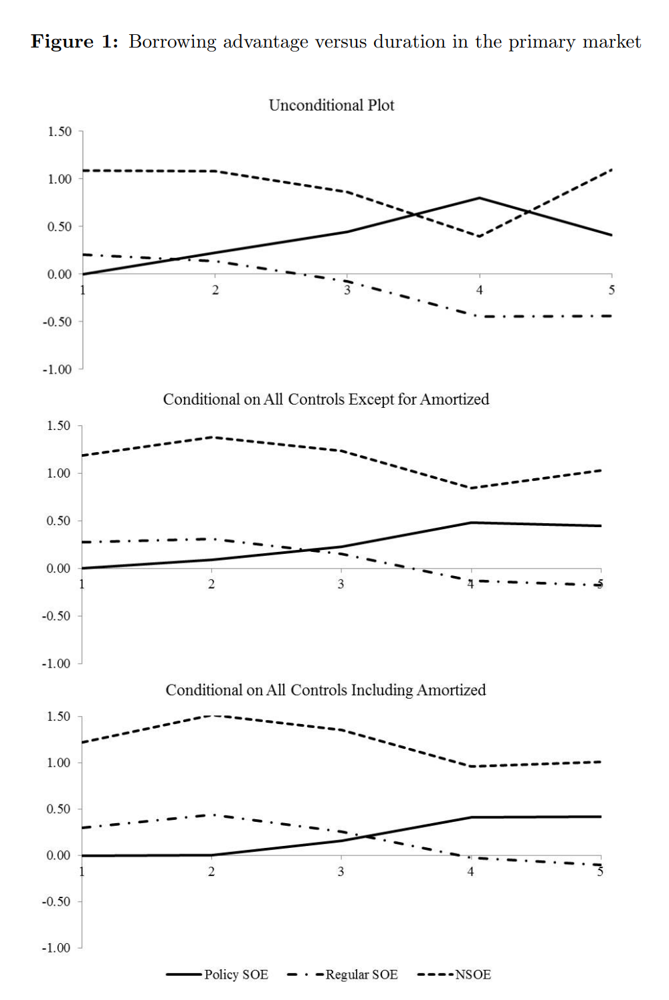
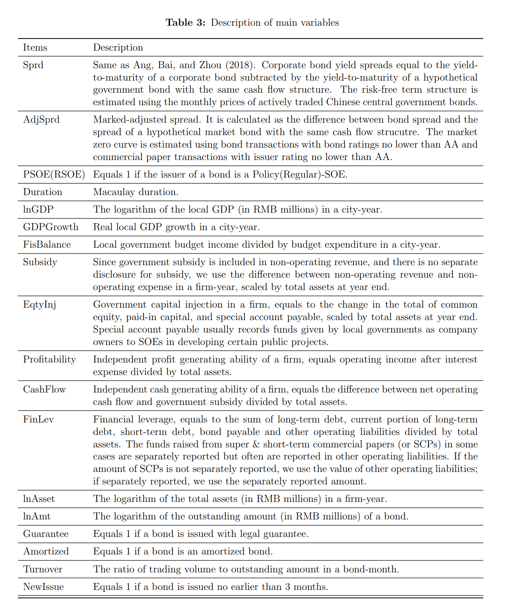
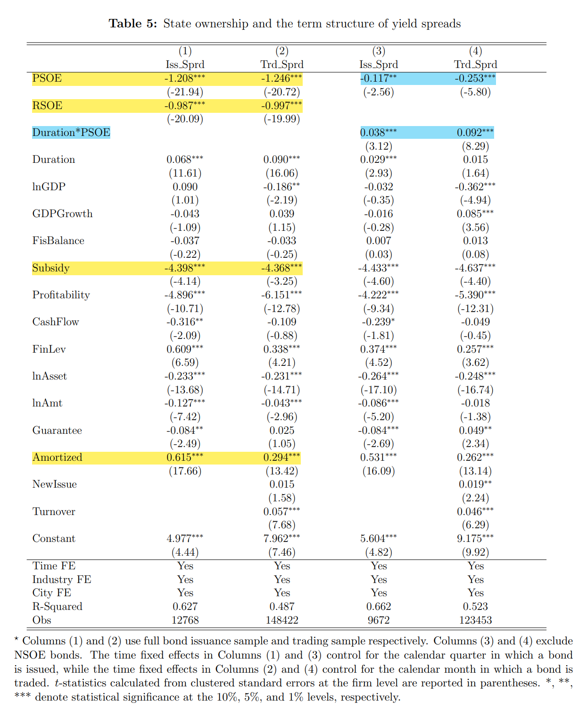
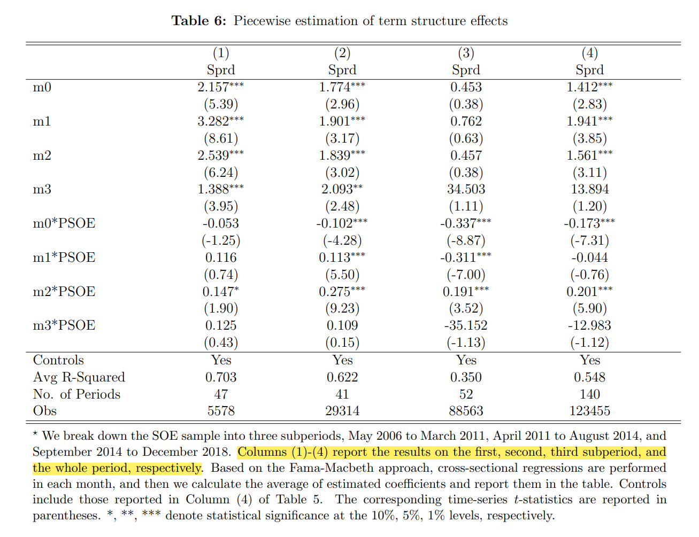
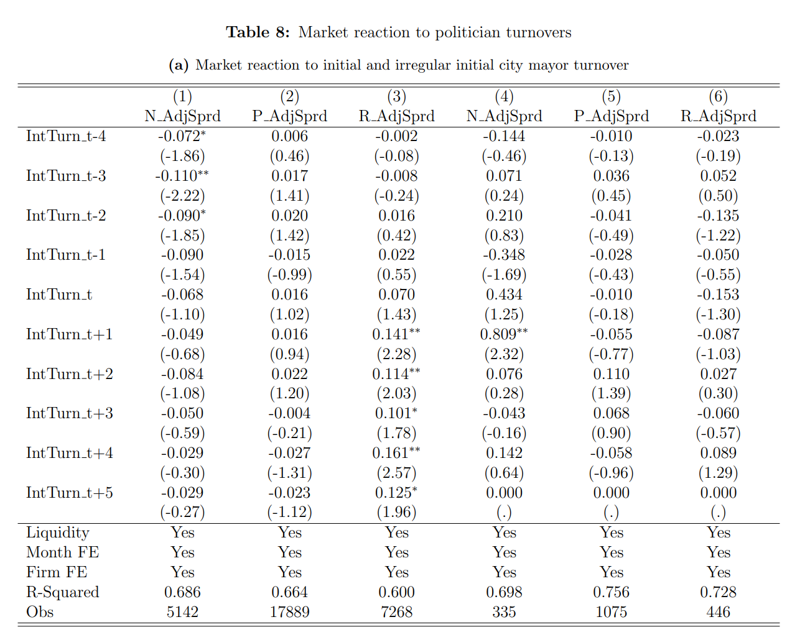
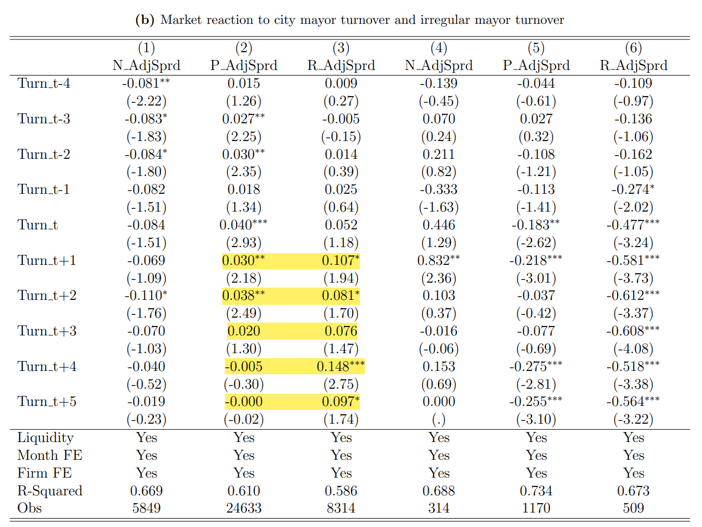
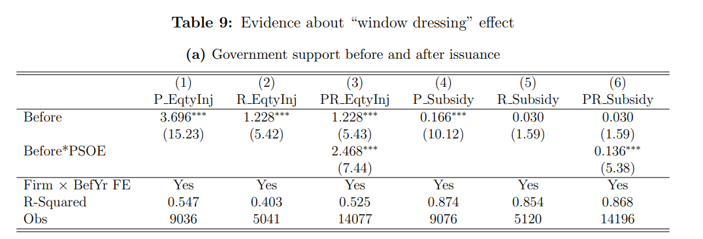
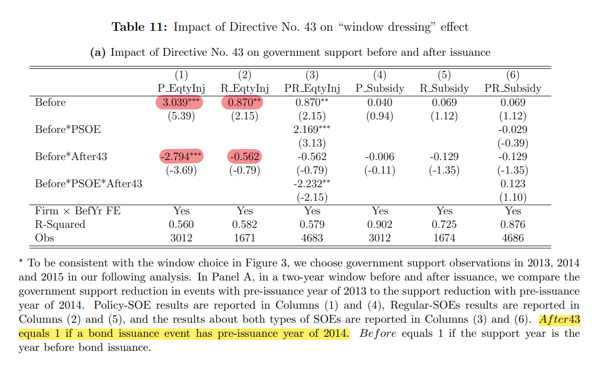
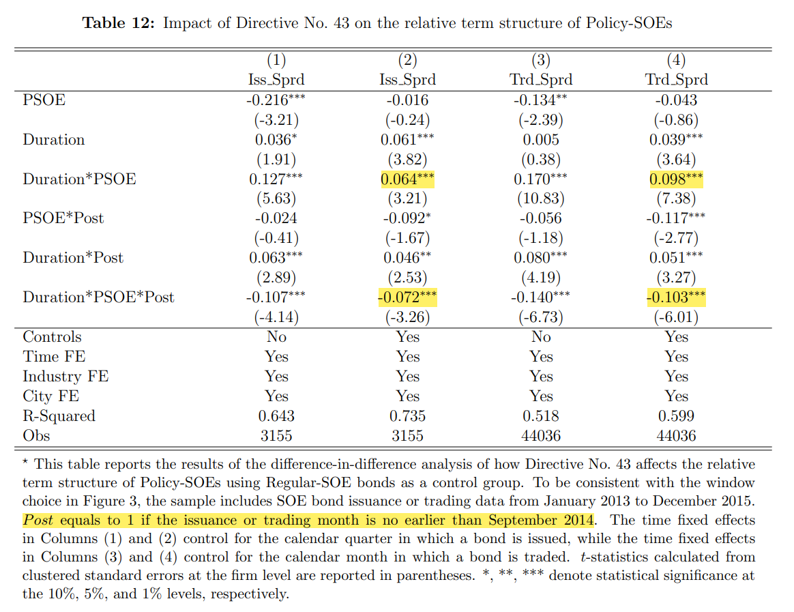

# State Ownership and the Term Structure of Yield Spreads: Evidence from China

Authors:

* Yuanzhen Lyu
* Fan Yu

## Abstract

We investigate $\text{\color{red}{how state ownership affects a firm’s term structure of yield spreads}}$  by examining SOEs in the Chinese bond market. Both $\text{\color{red}{Regular-SOEs}}$  and $\text{\color{red}{Policy-SOEs}}$ have substantially lower spreads than non-SOEs, and <mark>Policy-SOEs have even lower spreads than Regular-SOEs at shorter maturities, but their advantage disappears at longer maturities.</mark>The shrinking borrowing advantage cannot be explained by firm credit profiles, market liquidity, or decreasing government support due to local politician turnovers, while political uncertainty remains a possibility. Moreover, there is strong cross-sectional and causal evidence for a window dressing channel, where the government support for Policy-SOEs declines following bond issuance.

>[!TIP|label:提示]
>收益率差(Yield Spread)
收益率差是指一种债券的收益率与其期限相一致的无违约风险证券(通常指相同期限的同债)的收益率之差。这种收益率差主要取决于市场对该债券的信用风险的敏感性。

本文主要介绍了国有制如何影响公司收益率利差的期限结构。本文的一大创新点在于将国有企业进一步细分为政策性国有企业和普通国有企业。通过实证发现：<mark>政策性国有企业的短期利差 < 普通国有企业 < 非国有企业</mark>。但是长期来看政策国有企业利差增大。文章列出的可能原因有两个：公职人员的变动以及发债后政府支持的减少，从实证结果来看，前者可能无法解释这一现象，后者能够提供合理的解释。

## 1. Introduction

已有的文献主要探讨了政府机构和企业的联系会给企业带来的影响，包括融资的便利、低成本债务、更高的政府救助可能性等。也有文献研究了政治不确定性对于企业资产价格的影响，但政府关系对于企业债券收益率利差的影响尚未被学者研究，因此作者从不同的企业分类出发，对这一影响关系进行了深入探讨。

作者以中国债券市场为研究对象，因为国有经济在中国经济中占据主导地位，国有企业数量庞大。此外，中国的国有企业可以分类为政府融资目的的政策性国有企业和常规业务的普通国有企业，这种分类有利于更深入研究国有制对企业资产价格的影响。

政策性国有企业和普通国有企业的区别：

* 政策性国有企业是为了一定的融资目的而创立的，例如为基建项目融资；普通国有企业通常有正常的业务，可能还会与非国有企业竞争

* 由于主要以特定目的而设立，政策性国有企业的经营净现值很小，收益率很低

* 政府对政策性国有企业的支持主要有：提供补贴，注资或给予特殊经营许可

研究发现：

* 与同一城市的非国有企业相比，在控制了信贷和流动性状况以及政策性国有企业发行摊余债券的趋势之后，政策性国有企业和普通国有企业的短期借贷成本分别降低了约125和100个基点

* 如果政策性国有企业借款期限少于三年，则节省的借债成本将达到其营业收入的50%左右

* 然而，在较长期限的情况下，政策性国有企业的借贷成本实际上比普通国有企业高20个基点左右

* 二级市场 (trade market) 的债券期限结构与一级市场 (issue market) 的情况非常相似

由于与政府的关系更为紧密，因此政策性国有企业对政治不确定性的反应更为敏感。作者将不确定性的来源分为两类：政策的变动以及政府公职人员的变动。

* 政策的变动：由于政策性国有企业对政治不确定性的反应更为敏感，在长期他们的债券收益率利差会高于普通国有企业

* 政府公职人员的变动：当地的上一届政府可能出于个人晋升的目的而在城市基础设施上过度借贷和投资，但新一届政府不愿偿还前人的债务。因此，政府人员的更迭可能会导致政策性国有企业得到的支持减少，导致其长期借贷成本上升(实证表明这一猜想不成立)

### 事件研究

1. 云南高速公路违约

2011年4月，云南公路开发投资有限公司，拖欠其银行贷款的本金。虽然这一违约后来被云南省政府解决，但却引发了投资者的恐慌。

2. 第43号指令

2014年9月，国务院第43号指令加强了投资者对未来政府支持的预期。该指令要求地方政府将为公共项目筹集的债务纳入预算，并鼓励用省级政府发行的低收益长期市政债券取代高收益政策性国企债务。市场普遍将这一指令解读为未来政府更多支持的信号。

在执行第43号指令后，在更广泛的期限范围内，政策性国企债券相对于普通国企债券的收益率利差优势既更大，也更持久。在此期间对政府补贴和股权注入的进一步研究表明，无论是从绝对水平还是相对于常规国有企业作为基准，在债券发行后，政府对政策性国有企业的支持下降幅度都要小得多。因此，第43号指令的执行对政策性国有企业的现金流产生了可衡量的影响，这对其债券定价产生了积极影响

## 2. Borrowing Cost Savings of Chinese SOEs

背景：1994年Budget Law禁止地方政府在没有中央允许的情况下借债，所以地方政府纷纷创立政策性国有企业作为融资工具，以绕过债务监管。

由于需要承担许多低净现值的项目，政策性国有企业的盈利能力被严重降低。

鉴于政策性国有企业的大量债务融资和相对较弱的盈利能力，如果政策性国有企业仅筹集短期债务，则节省的借款成本将占其营业收入的50% 左右。

考虑到对债券利差期限结构的研究，文章控制了许多变量。本文使用固定现金流的债券，包括子弹债券(bullet bonds)和摊销债券(amortized bonds)

>[!NOTE|label:提示]
>根据债券本金的偿还方式进行分类：
>* 子弹债券：期间只定期支付利息，到期一次性偿还本金，也即我们通常理解的债券
>* 摊销债券：债券的本金被分摊到各期偿还。摊销债券又可以分为两种：$\\$
>  $\quad \rhd$ 完全摊销债券：将所有的本金分摊到各期 $\\$
>  $\quad \rhd$ 部分摊销债券：将本金的一部分分摊到各期，剩余的本金在到期日一次性偿还

本金的摊销缓解了投资者对这些政策性国有企业长期信用风险的担忧

下图表明了控制发行人和债券特征 (期限、未偿还金额、周转率以及债券是新发行、担保还是摊销) 的重要性：

## 3. Hypotheses

这一部分主要是针对前文描述的现象提出相关假说，并在实证部分验证它们

$\bullet$ Hypothesis 1：

政策性国有企业债券的利差对云南公路违约事件和第43号指令的执行反应比NSOE和普通国有企业债券的利差更敏感，并且这些反应在之后持续存在

$\bullet$ Hypothesis 2：

政策性国有企业债券的利差比NSOE债券和普通国有企业债券对人员变动的反应更强烈，平均而言，利差对这些人员变动的反应是积极的且持续的

$\bullet$ Hypothesis 3：

债券发行后，政府对政策性国企的支持力度下降，信用状况恶化，而对普通国企而言，这一趋势较弱

$\bullet$ Hypothesis 4：

2014年第43号指令执行后，“window dressing” 效应减弱，政策性国有企业相对于常规国有企业的借贷优势在较长期限内持续存在

## 4. Data and Variables

研究样本：2006年5月-2018年12月

文章控制了一系列变量

* bond characteristics (duration, amount outstanding, turnover, and whether the bond is newly issued, guaranteed, or amortized)
* firm financials (independent cash and profit generating abilities, financial leverage, total assets, and subsidies and equity injections from the government)
* city-level economic conditions (GDP, GDP growth, and local government fiscal balance)

文章没有控制信用评级，因为信用评级可能包含有关未来预期政府支持的信息

数据选取：

1. <strong>文章将政策性国有企业分类为在2006年5月至2018年12月的样本期内至少发行过一次城投债券的国有企业</strong>

2. 此外，作者将一个县级市与它所属的地级市相匹配，不包括中央政府或省级政府拥有的国有企业发行的债券，这意味着我们正在比较国有企业、政策性国有企业和普通国有企业在城市一级的期限结构差异

3. 排除浮动利率或嵌入期权的债券

最后大约有12000只债券作为发行债券的研究对象，其中47%由政策性国有企业发行，29%由普通国有企业发行，剩下的24%由非国有企业发行

## 5. Results

### 5.1 Yield Spread Differences among PSOE, RSOE, and NSOE Bonds

由于中国的大部分债券都是到期日较短，且政策性国有企业相对于普通国有企业的利差优势不会持续超过五年，因此本文根据四个债券的久期节点将债券进行分段，分别是0，3年，5年和15年。

分段线性项结构可以表示为(m是以年衡量的债券久期):

$$
Spread = \alpha_0m_0 + \alpha_1m_1 +\alpha_2m_2 +\alpha_3m_3
$$

$$
m_0=
\left\{
   \begin{array}{ccc}
      1-\frac{1}{3}m&\textrm{if}&m\in[0,3]\\
      \\
      0&\textrm{if}&m\in(3,15]
   \end{array}
\right.
$$

$$
m_1=
\left\{
   \begin{array}{ccc}
      \frac{1}{3}m&\textrm{if}&m\in[0,3]\\
      \\
      \frac{5}{2}-\frac{1}{2}m&\textrm{if}&m\in(3,5]\\
      \\
      0&\textrm{if}&m\in(5,15]
   \end{array}
\right.
$$

$$
m_2=
\left\{
   \begin{array}{ccc}
      0&\textrm{if}&m\in[0,3]\\
      \\
      \frac{1}{2}m-\frac{3}{2}&\textrm{if}&m\in(3,5]\\
      \\
      \frac{3}{2}-\frac{1}{10}m&\textrm{if}&m\in(5,15]
   \end{array}
\right.
$$

$$
m_3=
\left\{
   \begin{array}{ccc}
      0&\textrm{if}\quad m\in[0,5]\\
      \\
      \frac{1}{10}m-\frac{1}{2}&\textrm{if}\quad m\in(5,15]
   \end{array}
\right.
$$

为了估计政策性国企债券和普通国企债券在存续期的利差差异，设立一个虚拟指标代替政策性国有企业，将其与 $m_i$ 联系起来：

$$
Spread = \alpha_0m_0 + \alpha_1m_1 +\alpha_2m_2 +\alpha_3m_3 + (\alpha_4m_0 + \alpha_5m_1 +\alpha_6m_2 +\alpha_7m_3)*POSE + controls
$$

接下来，文章通过前述的两个事件，将研究时间段分为三段：2006年5月-2011年3月，2011年4月-2014年8月，2014年9月-2018年12月。在三个时间段分为运用上面的模型进行回归分析。

### 5.2 Policy Uncertainty

为了控制对债券价格有潜在影响的宏观经济因素，类似于股票价格反应中的异常回报，文章通过从债券价差中减去 “市场价差” 来计算调整后的价差。

### 5.3 Local Politician Turnovers

这一部分是为了验证假说二

文章将政府人员的调动分为两个维度：是否为主持发债的官员离职 (初次发行)，离开是否出于非正常原因

文章考虑债券的主持发行人、市长和市委书记的调动

Although Panel B shows that the adjusted spreads of Policy-SOE bonds increased around all mayor turnovers (Column (2)), the reaction is not persistent and is weaker than that of Regular-SOE bonds (Column (3))

由于大多数非正常离职是由于腐败造成的，因此将这些官员免职可能会改善国有企业的公司治理，对投资者来说可能是个好消息

### 5.4 “Window Dressing” Channel

验证假说三：

文章选择补贴和股权注入作为政府支持的代理

Before是一个二元变量，政府支持对应的年份如果是在债券发行之前，则Before为1，否则为0。将政府支持对Before进行回归，可以对比债券发行前后政府支持的变化。可以看出，对于政策性国有企业来说，股权注入的Before系数为3.7%，补贴的Before系数为0.17%。

验证假说四：

## 6. Comments

1. Chengtou bonds are not equal to Policy-SOEs
   - 一些政策性国有企业可能不发债，或不以城投债的形式融资
   - 一些城投债以非公开定向的方式发行
   - 普通国有企业也可以发城投债

2. Missing variables about government’s support
   - 实证部分考虑的政府支持的指标是股权注资和补贴，但还有很多形式，例如特许经营许可，准入门槛，技术人员的支持，这些都是政府支持的具体体现

3. Deficiencies in analyzing local politician turnovers
   - 应该准确定位负责掌管政策性国有企业的负责人或部门，而不一定是债券发行的主持人，市长或市委书记

4. No effective policy suggestions
   - 文章没有根据研究结论提出有效的政策建议，这些建议可以帮助投资者更好地投资决策，也可以帮助政府更好地实施相关政策