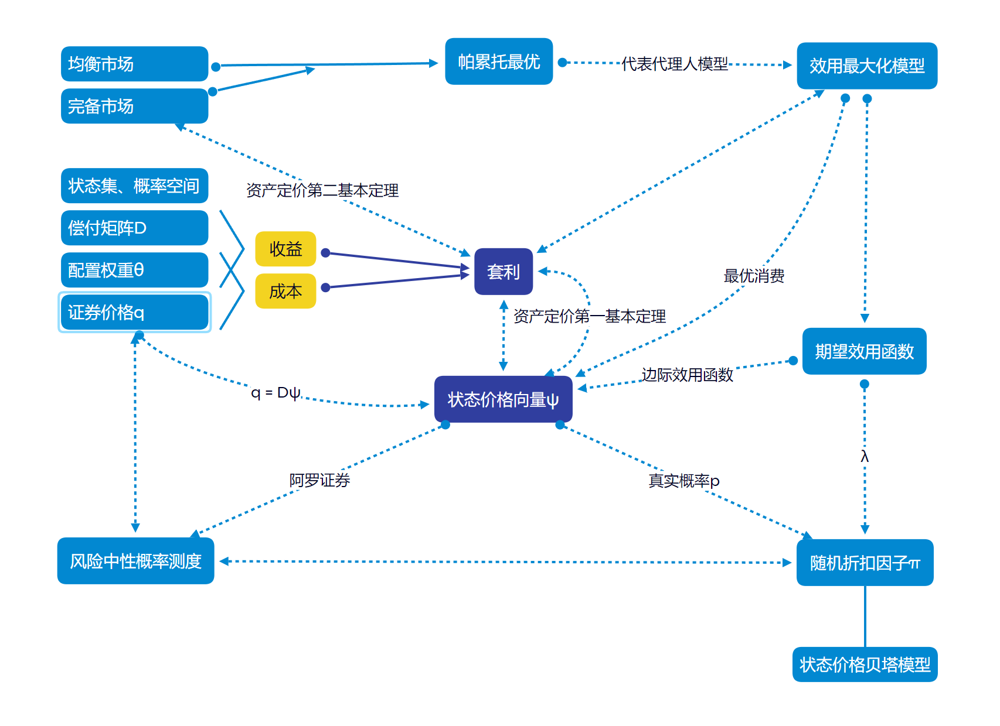
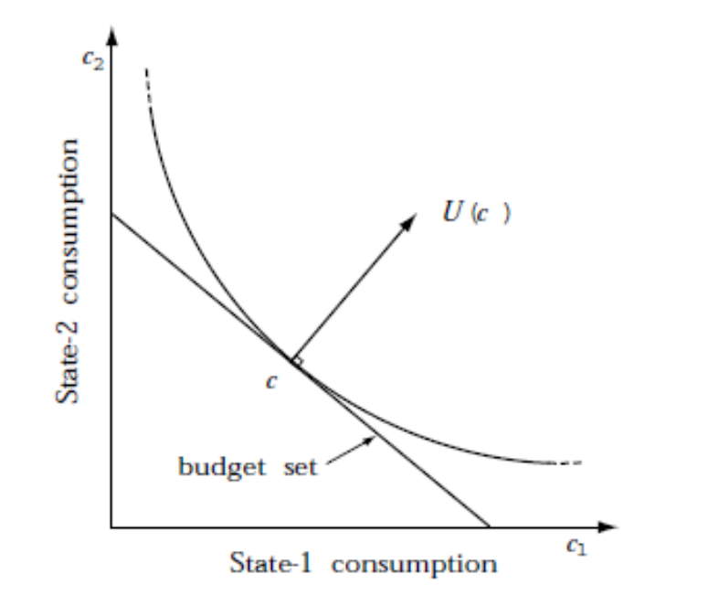
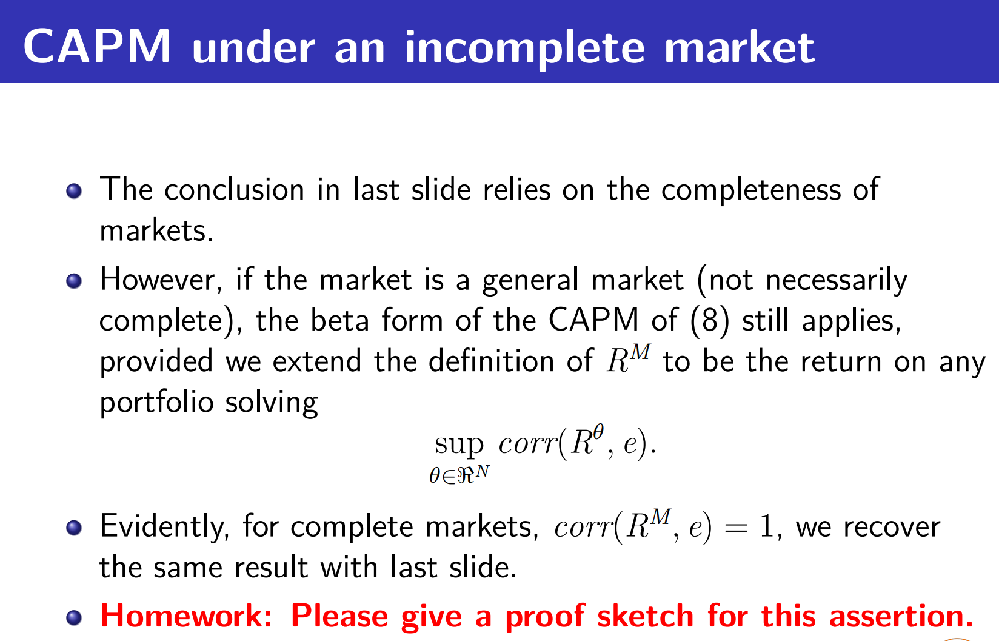

第一部分是summary；第二部分是证明题；第三部分是期权价格题

# Summary

根据所学知识，总结如下思维导图：

## 1. 基本定义

1. **状态集**：$\varOmega = \{1,2,\dotsb,S \}$，未来只有一种状态会发生。不确定性的来源：在当前时刻我们无法预知未来将会发生哪一种状态。

2. **概率空间**：$(\Omega,\ \mathcal{F},\ \mathbb{P})$

3. **偿付矩阵D**：

$$
\begin{bmatrix}
{D_{11}}&{D_{12}}&{\cdots}&{D_{1S}}\\
{D_{21}}&{D_{22}}&{\cdots}&{D_{2S}}\\
{\vdots}&{\vdots}&{\ddots}&{\vdots}\\
{D_{N1}}&{D_{N2}}&{\cdots}&{D_{NS}}\\
\end{bmatrix}_{N\times S}
$$

$\qquad D_{ij}$ 代表第 i 个资产在第 j 种状态下的资产偿付

4. **证券价格q**：

$\qquad$每一个证券在初始时刻 (t = 0) 都有一个价格，所有 N 个证券的价格表示成 N 维向量 $ q ，q =(q_1,q_2,\dotsb,q_N)^T \in R^N$

5. **配置权重 $\theta$**:

$\qquad \theta$ 代表投资组合的配置权重，$\theta \in R^N$

&nbsp;
**完整的证券市场模型：$ \{(\Omega,\ \mathcal{F},\ \mathbb{P}),(D,q)\} $**

## 2. 套利与状态价格

### 2.1 套利

套利的定义：存在一个投资组合$\theta$，使得投资的成本小于等于0，但收益为正；或投资成本为负，但收益非负。用公式表示为：

$q*\theta \leq 0$ and $D^T \theta >0$

$q*\theta < 0$ and $D^T \theta \geq0$

定义一个新的向量：

$\overrightarrow{M} =
\begin{bmatrix}
{-q*\theta}\\
{D^T \theta}\\
\end{bmatrix}_{(S+1)\times 1}
$

如果存在套利，则$M \in R^{S+1}_+$，即M的每一个元素都非负，且至少存在一个元素严格为正。此时 $\theta$ 称为一个套利组合

套利的直接含义便是在没有付出成本的情况下却获得了正收益

### 2.2 状态价格向量

紧接着我们将套利和状态价格联系起来，状态价格指的是：对应未来某种状态 j，如果在这种状态下获取1单位的收益，那么在当前要付出的成本。状态价格可以理解为一种没有单位的度量，例如未来在某种状态可以获得1元的偿付，$\psi_j = 0.9$表示在当前状态下为了获得这1元的偿付需要付出0.9元

因此：$\vec{q} = D\psi$

状态价格向量的每个元素都严格为正，因此$\psi \in R^S_{++}$

>[!TIP|label:提示]
>阿罗证券(Arrow security)：$\\$ 收益为单位向量 $(1, 0,\dotsb, 0)、(0, 1,\dotsb, 0)、\dotsb(0, 0,\dotsb,1)$ 的金融资产，即只在某一状态有1单位的收益，其他状态收益为0 $\\$ 因此阿罗证券的价格便是状态价格

因此确定状态价格十分重要！

### 2.3 无套利和状态价格向量的联系

资产定价第一基本定理：

!> 无套利 $\Longleftrightarrow$ 存在一个状态价格向量，使得 $\vec{q} = D\psi \qquad$(此时不要求状态价格唯一)

## 3. 风险中性概率测度

假设：

* 状态价格向量存在

* 存在一种资产，其未来每一种状态下都可以获得1单位的收益

则这种资产便是无风险的资产，在当前时刻，这种资产的价格应该是：$\psi_1 + \psi_2 + \dotsb + \psi_s$，记为 $\psi_0$

那么无风险资产的收益率(gross return)为:

$\frac{1}{\psi_0}= 1+R_f$

根据 $\vec{q} = D\psi$，可得：$q_i = \sum\limits_{j=1}^{S} \psi_jD_{ij} $

对上式变形：$q_i = \psi_0 \sum\limits_{j=1}^{S} \frac{\psi_j}{\psi_0} D_{ij} $

如果把 $\frac{\psi_j}{\psi_0}$ 理解为一种概率测度，上式可变为：$q_i = \psi_0\hat{E}(D_i) = \frac{1}{1+R_f}\hat{E}(D_i)$

可见未来的资产偿付是用无风险收益率进行折现，这符合风险中性世界的定义，即风险中性世界中，投资者只要求无风险收益率。因此 $\hat{\psi_j} = \frac{\psi_j}{\psi_0}$ 也称为风险中性概率测度

在市场存在无风险资产或者无风险投资组合的条件下，任何资产的价格等于在风险中性概率测度下资产收益贴现值的数学期望

当我们定价资产时，需要考虑时间折扣和风险折扣。每一种状态下1单位的收益对应的时间折扣都是不同的，所以状态价格向量的元素不全相同。而风险中性的意义在于利用 $\psi_0$ 来统一折现所有状态的收益，只需考虑风险的折扣。

## 4. 均衡、完备市场、帕累托最优

### 4.1 均衡市场

均衡是指市场价格是通过多方竞争形成的，在这种情况下，商品或服务的供给数量和需求数量是相同的。

证券市场的均衡：

存在m个个体，他们的效用函数分别是：$U_1, U_2, \dotsb,U_m$，初始禀赋分别是：$e^1,e^2,\dotsb,e^m$，若一个证券市场中，每个投资者都有自己的资产配置策略 $\theta^i$， $\theta^i = sup_\theta \ U_i(e^i + D^T\theta)$，并且 $\sum\limits_{i=1}^{m} \theta^i =0 $ (保证了供给需求平衡)，那么这个证券市场便是均衡的证券市场

### 4.2 完备市场

**定义：** 我们称一个资产市场x是完备的，意味着任何一个1期的消费计划都可以通过某个资产组合来实现。

从经济学意义来说，所谓完备市场，就是消费者可以通过买卖市场上的资产，在任何两个状态之间调配资源。从数学上来看，完备市场就是可以从市场上找到与状态数同样多的资产，这些资产构成了一个满秩（可逆）的矩阵（线性方程组有解判定）。

**Arrow-Debreu市场是最简单的完备市场**，其资产数目与状态数目相同，且每种资产都分别仅在一种状态中有1的支付，而在其他状态中无支付。其市场中的资产叫Arrow证券，Arrow证券的价格叫状态价格。任何资产都可以表示成Arrow证券的组合（无风险资产就是所有Arrow证券之和），资产定价的核心变成了求解状态价格。

!> $rank(D) = S \Longleftrightarrow$ 市场是完备的

**资产定价第二基本定理：**

!> 无套利市场中，状态价格唯一 $\Longleftrightarrow$ 市场是完备的

证明

1. 证明当状态价格唯一时，市场是完备的

证明其逆否命题：市场不完备时，状态价格不唯一

市场不完备时，$rank(D)<S, \exist \ \vec{\alpha}  \not ={0}\quad s.t. \quad D\alpha=0$

设 $\psi$ 是状态价格向量，于是 $\exist \ \epsilon >0 \quad  s.t. \quad \psi+\epsilon \alpha >0$

$D(\psi+\epsilon \alpha)=D\psi+\epsilon D\alpha = q+0=q$

说明 $\psi+\epsilon \alpha$ 也是状态价格向量，矛盾。命题得证，状态价格唯一时，市场是完备的

2. 证明当市场完备时，状态价格唯一

市场完备时，$rank(D)=S$，于是矩阵 $D^TD$ 是可逆的

$\because q=D\psi$

$\therefore \psi = (D^TD)^{-1}D^Tq$

可见状态价格向量有唯一的表达式，命题得证

### 4.3 帕累托最优

市场上所有个体的消费分布：$(c^1,c^2,\dotsb,c^m)$

不存在另一个消费分布：$(\hat{c^1},\hat{c^2},\dotsb,\hat{c^m})$，使得 $\forall i, U_i(\hat{c^i}) \geq U_i(c^i)$ 且 $\exist i, U_i(\hat{c^i}) > U_i(c^i)$

### 4.4 三者之间的联系

均衡不代表帕累托最优

> **Example:** if the market has no tradable asset, then every initial allocation corresponds to an equilibrium but it is generally not Pareto optimal.

但如果市场完备，则均衡一定是帕累托最优

> Suppose markets are complete and $\left(\theta^{1},\cdots,\theta^{m},q\right)$ is an equilibrium. Then the associated allocation is Pareto optimal.

## 5. 效用最大化模型

### 5.1 效用最大化

假设：

* 收益价格信息(D,q)已知；

* 个体(agent)的效用函数是严格递增的，并且边际效用递减；

* 个体(agent)的初始禀赋(endowment)为e

那么个体的预算可行集为：

$$
X(q,e) = {e + D^T\theta \in R^S_+ : \theta \in R^N, q*\theta \leq 0}
$$

最优化问题：

$$
sup \quad U(e + D^T\theta) \tag{1}
$$

>[!NOTE|label:提示]
>参与者的投资目标不是终止时刻的总收益或总收益的数学期望最大化，而是终止时刻消费效用的最大化

投资者通过交易来最大化自己的效用，通过找到最优交易策略 $\theta^*$ 来找到最优消费策略 $c^*$，以达到最大化效用的目的

金融市场的存在，使得投资者可以购买不同的资产，来改变自己的消费配置，从而找到最优消费策略。而 $q*\theta \leq 0$ 可以保证投资者在不同资产配置时无需付出额外成本。如果 $q*\theta < 0$，说明投资者在资产配置过程中有财富浪费，这部分浪费可以帮投资者更好地提升他的消费效用。因此一般 $q*\theta = 0$

(1)式有解 $\xleftrightharpoons{U连续}$ 无套利 $\Longleftrightarrow$ 存在一个状态价格向量

* 证明充分性：若存在无套利组合 $\tilde{\theta}$，则对任意组合 $\theta$，$\tilde{\theta}+\theta$ 的效用一定大于 $\theta$ 的效用，(1)式没有解 (逆否命题)
* 证明必要性：U连续，且 $\theta$ 有取值范围 ($q*\theta = 0$)，此时(1)式一定有解

### 5.2 最优消费和状态价格

intuition：未来时刻增加一单位的消费效用应当等于当前时刻对应的成本，即状态价格

通过证明，得到状态价格向量和效用梯度向量的关系：

$$
\psi = \lambda \nabla U(c^*) \qquad (\lambda > 0) \tag{2}
$$

考虑两个状态的情况，最大化效用的 $c^*$ 一定是效用函数与消费预算集的切点。

此时，

$
\begin{bmatrix}
\psi_1 \\
\\
\psi_2 \\
\end{bmatrix}=
\lambda\begin{bmatrix}
\frac{\partial{U(c^*)}}{\partial{c_1}} \\
\\
\frac{\partial{U(c^*)}}{\partial{c_2}} \\
\end{bmatrix}
$

### 5.3 Representative Agents Model

前面的效用函数仅仅是个人的，因此由个人的边际效用所求出的状态价格不能作为整个市场的状态价格。市场上有许多同质性的参与者，可以找到一个代理人，他是整个市场均衡的结果，因此代理人的效用函数能够代表整个市场；代理人的投资组合以及由此确定的消费水平必然是最优的

### 5.4 期望效用函数

$$
U(c) = E[u(c)] = \sum\limits_{j=1}^{S}p_ju(c_j) \tag{3}
$$

因此期望效用函数的梯度为：

$$
\nabla U(c) = \big(p_1u^{(1)}(c_1),p_2u^{(1)}(c_2),\dotsb,p_Su^{(1)}(c_S)\big)' \tag{4}
$$ 

根据(2)式，

$$
\psi = \lambda \nabla U(c^*) = \lambda \big(p_1u^{(1)}(c_1^*),p_2u^{(1)}(c_2^*),\dotsb,p_Su^{(1)}(c_S^*)\big)' \tag{5}
$$

## 6. 随机折扣因子

真实概率P, $p = (p_1,p_2,\dotsb,p_S)' \qquad p \in R^S_{++}$

定义随机折扣因子 $\pi = (\pi_1,\pi_2,\dotsb,\pi_S) $，其中 $\pi_s = \frac{\psi_s}{p_s}$

根据 $q = D\psi$，可得 $q = E(D\pi)$，可以证明向量 $\pi$ 和状态价格向量 $\psi$ 是一一对应的，因此随机折扣因子在资产定价中有着重要的作用

根据(5)式，

$$
\pi_s = \frac{\psi_s}{p_s} = \lambda u^{(1)}(c_S^*)
$$

### 状态价格贝塔模型

我们定义收益率 (gross return):

$$
R_s^{\theta} = \frac{(D^T\theta)_s}{q*\theta},\qquad s=1,2,\dotsb,S \tag{6}
$$

由于 $q = E(D\pi)$，将等式(6)代入，可得：

$$
E(\pi R^{\theta})=1 \tag{7}
$$

这里 $\pi$ 和 $R^{\theta}$ 都是随机变量，如果 $R^{\theta}$ 是无风险资产的收益率，则 $R^{\theta}$ 为常数，记为 $R^0$，此时：

$$
E(\pi R^0) = 1 = E(\pi)R^0 
$$

$$
E(\pi) = 1/R^0 \tag{8}
$$

对一般资产，应用协方差的定义：

$$
\begin{aligned}
cov( R^{\theta},\pi) &= E(\pi R^{\theta}) - E(R^{\theta}) E(\pi) \\
&= 1 - E(R^{\theta}) E(\pi)
\end{aligned} \tag{9}
$$

利用等式(8)的结论，对等式(9)两边同除以 $E(\pi)$，得到：

$$
E(R^{\theta}) - R^0 = -\frac{cov( R^{\theta},\pi)}{E(\pi)} \tag{10}
$$

定义 $\theta^* = sup_\theta \ corr(D^T\theta,\pi)$

可以证明：

$$
E(R^{\theta}) - R^0 = \beta_{\theta}(E(R^{{\theta}^*}) - R^0) \tag{11}
$$

其中 $\beta_{\theta} = \frac{cov(R^{\theta},R^{{\theta}^*})}{var(R^{{\theta}^*})}$

如果将 $R^{{\theta}^*}$ 看做市场组合的收益率，这一形式便与我们熟知的CAPM模型相同，其结论与CAPM相同：**资产的收益率取决于市场收益率以及它与市场收益率的相关性**。可见我们能够从随机折扣因子推导传统的资产定价的模型

$$
q = AE(D) − Bcov(D, e) \tag{12}
$$

采取配置策略，两边同时乘以 $\theta$：

$$
q^T\theta = AE(D^T\theta) − Bcov(D^T\theta, e) \tag{13}
$$

两边同时除以成本 $q^T\theta$：

$$
1 = AE(R^{\theta}) − Bcov(R^{\theta}, e) \tag{14}
$$

设 $\theta^0$ 代表无风险资产的配置，将 $\theta^0$ 代入(3)式:

$$
1 = AE(R^0) − Bcov(R^0, e) \tag{15}
$$

无风险资产与任意资产协方差为0，于是：

$$
A = 1/E(R^0) \tag{16}
$$

设 $\theta^M$ 代表市场组合的配置，将 $\theta^M$ 代入:

$$
1 = E(R^M)/R^0 − Bcov(R^M, e) \tag{17}
$$

结合(16)式，可得：

$$
B = \frac{E(R^M-R^0)}{R^0cov(R^M,e)} \tag{18}
$$

设 $\theta$ 代表任一投资组合，将 $A,B$ 代入(14)式：

$$
E(R^{\theta}-R^0) =  \frac{cov(R^{\theta}, e)}{cov(R^M,e)} \ E(R^M-R^0) \tag{19}
$$

$\because corr(R^M,e) = 1$

$\therefore \frac{cov(R^{\theta}, e)}{cov(R^M,e)}=\frac{cov(R^{\theta}, R^M)}{cov(R^M,R^M)} =\frac{cov(R^{\theta}, R^M)}{var(R^M)} = \beta_\theta$

等式(19)变为：

$$
E(R^{\theta}-R^0) =  \beta_\theta E(R^M-R^0) \tag{20}
$$

# 第一题

proof:

对于优化问题 $sup_{\theta} \ \ corr(R^{\theta},e) $，我们可以考虑优化问题：$sup_{\theta} \ \ corr(D^T\theta,\pi) $，一定存在 $\theta^*$，使得 $D^T\theta^*$ 是向量 $\pi$ 在空间 span(D) 的投影，因此 $\theta^*$ 是优化问题的解 $\big(\overrightarrow{\pi} = \overrightarrow{D^T\theta^*} + \overrightarrow{p}, \overrightarrow{p} \perp span(D)\big)$

对于 $\forall \theta \in R^N$:

$$
cov(\pi - D^T\theta^*,D^T\theta) = 0 \tag{21}
$$

根据成本收益公式：

$$
D^T\theta^* = (q^T\theta^*)R^{\theta^*} \tag{22}
$$

考虑任一资产收益率与随机折扣因子协方差：

$$
\begin{aligned}
cov( R^{\theta},\pi) &= cov(\frac{D^T\theta}{q^T\theta},\pi) \\
\\
&= \frac{1}{q^T\theta} cov(D^T\theta,\pi) \\
\\
&= \frac{1}{q^T\theta} cov(D^T\theta,\pi - D^T\theta^* + (q^T\theta^*)R^{\theta^*})\\
\\
&= \frac{1}{q^T\theta} cov(D^T\theta, (q^T\theta^*)R^{\theta^*})\\
\\
&= q^T\theta^* cov(R^{\theta},R^{\theta^*})
\end{aligned} \tag{23}
$$

由等式(10)可知：

$$
\begin{aligned}
\frac{E(R^{\theta}-R^0)}{E(R^{\theta^*}-R^0)} &= \frac{cov(R^{\theta}, \pi)}{cov(R^{\theta^*}, \pi)} \\
\\
&= \frac{cov(R^{\theta}, R^{\theta^*})}{cov(R^{\theta^*}, R^{\theta^*})} \\
\\
&= \frac{cov(R^{\theta}, R^{\theta^*})}{var(R^{\theta^*})} \\
\\
&= \beta_{\theta}
\end{aligned} \tag{24}
$$

将上式变形，得：

$$
E(R^{\theta}-R^0) = \beta_{\theta}E(R^{\theta^*}-R^0) \tag{25}
$$

命题得证

# 第二题

**Please compute the option price in the previous one-period model by using the stochastic discount factor?**

随机折扣因子方法考虑对未来收益的贴现，假设期权未来有两种状态，对应的收益分别是 $X_1$ 和 $X_2$，则期权的价格应当等于它未来收益的贴现值：

$$
\begin{aligned}
V &= E(\pi X) \\
\\
&= p_1 \pi_1 X_1 + p_2 \pi_2 X_2 \\
\end{aligned} \tag{26}
$$

根据随机折扣因子定义：$\pi_s = \frac{\psi_s}{p_s}$，上式变为：

$$
V = \psi_1X_1 + \psi_2X_2 \tag{27}
$$

考虑两个资产的市场：

$$
q =
\begin{bmatrix}
{1}\\
{S_0}\\
\end{bmatrix}
\qquad
D =
\begin{bmatrix}
{1+r}&{1+r}\\
{S_0u}&{S_0d}\\
\end{bmatrix}
$$

由$\vec{q} = D\psi$，解得：

$$
\psi =
\begin{bmatrix}
\frac{u-1-r}{(u-d)(1+r)}\\
\\
\frac{1+r-d}{(u-d)(1+r)}\\
\end{bmatrix}
$$

若期权执行价格为K,则：

$$
X_1 = (S_0u- K)^+
$$

$$
X_2 = (S_0d- K)^+
$$

由(23)式，期权价格为：

$$
V = \frac{u-1-r}{(u-d)(1+r)}(S_0u- K)^+ \ + \ \frac{1+r-d}{(u-d)(1+r)}(S_0d- K)^+
$$