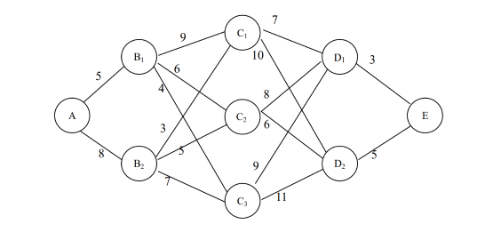

# 数理金融第四次作业

## Question 1 the shortest path problem

Please solve the following shortest path problem (the computation should be as detailed as possible):

$\mathbf{\huge{Answers:}}$

解决如下优化问题：

$$
V_k(x_k)=\min\limits_{u_k\in U_k(x_k)}\{g_k(x_k,u_k)+V_{k+1}[f_k(x_k,u_k)]\}\\
\qquad \qquad \qquad \qquad \qquad \text{for}\ k = N − 1, n − 2, \cdots , 1, 0
$$

从 E 开始，逆向递推得到最短路径

$\qquad V_4(E)=0, V_3(D_1)=3, V_3(D_2)=5$

**节点C到E的最短距离**

$
\qquad
\begin{aligned}
    g_2(C_1,D_1)+V_3(D_1)&=10\\
    g_2(C_1,D_2)+V_3(D_2)&=15
\end{aligned}
\implies
V_2(C_1)=10
$

$
\qquad
\begin{aligned}
    g_2(C_2,D_1)+V_3(D_1)&=11\\
    g_2(C_2,D_2)+V_3(D_2)&=11
\end{aligned}
\implies
V_2(C_2)=11
$

$
\qquad
\begin{aligned}
    g_2(C_3,D_1)+V_3(D_1)&=12\\
    g_2(C_3,D_2)+V_3(D_2)&=16
\end{aligned}
\implies
V_2(C_3)=12
$

**节点B到E的最短距离**

$
\qquad
\begin{aligned}
    g_1(B_1,C_1)+V_2(C_1)&=19\\
    g_1(B_1,C_2)+V_2(C_2)&=17\\
    g_1(B_1,C_3)+V_2(C_3)&=16
\end{aligned}
\implies
V_1(B_1)=16
$

$
\qquad
\begin{aligned}
    g_1(B_2,C_1)+V_2(C_1)&=13\\
    g_1(B_2,C_2)+V_2(C_2)&=16\\
    g_1(B_2,C_3)+V_2(C_3)&=19
\end{aligned}
\implies
V_1(B_2)=13
$

**节点A到E的最短距离**

$\qquad g_0(A,B_1)+V_1(B_1)=5+16=21$

$\qquad g_0(A,B_2)+V_1(B_2)=8+13=21$

综上所述，最短路径为:

$A \to B_1 \to C_3 \to D_1 \to E\;$ 或 $\; A \to B_2 \to C_1 \to D_1 \to E$

## Question 2 An optimal consumption problem

An investor is characterized by his initial wealth $W_0$, a time-discount rate $\beta$ and his preference $U(·)$. We assume $U(·)$ is given by a CARA (Constant Absolute Risk Aversion Coefficient) utility, i.e. exponential utility with

$$
U(c)=-\exp(-\gamma c)/\gamma,c\in\Re \tag{18}
$$

where $\gamma >0$ is the absolution risk aversion parameter. We assume the investor invests only in the risk-free asset to smooth his consumption. Thus his wealth process $W$ is subject to

$$
dW_t=(rW_t-C_t)dt,t\ge0,W_0>0 \tag{19}
$$

where r is the risk-free interest rate. The investor seeks to choose a consumption plan $C$ so as to maximize his lifetime time-additive utility of consumption. That is, he needs to solve the following optimization problem:

$$
\sup\limits_C J((C_t)_{t\geq0})\equiv\int_0^\infty\exp{(-\beta t)}U(C_t)dt \tag{20}
$$

Noting that the problem formulated by (20) and (19) is a deterministic control problem (Dynamic Programming).

Define value function at any time $t \geq 0$

$$
V(t,W_t)=\sup\limits_{C}J((C_s)_{s\geq t})\equiv\int_{t}^{\infty}\exp{(-\beta s)}U(C_s)ds
$$

Please verify the following explicit solution, and the optimal consumption rate selected at time s:

$$
V(t,W_t)=-\frac{1}{\gamma r}\exp(1-\beta/r-\beta t-\gamma rW_t) \tag{21}
$$

$$
C_s^*=\frac{\beta-r}{\gamma r}+rW_s \tag{22}
$$

$\mathbf{\huge{Answers:}}$

> [!TIP|label:HJB equation]
> $\\ V_t + \underset{u \in U}{\mathrm{sup}}\ [b(t,\ x,\ u)V_x + f(t,\ x,\ u)] = 0$

令 $1-\beta/r-\beta t-\gamma rW_t = \square$

根据(21)式，

$$
V_t=-\frac{1}{\gamma r}e^\square (-\beta)=\frac{\beta}{\gamma r}e^\square \tag{23}
$$

$$
V_x =V_W =  -\frac{1}{\gamma r}e^\square (-\gamma r)=e^\square \tag{24}
$$

根据(22)式，$c_t=\frac{\beta-r}{\gamma r}+rW_t$,

$$
b(t,\ x,\ u)=\frac{dW_t}{dt} = rW_t -c_t=-\frac{\beta - r}{\gamma r} \tag{25}
$$

$$
f=\exp{(-\beta t)}U(C_t)=\frac{-1}{\gamma}e^{1-\beta/r-\beta t-\gamma rW_t}=\frac{-1}{\gamma}e^{\square} \tag{26}
$$

将 (22)~(25) 代入 HJB 方程，可以验证 HJB 方程成立：

$$
\begin{array}{lll}
&V_t + b(t,\ x,\ u)V_x + f(t,\ x,\ u)\\
\\
=&\frac{\beta}{\gamma r}e^\square +(-\frac{\beta - r}{\gamma r})e^\square + (\frac{-1}{\gamma}e^{\square}) \\
\\
=& (\frac{\beta}{\gamma r}-\frac{\beta - r}{\gamma r}-\frac{1}{\gamma})e^\square\\
\\
=&0
\end{array}
$$

## Question 3

Following Question 2, we assume the investor also has access to a risky asset, the price process of which is governed by:

$$
dP_t=\mu P_tdt+\sigma P_tdZ_t
$$

where $Z$ is a standard Brownian motion. For the current time $t > 0$, we define the $\color{red}{\text{modified value function}}$

$$
\begin{array}{lll}
&&G(W_t) \\
\\
&=&\sup\limits_{(C,\theta)\in\mathcal{C}\times\Pi}J^0((C_s)_{s\geq t},(\theta_s)_{s\geq t})\\
\\
&\equiv&\mathbb{E}\left[\int_{\textcolor{red}{t}}^\infty e^{(-\beta(s-\textcolor{red}{t}))}U(C_s)ds|\mathcal{F}_t\right]
\end{array}
$$

where $W_t$ represents the current wealth level. Please verify that the modified value function is given by：

$$
G(W_t)=-\frac{1}{\gamma r}\exp \big(1-\beta/r-\gamma r(W_t+\frac{\eta^2}{2\gamma r^2})\big)
$$

where $\eta=(\mu-r)/\sigma$ denotes the Sharpe Ratio of the tradable risky assets. And $C_s^*$ and $\theta_s^*$ are the optimal consumption and portfolio rules selected at time $s$ respectively, which are given by:

$$
\begin{aligned}
C_s^*&=\; \frac{\beta-r}{\gamma r}+r(W_s+\frac{\eta^2}{2\gamma r^2}), \\
\theta_s^*&=\; \frac{\eta}{\sigma\gamma r}
\end{aligned}
$$

$\mathbf{\huge{Answers:}}$

> [!TIP|label:HJB equation]
> $\\ v_s+\underset{u \in U}{\mathrm{sup}}\ \{\frac{1}{2}\sigma^2(s,y,u)v_{yy}+b(s,y,u)v_y+f(s,y,u)\}=0$

取 $\hat{t} \to t$

$$
\begin{aligned}
G(W_t) &= \mathbb{E}\left[\int_t^\infty e^{(-\beta(s-t))}U(C_s)ds|\mathcal{F}_t\right]\\
&=\mathbb{E}\left[\int_{t}^{\hat{t}} e^{(-\beta(s-t))}U(C_s)ds + \int_{\hat{t}}^{\infty} e^{(-\beta(s-t))}U(C_s)ds \right]
\end{aligned}
$$

而 $ G(W_{\hat{t}}) = \int_{\hat{t}}^{\infty} e^{(-\beta(s-\textcolor{red}{\hat{t}}))}U(C_s)ds \not ={} \int_{\hat{t}}^{\infty} e^{(-\beta(s-\textcolor{red}{t}))}U(C_s)ds$，所以不能直接对 $G(W_t)$ 应用 $HJB$ equation

构造新函数，令 $H(t,W_t) = e^{-\beta t}\cdot G(W_t)$

$$
\begin{aligned}
 H(t,W_t) &= e^{-\beta t}\mathbb{E}\left[\int_{\textcolor{red}{t}}^\infty e^{(-\beta(s-\textcolor{red}{t}))}U(C_s)ds|\mathcal{F}_t\right]\\
 &=\mathbb{E}\left[\int_{\textcolor{red}{t}}^\infty e^{-\beta s}U(C_s)ds|\mathcal{F}_t\right]
\end{aligned}
$$

考虑如下动态优化问题：

$$
\begin{aligned}
H(t,W_t) &=\mathbb{E}\left[\int_{\textcolor{red}{t}}^\infty e^{-\beta s}U(C_s)ds|\mathcal{F}_t\right]\\
&=\mathbb{E}\left[\int_{\textcolor{red}{t}}^{\textcolor{red}{\hat{t}}} e^{-\beta s}U(C_s)ds + H(\hat{t},W_{\hat{t}}) \right]
\end{aligned}
$$

令 $1-\beta/r-\gamma r(W_t+\frac{\eta^2}{2\gamma r^2}) = \Delta$，于是，

$$
v_s = H_t(t,W_t)=-\beta e^{-\beta t}(-\frac{1}{\gamma r})e^{\Delta} = \frac{\beta}{\gamma r}e^{-\beta t}e^{\Delta} \tag{3-1}
$$

$f=\exp{(-\beta t)}U(C_t)=\frac{-1}{\gamma}e^{-\beta t}e^{-\gamma c_t}$，将 $C_s^*$ 代入，得：

$$
f= \frac{-1}{\gamma}e^{-\beta t}e^{\Delta}  \tag{3-2}
$$

$$
v_y = H_W(t,W_t) = \frac{-1}{\gamma r}e^{-\beta t}e^{\Delta}\cdot (-\gamma r) = e^{-\beta t}e^{\Delta}  \tag{3-3}
$$

$$
v_{yy} = H_{WW}(t,W_t) = e^{-\beta t}e^{\Delta}\cdot (-\gamma r) = -\gamma re^{-\beta t}e^{\Delta}  \tag{3-4}
$$

$\because \qquad dP_t=\mu P_tdt+\sigma P_tdZ_t$

$
\therefore
\qquad
\begin{aligned}
    dW(t) &= \theta(t)\frac{dP_t}{P_t} + (W(t)-\theta(t))\frac{dB_t}{B_t} - C(t)dt\\
    &= \theta(t)(\mu dt+\sigma dZ_t) + (W(t)-\theta(t))rdt- C(t)dt\\
    &= [rW(t)+(\mu-r)\theta(t)-C(t)]dt+\sigma \theta(t)dZ(t)
\end{aligned}
$

于是，

$$
\begin{aligned}
b(s,y,u) &= rW(t)+(\mu-r)\theta(t)-C(t)\\
 &= -\frac{\beta - r}{\gamma r} - \frac{\eta^2}{2\gamma r} + \frac{(\mu-r)\eta}{\sigma \gamma r}
\end{aligned} \tag{3-5}
$$

$$
\frac{1}{2}\sigma^2(s,y,u) = \frac{1}{2}\big(\sigma\theta(t)\big)^2= \frac{1}{2}\sigma^2 (\frac{\eta}{\sigma\gamma r})^2= \frac{\eta^2}{2\gamma^2 r^2} \tag{3-6}
$$

将 (3-1) ~ (3-6) 代入 HJB 方程，可以验证 HJB 方程成立：

$$
\begin{array}{lll}
&v_s+\frac{1}{2}\sigma^2(s,y,u)v_{yy}+b(s,y,u)v_y+f(s,y,u)\\
\\
=&\frac{\beta}{\gamma r}e^{-\beta t}e^{\Delta}+\frac{\eta^2}{2\gamma^2 r^2}(-\gamma re^{-\beta t}e^{\Delta})+(-\frac{\beta - r}{\gamma r} - \frac{\eta^2}{2\gamma r} + \frac{(\mu-r)\eta}{\sigma \gamma r})e^{-\beta t}e^{\Delta} + \frac{-1}{\gamma}e^{-\beta t}e^{\Delta}\\
\\
=&e^{-\beta t}e^{\Delta}\big(\frac{\beta}{\gamma r} - \frac{\eta^2}{2\gamma r} - \frac{\beta}{\gamma r} + \frac{1}{\gamma} - \frac{\eta^2}{2\gamma r} + \frac{(\mu-r)\eta}{\sigma \gamma r} - \frac{1}{\gamma} \big)\\
\\
=&e^{-\beta t}e^{\Delta}\big( - \frac{\eta^2}{2\gamma r} - \frac{\eta^2}{2\gamma r}   + \frac{\eta^2}{\gamma r}  \big)\\
\\
=&0
\end{array}
$$

## Question 4 A classic problem of dynamic programming

Suppose you desire to marry the richest person you meet. We make the assumptions that

* 1 If you ask anyone to marry you, they will immediately accept.
* 2 You are allowed to meet only $N$ persons.
* 3 The wealth of each person is randomly uniformly distributed in [0, 1].

What is the optimal strategy to maximize the expected wealth of your marriage partner? Specially, if $N = 10$, how much is the optimal expected wealth.

$\mathbf{\huge{Answers:}}$

### model 1

假设:

* 每个人的财富是 $X_t$，由题意可知 $X_1,X_2,\cdots,X_N \backsim i.i.d$

* 将所有人随机排序，若选择的第 $t$ 个人的财富满足 $x_t = max\{x_1,x_2,\cdots,x_t\}$，则 $I_t =1$，否则 $I_t =0$

由于 $X_t \backsim U[0,1]$，$x_t = max\{x_1,x_2,\cdots,x_t\}$ 的期望是：

$$
E_t=E(X_t|I_t=1)=\frac{t}{t+1}
$$

因为 $\text{d}E_t/\text{d}t>0$，所以寻找到满足 $I_t =1$ 的人，也能寻找到 $I_{t+k} =1$ 的人，因此我们要找到最小的 $t$，使得 $I_t =1$

假设从第 $c$ 个人开始做选择， $V_n(c)$ 代表第 $c$ 个人到第 $n-1$ 个人中选择的期望财富

$$
\begin{aligned}
V_{n}(c)& =\sum_{t=c}^{n-1}\left[\prod_{s=c}^{t-1}\left({\frac{s-1}{s}}\right)\right]\left({\frac{1}{t+1}}\right)+\left[\prod_{s=c}^{n-1}\left({\frac{s-1}{s}}\right)\right]{\frac{1}{2}}  \\
&=\sum_{t=c}^{n-1}\left(\frac{c-1}{t-1}\right)\left(\frac{1}{t+1}\right)+\left(\frac{c-1}{n-1}\right)\frac{1}{2} \\
&=\frac{1}{c+1}+(c-1)\left(\frac{1}{c(c+2)}+\cdots+\frac{1}{(n-2)n}\right)+\left(\frac{c-1}{n-1}\right)\frac{1}{2} \\
&=\frac{2c n-c^2+c-n}{2c n}
\end{aligned}
$$

令 $\partial V/\partial c=(-c^2+n)/(2c^2n)=0$，解得 $c= \sqrt{n},\quad \partial^2 V/\partial c^2<0$

因此 $c= \sqrt{n}$ 时，$V_{n}(c)$ 最大

$\sqrt{10} = 3.16$

$V_{10}(3)=0.7333$

$V_{10}(4)=0.725$

所以最优策略是从第三个人开始选，这种策略的最大期望财富是 0.7333，大于 $U[0,1]$ 的期望 0.5

?> Reference: [https://doi.org/10.1016/j.jmp.2005.11.003](https://www.sciencedirect.com/science/article/abs/pii/S0022249605000933?via%3Dihub=)

### model 2

假设 $V (t − 1)$ 代表第 $t$ 个人是最富有的人的概率；先 meet $t-1$ 个人，并且在这 $t-1$ 个人中不做出选择

因为 $N$ 个人期望财富满足独立同分布，因此：

$\qquad p(t^{th}\ \text{person the richest})=\frac{1}{t}$

$\qquad p(t^{th}\ \text{person not the richest})=\frac{t-1}{t}$

If the $t^{th}$ person is not the best out of the first t, then the probability they are the best overall is 0 and the probability they are not is $V(t)$;

If the $t^{th}$ person is the best out of the first t, then the probability they are the best overall is $\frac{t}{N}$ and the probability they are not is $V(t)$.

$$
\begin{aligned}
    V(t-1)&=\frac{t-1}{t}\max\left\{0,V(t)\right\}+\frac{1}{t}\max\left\{\frac{t}{N},V(t)\right\}\\
    &=\max\left\{\frac{t-1}{t}V(t)+\frac{1}{N},V(t)\right\}
\end{aligned}
$$

从 $N$ 开始逆向递推，根据计算，可以发现当 $t\approx \dfrac{N}{e} $ ( e 是自然对数底数) 时，$V(t)$ 达到最大，且不再变化

以 $N = 10$ 为例：

|||
|:------|:------|
|$V(10)$ |0.1|
|$V(9)$ |0.18888888888888888|
|$V(8)$ |0.2652777777777778|
|$V(7)$ |0.3273809523809524|
|$V(6)$ |0.3728174603174603|
|$V(5)$ |0.3982539682539683|
|$V(4)$ |0.39869047619047626|
|$V(3)$ |0.39869047619047626|
|$V(2)$ |0.39869047619047626|
|$V(1)$ |0.39869047619047626|

可以发现，当 $t=3\ or\ 4$ 时，$V(t)$ 最大 $(\frac{10}{e} \approx 3.6)$

所以最优策略是：先 meet 3或4个人，了解他们的财富情况，再在剩下的人中选择可能财富最大的人

?> Reference: 1. [A Book](https://acme.byu.edu/00000180-6cb9-dde7-ad8c-6db9a8920001/dynamic-programming) $\;\;$ 2. [Knowing When to Stop](https://www.americanscientist.org/article/knowing-when-to-stop)

### model 3

同样假设先 meet $t$ 个人，从第 $t+1$ 个人开始做出决策，选择或放弃，直到第 $N$ 个人

假设第 $k$ 个人是 $1 \backsim k$ 中财富最大的人的概率为 $p(k=max),\quad k=t+1,\cdots,N$，事件 A 代表前 $k-1$ 个人中 $max$ 在 t 之前

$$
p(k=max) = p(k)\cdot p(A|k) = \frac{1}{N}\frac{t}{k-1}
$$

最优目标：$max(\sum\limits_{k=t+1}^{N} p_k(k=max))$

$$
\begin{array}{lll}
\sum p_k(k=max) &=& \sum\limits_{k=t+1}^{N} \frac{1}{N}\frac{t}{k-1}\\
\\
 &=& \frac{t}{N}\sum\limits_{k=t+1}^{N} \frac{1}{k-1}\\
 \\
 &=& \frac{t}{N}\sum\limits_{k=t}^{N-1} \frac{1}{k} \\
 \\
 &=&  \frac{t}{N}\int_t^N \frac{1}{k}  \\
 \\
 &=& \frac{t}{N}ln\frac{N}{t}
\end{array}
$$

对 $f(x) = \cfrac{lnx}{x}$ 求导，可知 $x=e$ 时，函数值最大，也即 $t= \cfrac{N}{e}$ 时，解最优，最优策略与 model 2 相同

?> This method was provided by Sun cheran.