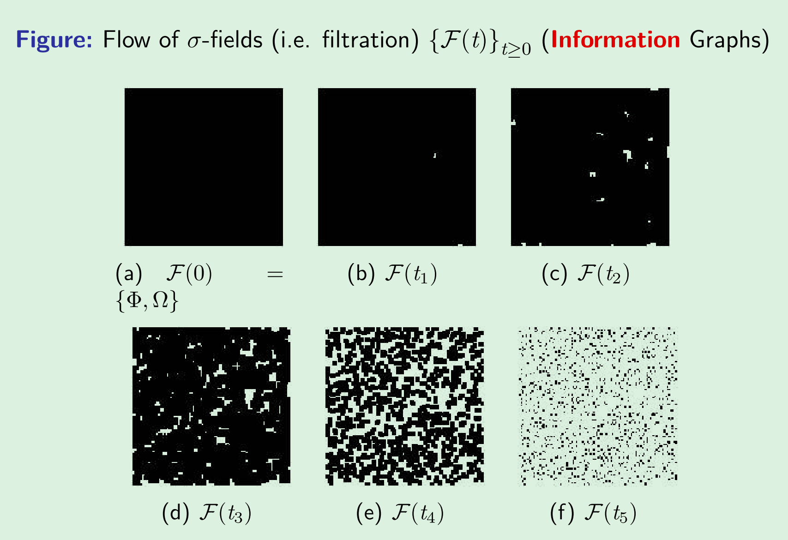

# Asset price models, Brownian motion and B-S formulas

## 1. Random walks and Brownian motion

### Symmetric Random Walk

重复投掷一枚均匀的硬币，第 i 次投掷的结果用 $w_i$ 表示：

$$
X_j=
\begin{cases}
1,& if \ w_j = \text{H} \\
-1,& if \ w_j = \text{T} \\
\end{cases}
$$

定义 $M_0=0$，$M$ 是一个对称的随机游走：

$$
M_k = \sum\limits_{j=1}^{k} X_j \quad k=1, 2, \cdots
$$

$M$ 具有如下性质：

* $M$ 有独立的增量，也即 $X \thicksim i.i.d$
* $E(M_{k_{i+1}} - M_{k_i}) = 0, var(M_{k_{i+1}} - M_{k_i}) = k_{i+1}-k_i$
$$
M_{k_{i+1}} - M_{k_i} = X_{k_i+1} + X_{k_i+2} + \cdots + X_{k_{i+1}} \\
{}\\
E(X_i) = 0, var(X_i) =1, X \thicksim i.i.d
$$
* $M$ 是一个鞅过程：$\mathrm{E}(M_{k_{i+1}}|\mathcal{F}_{k_i})=M_{k_i}$
$$
\begin{aligned}
    \mathrm{E}(M_{k_{i+1}}|\mathcal{F}_{k_i})&=\mathrm{E}(M_{k_i}+M_{k_{i+1}}-M_{k_i}|\mathcal{F}_{k_i})\\
    &=\mathrm{E}(M_{k_i}|\mathcal{F}_{k_i}) + \mathrm{E}(M_{k_{i+1}}-M_{k_i}|\mathcal{F}_{k_i})\\
    &=M_{k_i}+0
\end{aligned}
$$
* 二次变量 $[M,\ M]_k = \sum\limits_{j=1}^{k} (M_j-M_{j-1})^{2} = \sum\limits_{j=1}^{k} X_j^{2} = k$

### Scaled Symmetric Random Walk

$$
W^{n}(t) = \frac{1}{\sqrt{n}}M_{nt},\quad t\geq 0
$$

>Scaled Symmetric Random Walk have almost the same equalities with Symmetric Random Walk but more like a Brownian motion.$\\$ In particular, we shall obtain a Brownian motion in the limit as $n \to \infin$

根据中心极限定理， $n\to \infty, M_{nt} \thicksim N(0,\ nt)$，于是 $W^{n}(t)\sim N(0,\ t)$，也可以表示为 $W(t)$，这一过程称为Brownian motion，或 <mark>$Wiener\; process$</mark>

### Arithmetic Brownian Motion

Louis Bachelier (1900):

$$
S(t) = at + b W(t)\quad t\geqslant 0, W(t)\sim N(0,\ t)
$$

### Geometric Brownian Motion

Paul A. Samuelson (1965):

$$
S(t) = S(0)e^{\left( \sigma W(t) +(\mu-\frac{1}{2}\sigma^{2})t \right) }\quad t\geqslant 0
$$

[证明 GBM 是 Binomial Model 的极限](https://leetah666.github.io/Notes/#/courses/mathematical_finance/3_wiener_process?id=geometric-brownian-motion-gbm)

### <mark>Wiener Process</mark>

$$
\mathbb P[X_{k,n}=1]=\mathbb P[X_{k,n}=-1]=\frac12\\
\Downarrow \\
\frac{1}{\sqrt{n}}\sum_{k=1}^{nt}X_{k,n}\to W(t)\sim N(0,t)
$$

随机过程 $W(t)$ 称作 **standard Brownian motion** 也即 **Wiener process**

布朗运动 (Brownian Motion) 的定义：

1. 概率空间 $(\Omega,\ \mathcal{F},\ \mathbb{P})$ 中，对每一个 $\omega \in \Omega$，都存在一个连续函数 $W(t), t \geq 0$ 满足 $W(0)=0$ 且 $W(t)$ 依赖于 $\omega$

2. 对所有的 t ：$0=t_{0}<t_{1}<\cdots<t_{m}$，增量 $\left\{W\left(t_i\right)-W\left(t_{i-1}\right);i=1,\cdots,m\right\}$ 相互独立，且都服从于正态分布

$$
\left.
    \begin{array}{l}
    \mathbb{E}[W(t_{i+1})-W(t_i)]=0\\
    {}\\
    Var[W(t_{i+1})-W(t_i)]=t_{i+1}-t_i
    \end{array}
\right\}
\implies \mathrm{d}W(t) \sim N(0,dt) = \sqrt{dt}\; N(0,1)
$$

布朗运动的性质：

* $Cov(W(t_1),W(t_2))=\min\{t_1,t_2\}$
* Brownian motion 是一个鞅过程：

$$
\begin{aligned}
\mathrm{E}(W(t_2)|\mathcal{F}_1) &= \mathrm{E}(W(t_1) + W(t_2)-W(t_1)|\mathcal{F}_1)\\
&= W(t_1) + \mathrm{E}(W(t_2)-W(t_1)|\mathcal{F}_1) \\
&= W(t_1)
\end{aligned}
$$

* 对所有的 $T \geq 0 \ \ [W,\ W]_T = T \qquad (\mathrm{d}W(t))^{2}=\mathrm{d}t$;
* $\mathrm{d}W(t)\mathrm{d}t=0$, $(\mathrm{d}t)^{2}=0$ and $\mathrm{d}W(t)=\phi \sqrt{\mathrm{d}t} \qquad \phi \sim N(0,1)$

**伊藤公式：**

$f(t,x)$ 是一个函数，偏导数 $f_t(t,x), f_x(t,x), f_{xx}(t,x)$ 都是连续函数
$$
df(t,W(t))=f_t(t,W(t))dt+f_x(t,W(t))dW(t)+\frac{1}{2}f_{xx}(t,W(t))dt
$$

例：利用伊藤公式求 dS(t)

${}\\ S\left(t\right)=S_{0}e^{r t-\frac{1}{2}\sigma^{2}t+\sigma w\left(t\right)}$

令 $r t-\frac{1}{2}\sigma^{2}t+\sigma w\left(t\right) = \square$

$$
\begin{aligned}
d s\left(t\right) &=\frac{\partial s}{\partial t}d t+\frac{\partial s}{\partial w}d w+\frac{1}{2}\frac{\partial^2 s}{\partial w^{2}}d t \\
\\
&=S_{0}\cdot e^{\square}\left(r-\frac{1}{2}\sigma^{2}\right)d t+S_{0}\cdot e^{\square}d w+\frac{1}{2}S_{0}\cdot e^{\square}\cdot \sigma^{2}d t\\
\\
&=S_{0}\cdot e^{\square}rdt + S_{0}\cdot e^{\square}\sigma dw\\
\\
&=rS_{t}dt + \sigma S_{t}dw\\
\end{aligned}
$$

例：利用等价概率测度改变布朗运动的漂移项

设 $W(t), 0 \leq t \leq T$ 是概率空间 $(\Omega,\ \mathcal{F},\ \mathbb{P})$ 上的一个布朗运动，定义随机变量：

$$
Z=\exp\left(-\frac{1}{2}\frac{(\mu-r)^2}{\sigma^2}T-\frac{\mu-r}{\sigma}W(T)\right)
$$

$\mathbb{E}Z=1$，定义概率测度 $\widetilde{\mathbb{P}}$，于是 $\dfrac{d\widetilde{\mathbb{P}}}{d \mathbb{P}}=Z$

得到在概率空间 $(\Omega,\ \mathcal{F},\ \widetilde{\mathbb{P}})$ 上的带漂移项的布朗运动：

$$
\tilde{W}(t)\equiv W(t)+\frac{\mu-r}{\sigma}t
$$

## 2. Information, partition and general conditional expectations

### Partition

样本空间 $\Omega$ 的非空子集 $f=\left\{f_{1},\cdots,f_{u}\right\}$，若：

* $\forall \ i\neq j, f_{i}\cap f_{i}=\emptyset$
* $f_{1}\cup\cdots\cup f_{u}=\Omega$

称集合 f 为 $\Omega$ 的 partition

如果当前状态是 $w$，则 $f(w)$ 代表 $partition \ f$ 的包含 $w$ 的子集

example 1：

掷两枚硬币会出现四种状态：$\Omega=\left\{h h,h t,t h,t t\right\}$

partition 可以表示为：$f=\{\{hh\},\{ht,th\},\{tt\}\}$

example 2：

$\Omega=\{\omega_{1},\cdots,\omega_{K}\}$

* null partition $f=\{\{\omega_{1},\cdots,\omega_{K}\}\}$ 不包含有效信息
* $f=\{\{\omega_{1}\},\cdots,\{\omega_{K}\}\}$ 包含所有信息，因为每个状态都有

### Filtration

$\Omega$ 是一个非空集合，$T$ 是固定的正数，假设对每一个 $t \in [0,T]$，都有一个 $\sigma-algebra \; \mathcal{F}(t)$

进一步假设，若 $s<t$，则 $\mathcal{F}(s)$ 中的每一个子集都在 $\mathcal{F}(t)$ 中

>Then we call the collection $\sigma-algebras \; \mathcal{F}(t), 0 \leq t \leq T$, a filtration

filtration 是指一个包含了随机过程中所有信息的序列或集合，$\mathcal{F}(t)$ 是由在时间 $t$ 之前发生的事件所组成的 $\sigma-algebra$，通常称为时间 $t$ 的信息集合。换句话说，一个 filtration 表示了随机过程的演化历程中逐渐观测到的过去和现在的所有信息

### The information σ(X) received from observing X

$X$ 是定义在非空的样本空间 $\Omega$ 上的一个随机变量，$\sigma(X)$ 代表 $X$ 产生的 $\sigma-algebra$

>Let $X$ be a random variable defined on a non-empty sample space $\Omega$. The $\sigma-algebra$ generated by $X$, denoted $\sigma(X)$, is the collection of all subsets of $\Omega$ ofthe form $\{X\in B\}$, where B ranges over the Borel subsets of $\Re$.

example：

$\Omega=\{1,2,3,4,5,6\}$，定义 $X(\omega)$：

$$
X(\omega)=
\begin{cases}
1,\; \text{if}\; \omega=1,3,5;\\ 
0,\; \text{if}\; \omega=2,4,6.
\end{cases}
$$

则，$\sigma(X)=\{\phi,\Omega,\{1,3,5\},\{2,4,6\}\}$

### Optimum non-empty set and measurable criterion

$X$ 是定义在非空的样本空间 $\Omega$ 上的一个随机变量，$\mathcal{G}$ 是 $\Omega$ 子集的一个 $\sigma-algebra$，如果 $\sigma(X)$ 中的每一个子集也都在 $\mathcal{G}$ 中，则 $X$ 是 $\mathcal{G}-measurable$

>Let X be a random variable defined on a non-empty sample space $\Omega$. Let $\mathcal{G}$ be a $\sigma-algebra$ of subsets of $\Omega$. If every set in $\sigma(X)$ is also in $\mathcal{G}$, then $X$ is $\mathcal{G}-measurable$

最小非空集 $A$：

$\qquad (\Omega,\ \mathcal{F},\ \mathbb{P})$ 是一个有限的概率空间，$A \in \Omega, A \not ={\phi}$

$\qquad \forall B \not ={\phi}$，若 $B\in\mathcal{F}\ \text{with}B\ \subset A$，则 $B=A$

### Conditional Probability

对于 $(\Omega,\mathbb{P})$ 上的事件 A，和 $\Omega$ 的 partition $f$，条件概率 $P\left(A|f\right)$ 是一个随机变量，表示为：

$$
\mathbb{P}(A|f)(\omega)\equiv\frac{\mathbb{P}[A\cap f(\omega)]}{\mathbb{P}[f(\omega)]}
$$

### Conditional Expectations

对于 $(\Omega,\mathbb{P})$ 上的随机变量 $\xi$，和 $\Omega$ 的 partition $f$，条件期望 $\mathbb{E}_{\mathbb{P}}(\xi|f)$ 是一个随机变量，表示为：

$$
\mathbb{E}_{\mathbb{P}}(\xi|f)(\omega)\equiv\frac{\sum_{\omega'\in f(\omega)}\mathbb{P}(\omega')\xi(\omega')}{\mathbb{P}[f(\omega)]}
$$

example：

${}\\ \Omega = \{1,\ 2,\ 3,\ 4,\ 5,\ 6\}$

定义随机变量 X:

$
X(\omega) = 
\begin{cases}
    1,& \omega=1,\ 3,\ 5 \\
    0,& \omega=2,\ 4,\ 6 \\
\end{cases}
$

1. Conditional Probability

$\qquad A=\{1, 2\}, f = \{\{1,3,5\},\ \{2,4,6\}\}$

$
\qquad
\mathbb{P}(A|f)(\omega) = \begin{cases}
    \dfrac{\mathbb{P}(\{1\})}{\mathbb{P}(\{1,\ 3,\ 5\})}=\dfrac{1}{3},& \omega \in \{1,\ 3,\ 5\}\\
    {}\\
    \dfrac{\mathbb{P}(\{2\})}{\mathbb{P}(\{2,\ 4,\ 6\})}=\dfrac{1}{3},& \omega \in \{2,\ 4,\ 6\}\\
\end{cases}
$

2. Conditional Expectations

$\qquad f = \{\{1,2,3\},\ \{4,5,6\}\}$

$
\qquad
\mathrm{E}(X|f)(\omega) = \begin{cases}
    \dfrac{\sum\limits_{\omega^{\prime} \in \{1,\ 2,\ 3\}} \frac{1}{6}X(\omega^{\prime})}{\mathbb{P}(\{1,\ 2,\ 3\})}=\dfrac{\frac{1}{6}(1+0+1)}{\frac{1}{2}} = \dfrac{2}{3},& \omega\in \{1,\ 2,\ 3\}\\
    {}\\
    \dfrac{\sum\limits_{\omega^{\prime} \in \{4,\ 5,\ 6\}} \frac{1}{6}X(\omega^{\prime})}{\mathbb{P}(\{4,\ 5,\ 6\})}=\dfrac{\frac{1}{6}(0+1+0)}{\frac{1}{2}} =\dfrac{1}{3},& \omega\in \{4,\ 5,\ 6\}\\
\end{cases}
$

### General Conditional Expectations

## 3. Stochastic Process

