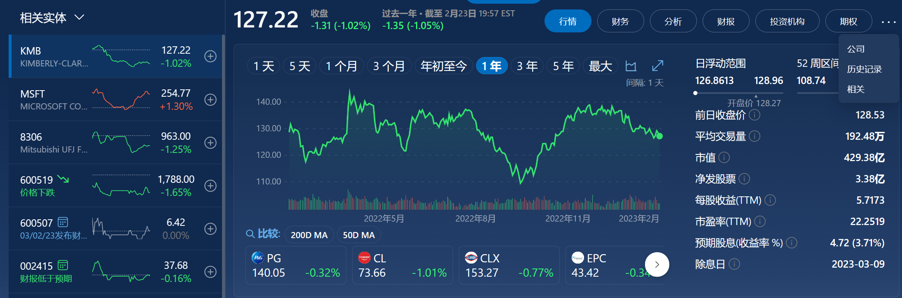

# chapter 1

#### A. What is Kimberly-Clark's core business?

Kimberly-Clark is a consumer products company that primarily produces personal care products such as tissues, feminine care products, diapers, paper towels, toilet paper, and more. The company also produces products for medical and industrial use.

#### B. What is Kimberly-Clark's strategy for the future? 

Kimberly-Clark's strategy for the future is to focus on innovation and growth. This includes developing new products, expanding into new markets, and investing in digital transformation and sustainability initiatives. The company is also investing in its core businesses, such as health care and hygiene, to ensure they remain competitive in the future. Additionally, Kimberly-Clark is focusing on data-driven insights to better understand customer needs and develop tailored solutions. Finally, the company is committed to responsible and ethical practices to ensure it is a leader in the industry.

#### C. How does Kimberly-Clark intend to grow? Does it grow through acquisitions?

Kimberly-Clark’s growth strategy is focused on organic growth through innovation and productivity initiatives. The company also plans to grow by executing strategic acquisitions, joint ventures and alliances. Kimberly-Clark has made several key acquisitions in recent years, such as the 2018 acquisition of Softex Indonesia, a manufacturer of personal care products.

#### D. What is Kimberly-Clark's competitive environment? Who are its main competitors?

Kimberly-Clark operates in a highly competitive environment. Its main competitors include Procter & Gamble, Unilever, Essity, and Henkel. Other competitors in the consumer products space include Colgate-Palmolive, Clorox, and SC Johnson.

#### E. What are the main risks facing the firm? Would you describe this as a risky firm?

* Fluctuations in raw material costs: Kimberly-Clark's products rely on various raw materials such as wood pulp, cotton, and synthetic fibers, the prices of which are subject to market fluctuations. Any increase in raw material prices could result in higher manufacturing costs and lower profit margins.
* Intense competition: Kimberly-Clark operates in a highly competitive industry, and there are many established players in the market that offer similar products. New entrants into the market could also intensify competition and pressure prices.
* Economic conditions: Kimberly-Clark's business is affected by global economic conditions. Economic downturns could result in decreased demand for its products and lower revenues.

I don't think it is a risky firm, although the risks it face could have a significant impact on its operations and financial performance, but Kimberly-Clark has a strong financial position, a diverse range of products, and a global presence, which can help mitigate some of the risks it faces. The company also has a history of strong financial performance, with consistent revenue and profit growth. So in the long run, I think it will perform well.

#### F. Go to the Yahoo! Finance or Google finance Web sites, enter the ticker (KMB), and observe the information there. Compare the current information with that on March 31, 2011 in Exhibit 1.1 . Look at the price plots and observe how KMB has performed in the market. KMB paid a dividend of $2.64 per share in 2010. Can you calculate the return that shareholders earned over the most recent calendar year? Can you spot the P/E ratio and the price-to-book (P/B) ratio?

The dividend KMB paid in 2022 was \$4.64, the price at January 1, 2022 was \$141.88, the price at December 31, 2022 was \$135.75.

The return that shareholders earned in 2022: (135.75-141.88+4.64)/141.88 = -1.05%
the P/E ratio: 22.2
the P/B ratio: 78.5

#### G. Summarize and discuss the main features of the analysts' reports in Exhibit 1.1.

* The current price is $65.24 and the P/E ratio is 14.67;
* In general, analysts recommend to hold KMB's stocks;
* Analysts expect the price will be \$68.79 in a year, with the dividend of \$2.8, the expected return will be around 9.7%;
* The EPS forecast is \$4.98 for 2011 and \$5.35 for 2012;
* The P/E ratio estimated for 2011 will be \$65.24/\$4.98 = 13.1  

#### H. Overall, do analysts (covered in Exhibit 1.1) think KMB shares are reasonably priced, cheap, or expensive?

Analysts think KMB shares are reasonably priced, for they provide an average recommendation of 2.6 , 2.6 means you can hold this stock.

#### I. In a press report in Barron son March 31, 2011, Kimberly-Clark's CFO, Mark Buthman pointed to an increase in stock repurchases, to be financed by borrowing. "Our after-tax cost of debt is actually less than our dividend yield," he said. "For every dollar of shares I buy back, I actually save money." What do you think of his statement?

I think Mr.Buthman's statement is wrong. 

Share repurchases in this case saves the cash flow for the corporation indeed, but in fact, it could do harm to shareholders' interest in the long run. The shareholders hold the stocks not merely seek for dividends, but also the price fluctuation, if you repurchase the stocks, there no people to buy your stocks, in the last ,you can only borrow to operate the company, and you need to pay interest every year. In contrast, you don't need to pay dividends every year.

From another perspective, if you rise the dividend yield, you can borrow more, that looks cheap, but it is deceiving yourself.

#### J. How has KMB 's stock price fared since March 31, 2011, the date of the report in Exhibit 1.1? Did the analysts' earnings and revenue forecasts in Exhibit 1.1 turn out to be accurate?

The price at May 2012 was $79.60, higher than that in March 2011.

EPS in 2011 was \$4.02, lower than analysts' forecast of \$4.98, their forecast are not so accurate.

