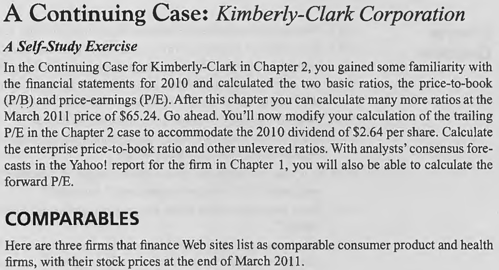
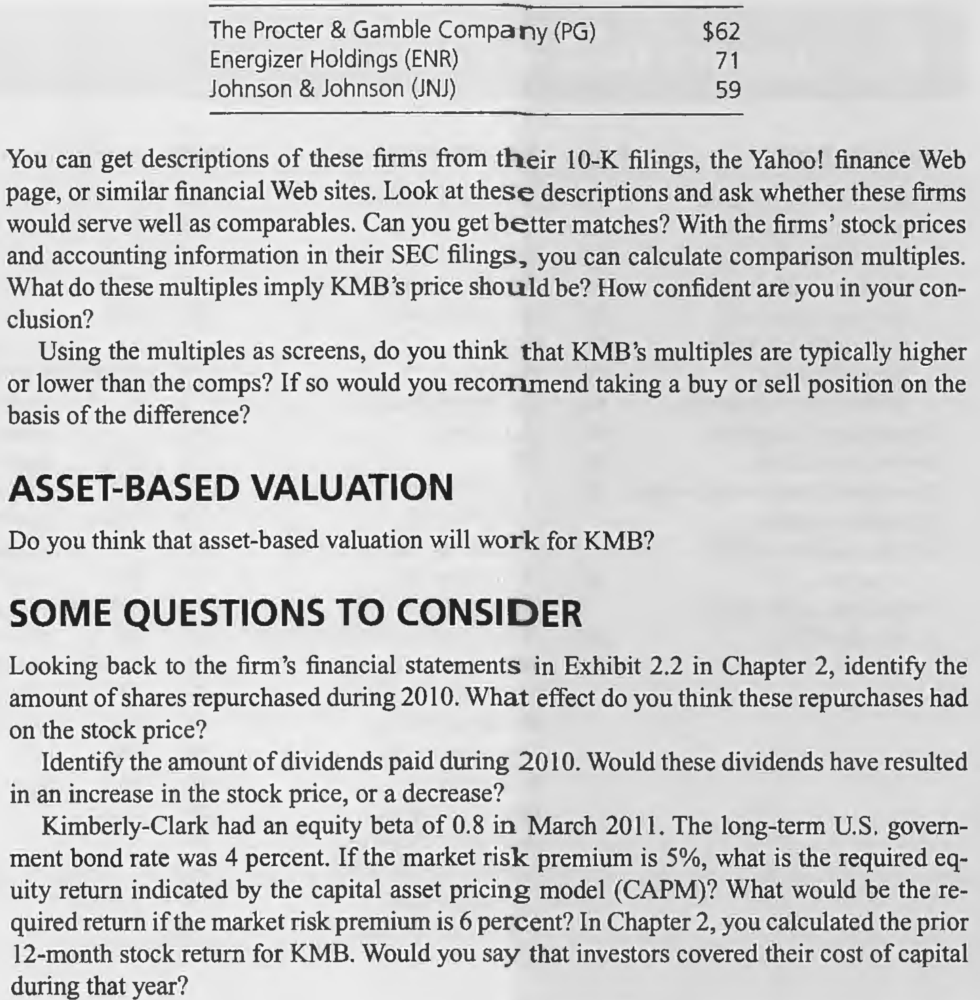

# Chapter 3

## A self-study Exercise

**Calculate the enterprise price-to-book ratio and other unlevered ratios. With analysts' consensus forecasts in the Yahoo! report for the firm in Chapter 1, you will also be able to calculate the forward P/E.**

    P/B ratio           = 26,546/5,917 
                        = 4.49

    Value of the firm (enterprise) 
                        = Value of the equity + Value of debt + Value of the Minority Interest
                        = 26,546 + 5,050 + 1,280
                        = $32,876

    The book value of the enterprise
                        = Equity book value + Net debt + Noncontrolling Interest
                        = 5,917 + 5,050 + 285
                        = $11,252

    Enterprise P/B      = 32,876/11,252
                        = 2.92

    Price/Sales         = 32,876/19,746 
                        = 1.66

    Price/ebit          = 32,876/2,954 
                        = 11.13

    ebitda              = ebit + depreciation + amortization
                        = 2,954 + 813
                        = $3,767

    Price/ebitda        = 32,876/3,767
                        = 8.73

    Forward P/E         = 65.24/4.98 
                        = 13.10

    Trailing P/E        = (65.24 + 2.64)/4.47
                        = 15.19

## COMPARABLES

**Look at these descriptions and ask whether these firms would serve well as comparables. Can you get better matches?**

KMB, ENR, and JNJ are similar in many aspects,their business are about consumer product and personal care. This is similar to KMB. So they can serve well as KMB's comparables.

**With the firms' stock prices and accounting information in their SEC filings, you can calculate comparison multiples. What do these multiples imply KMB's price should be? How confident are you in your conclusion?
Using the multiples as screens, do you think that KMB's multiples are typically higher or lower than the comps? If so would you recommend taking a buy or sell position on the basis of the difference?**

                                KMB         PG          ENR         JNJ

    Sales                    19,746     78,938        4,248      61,587                
    Ebit                      2,954     15,993          689      17,402
    Ebitda                    3,767     19,101          828      20,341
    Bookvalue                 5,917     61,439        2,100      56,579
    MV of equity             26,546    173,198        4,960     162,588
    Net debt                  5,050     21,314        1,713     (10,830)
    Enterprise market value  32,876    194,512        6,673     151,758
    Enterprise book value    11,252      82753        3,813      45,749
    Price per share           65.24      60.91        70.56       59.38
    EPS                        4.47       4.32         5.76        4.85

---

                    Average     PG      ENR     JNJ     Apply the multiples
    P/Sales            2.16   2.46     1.57    2.46     2.16*19746 = $42651 enterprise value
    P/ebit            10.19  12.16     9.69    8.72     10.19*2,954 = $30,101 enterprise value
    P/ebitda           8.57  10.18     8.06    7.46     8.57*3,767 = $32,283 enterprise value
    P/E               12.86  14.10    12.25   12.24     12.86*4.47 = $57.48 price per share
    P/B                2.68   2.82     2.36    2.87     2.68*5,917 = $15,858 equity value
    Enterprise P/B     2.47   2.35     1.75    3.32     2.47*11,252 = $27,792 enterprise value

## ASSET-BASED VALUATION

**Do you think that asset-based valuation will work for KMB?**

I don't think it will work for KMB. KMB's P/B ratio is 4.49, but its Enterprise P/B ratio is 2.92, this indicates that there may be some assets that are not reflected on the firm's balance sheet. So just using the asset-based valuation without considering invisible assets is inappropriate.

## SOME QUESTIONS TO CONSIDER

**What effect do you think these repurchases had on the stock price?**

The repurchases almost had no effect on the stock price, which means the market think the repurchase value is rational. Even though the firm paid money to repurchase, the shares decreases at the same time, so the price was unchanged.

**Identify the amount of dividends paid during 2010. Would these dividends have resulted in an increase in the stock price, or a decrease?**

The dividends paid during 2010 were $1,066 million. These dividends have resulted in an decrease in the stock price, unlike repurchasing, paying dividends made the cash flow decreased but the shares didn't change, so the price per share decreased.

**Kimberly-Clark had an equity beta of 0.8 in March 2011. The long-term U.S. government bond rate was 4 percent. If the market risk premium is 5%, what is the required equity return indicated by the capital asset pricing model (CAPM)? What would be the required return if the market risk premium is 6 percent? In Chapter 2, you calculated the prior 12-month stock return for KMB. Would you say that investors covered their cost of capital during that year?**

The required equity return indicated by CAPM:

    4.0% + 0.8 * 5.0% = 8.0%

If the market risk premium is 6%:

    4.0% + 0.8 * 6.0% = 8.8%

Investors' annual return was 4.74%, lower than CAPM's required return, they didn't cover their cost of captial during that year.