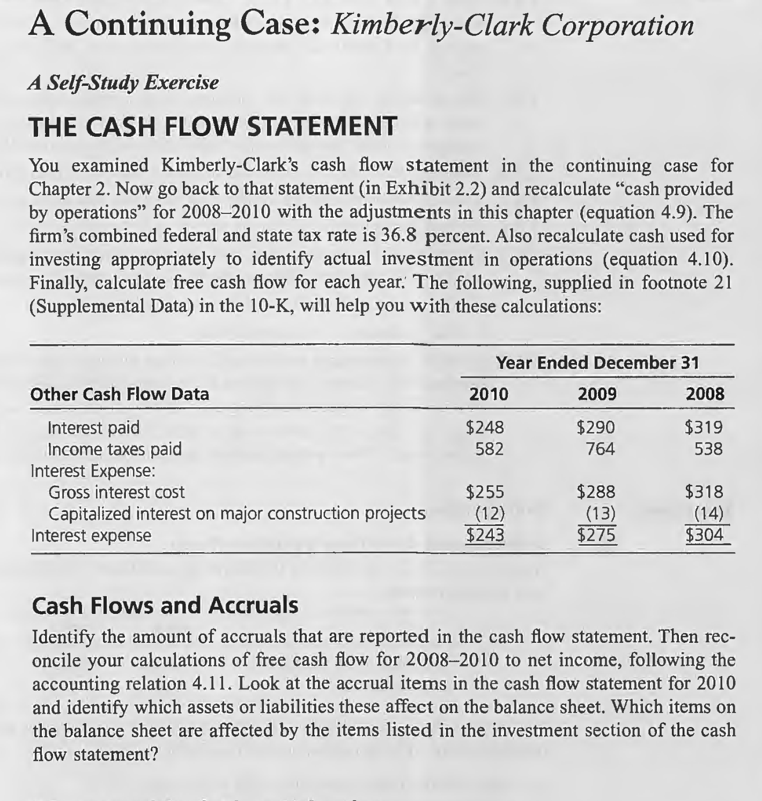

# Chapter 4

## THE CASH FLOW STATEMENT

<table><tr><td bgcolor=lightgrey>

$
\begin{array}{lrrr}
 & 2010 & \qquad \qquad 2009 & \qquad \qquad 2008 \\
 &&&\\
 \text{Reported cash flow from operations} & 2,744&3481 &2516\\
 \text{Interest payments} & 248\ \qquad& 290\ \qquad&319\ \qquad\\
 \text{Interest income (1)} & (20) \qquad&26\ \qquad&46\ \qquad\\
 \text{Net interest payments} &228\ \qquad& 264\ \qquad&273\ \qquad\\
 \text{Tax (36.8\%)} & 83.9\ \qquad& 97.2\ \qquad&100.5\ \qquad\\
 \text{Net Interest payments after tax} & 144.1&166.8 &172.5\\
 \text{Cash flow from operations} & 2888.1& 3647.8&2688.5\\
 &&&\\
 \text{Reported cash used in investing activities} &781 &1288 &847\\
  \text{Investment in marketable securities} &1\ \qquad& -\ \qquad&(9) \qquad\\
 \text{Sales of investments} & 47\ \qquad &40\ \qquad&48\ \qquad\\
 \text{Net increase in time deposits} & 117 \ \ \ 165 & (47)\ \ (7)&76\ \ \ 115\\
 \text{Cash investment in operations} &946 &1281 &962\\
  \text{Free cash flow} & 1942.1 & 2366.8&1726.5\\
\end{array}
$
</td></tr></table>

## Cash Flows and Accruals

**Identify the amount of accruals that are reported in the cash flow statement.**

<table><tr><td bgcolor=lightgrey>

$
\begin{array}{lrrr}
 & 2010 & \qquad \qquad 2009 & \qquad \qquad 2008 \\
 &&&\\
 \text{Net income} & 1,943&1994 &1829\\
 \text{Cash from operations} \qquad \qquad \qquad \qquad \qquad & 2744 & 3481&2516\\
 \text{Accruals} & (801)&(1487)&(687)\\
\end{array}
$
</td></tr></table>

**Then reconcile your calculations of free cash flow for 2008- 2010 to net income, following the accounting relation 4.11.**

<table><tr><td bgcolor=lightgrey>

$
\begin{array}{lrrr}
 & 2010 & \qquad \qquad 2009 & \qquad \qquad 2008 \\
 &&&\\
 \text{Earnings} & 1,943 &1994 &1829\\
 \text{Net interest paid after tax} \qquad \qquad \qquad \qquad  & +144 & +167& +173\\
 \text{Investments} & -946 & -1281& -962\\
 \text{Accruals} & +801& +1487& +687\\
 \text{Free cash flow} & \$1942 & \$2367 & \$1727 \\
\end{array}
$
</td></tr></table>

**Look at the accrual items in the cash flow statement for $\text{2010}$ and identify which assets or liabilities these affect on the balance sheet.**
  
<table><tr><td bgcolor=lightgrey>

$
\begin{array}{ll}
 \text{Accrual} &\qquad \text{Balance Sheet Item}\\
 &\\
 \text{Depreciation and amortization} &\qquad \text{Property, plant and equipment (PPE) Patents } \\
&\qquad \text{in “Other assets”} \\
\text{Stock-based compensation} &\qquad \text{This affects “Recognition of stock-based compensation” }\\
&\qquad \text{in the equity statement.} \\
\text{Deferred income tax} &\qquad \text{Deferred tax assets and liabilities}\\
\text{Equity earnings} &\qquad \text{Investments in equity companies}\\
\text{Minority owners share of income} &\qquad \text{Minority interest in balance sheet}\\
\end{array}
$

</td></tr></table>

**Which items on the balance sheet are affected by the items listed in the investment section of the cash flow statement?**

<table><tr><td bgcolor=lightgrey>

$
\begin{array}{ll}
\text{Investment}&\qquad \text{Balance Sheet Item} \\
 &\\
\text{Capital spending}&\qquad \text{PPE} \\
\text{Net increase in time deposits}&\qquad \text{Cash equivalents or “other assets”} \\
\text{Proceeds from dispositions of property}&\qquad \text{PPE} \\
\end{array}
$

</td></tr></table>

## Discounted Cash Flow Valuation

**Suppose you were valuing KMB at the end of 2007 and that you received the free cash flows that you just calculated as forecasts for 2008- 2010. Attempt to value the equity with a DCF valuation. Identify aspects of the valuation about which you are particularly uncertain. Kimberly-Clark had 406.9 million shares outstanding at the end of 2010 and had net debt of $5,294 million. You should verify these numbers on the 2010 balance sheet.
For these calculations, use a required return for the firm of 8 percent.**

<table><tr><td bgcolor=lightgrey>

$
\begin{array}{lrrrr}
 &\qquad 2007 &\qquad 2008 &\qquad 2009 &\qquad 2010 \\
 &&&&\\
\text{FCF} & & 1726&2367&1942\\
\text{Discount factor} &&1080&1166&1260\\
\text{PV of FCF} &&1598&2030&1541\\
\text{Total PV of FCF} &5169&&&\\
\text{FCF Growth rate 4.0\%} &&&&\\
\text{Continuing value (CV)} &&&&33014\\
\text{PV of CV} &26202&&&\\
\text{Value of the firm} &31371&&&\\
\text{Book Value of Net debt} &(5294)&&&\\
\text{Value of Equity} &26077&&&\\
\text{Value of Equity per share} & 64.1 & & &
\end{array}
$
</td></tr></table>

Continuing value at the end of 2010:

$$\frac{1942\times1.02}{1.08-1.02} = \$33014 $$

2007 PV of the Continuing value calculated above:

$$\frac{\$33014}{1.08^3} = \$26202 $$