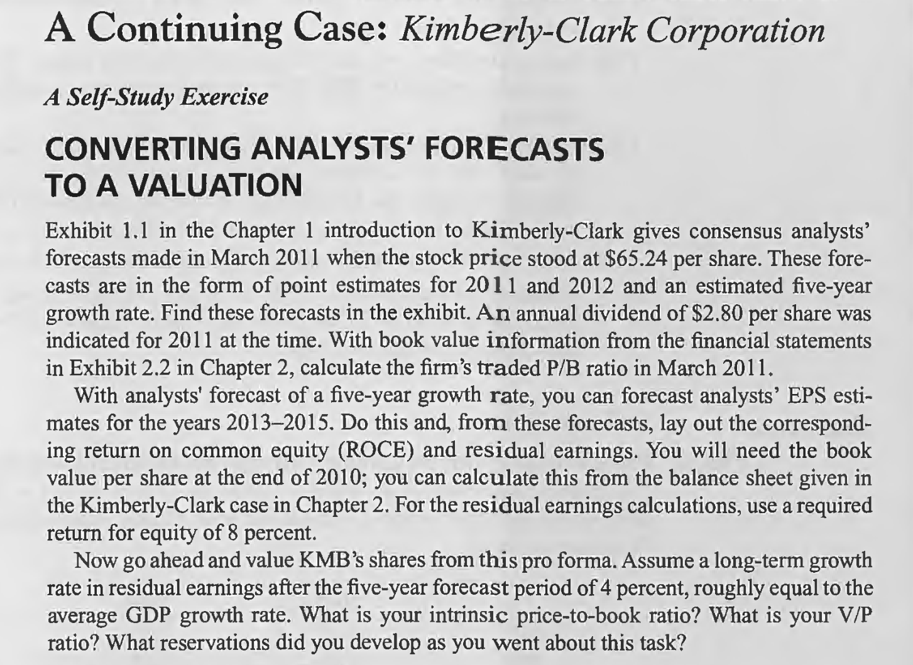

# Chapter 5

## CONVERTING ANALYSTS' FORECASTS TO A VALUATION

**With book value information from the financial statements in Exhibit 2.2 in Chapter 2, calculate the firm's traded P/B ratio in March 2011.**

KMB’s traded P/B in March 2011 was 4.49 (65.24/14.54), we have calculated it in Chapter 3.

**With analysts' forecast of a five-year growth rate, you can forecast analysts' EPS estimates for the years 2013- 2015. Do this and, from these forecasts, lay out the corresponding return on common equity (ROCE) and residual earnings. You will need the book value per share at the end of 2010; you can calculate this from the balance sheet given in the Kimberly-Clark case in Chapter 2. For the residual earnings calculations, use a required return for equity of 8 percent.**

<table><tr><td bgcolor=lightgrey>

$
\begin{array}{lrrr}
Required \ Return: 8\% & \qquad 2010 & \qquad \qquad 2011 & \qquad \qquad 2012 \\
 &&&\\
 \text{Eps} & &4.98&5.35\\
 \text{Dps} & &2.80&3.00\\
 \text{Bps} & 14.54 & 16.72&19.07\\
 \text{ROCE} & &34.3\%&32.0\%\\
 \text{RE} & &3.82&4.01\\
 \text{Discount factor} & &1.08&1.17\\
 \text{PV of RE} & &3.53&3.44\\
 \text{Total PV of RE} & 6.98&&\\
RE \ growth \ rate: 4\% & &&\\
 \text{Continuing value} & &&104.31\\
 \text{PV of CV} & 89.46&&\\
 \text{Value per share} & 110.98&&\\
\end{array}
$
</td></tr></table>

**Now go ahead and value KMB's shares from this proforma. Assume a long-term growth rate in residual earnings after the five-year forecast period of 4 percent, roughly equal to the average GDP growth rate. What is your intrinsic price-to-book ratio? What is your V/P ratio? What reservations did you develop as you went about this task?**

in 2013-2015, EPS grow at a rate of 9.1%
for years after 2015, EPS grow at a rate of 4%

<table><tr><td bgcolor=lightgrey>

$
\begin{array}{lrrrrrr}
Required \ Return: 8\% & \qquad 2010 & \qquad 2011 & \qquad 2012 &\qquad 2013&\qquad 2014&\qquad 2015\\
 &&&&&&\\
 \text{Eps} & &4.98&5.35&5.84&6.37&6.95\\
 \text{Dps} & &2.80&3.00&3.27&3.57&3.90\\
 \text{Bps} & 14.54 & 16.72&19.07&21.64&24.44&27.49\\
 \text{ROCE} & &34.3\%&32.0\%&30.6\%&29.4\%&28.4\%\\
 \text{RE} & &3.82&4.01&4.31&4.64&5.00\\
 \text{Discount factor} & &1.08&1.17&1.26&1.36&1.47\\
 \text{PV of RE} & &3.53&3.44&3.42&3.41&3.40\\
 \text{Total PV of RE} & 17.21&&&&&\\
RE \ growth \ rate: 4\% & &&&&&\\
 \text{Continuing value} & &&&&&129.85\\
 \text{PV of CV} & 88.39&&&&&\\
 \text{Value per share} & 120.14&&&&&\\
\end{array}
$
</td></tr></table>

    Intrinsic P/B   = 8.26
    V/P             = 120.14/65.24 
                    = 1.84
