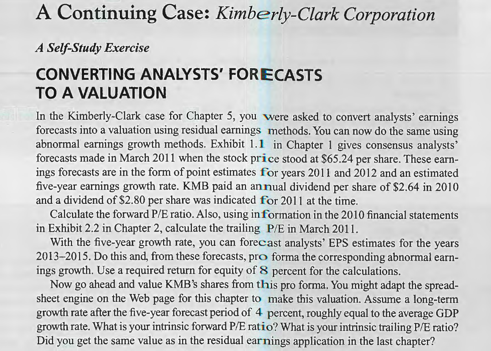

# Chapter 6

**Calculate the forward P/E ratio. Also, using information in the 2010 financial statements in Exhibit 2.2 in Chapter 2, calculate the trailing P/E in March 2011.**
&nbsp;

<table><tr><td bgcolor='#e8e7e7'>

$
\begin{array}{lrl}
Forward \ P/E&=&65.24/4.98\\
&=&13.1\\
&&\\
Trailing \ P/E&=&(65.24 + 2.64)/4.47\\
&=&15.2\\
\end{array}
$
</td></tr></table>
&nbsp;

**With the five-year growth rate, you can forecast analysts' EPS estimates for the years 2013- 2015. Do this and, from these forecasts, pro forma the corresponding abnormal earnings growth. Use a required return for equity of 8 percent for the calculations.
Now go ahead and value KMB's shares from this pro forma. You might adapt the spreadsheet engine on the Web page for this chapter to make this valuation. Assume a long-term growth rate after the five-year forecast period of 4 percent, roughly equal to the average GDP growth rate. What is your intrinsic forward P/E ratio? What is your intrinsic trailing P/E ratio? Did you get the same value as in the residual earnings application in the last chapter?**
&nbsp;

<table><tr><td bgcolor=lightgrey>

$
\begin{array}{lrrrrrr}
Required \ Return: 8\% & \qquad 2010 & \qquad 2011 & \qquad 2012 &\qquad 2013&\qquad 2014&\qquad 2015\\
 &&&&&&\\
 \text{Eps} & &4.98&5.35&5.84&6.37&5.22\\
 \text{Dps} & &2.80&3.00&3.27&3.57&3.90\\
 \text{Residual earnings (RE)} &  & &4.012&4.314&4.638&4.995\\
 \text{Change in RE = AEG} & &&0.195&0.302&0.324&0.357\\
 \text{Discount factor} & &&1.08&1.17&1.26&1.36\\
 \text{PV of AEG} & &&0.181&0.259&0.257&0.263\\ 
 \text{Total PV of AEG} & &0.960&&&&\\
AEG \ Growth \ Rate \ (g) : 4\%& &&&&&\\
 \text{Continuing value} & &&&&&9.282\\
 \text{PV of continuing value} & &6.825&&&&\\
 \text{Total} & &12.765&&&&\\
 \text{Capitalization rate} & &0.08&&&&\\
 \text{Value per share} & 159.56&&&&&\\
\end{array}
$
</td></tr></table>

&nbsp;

<table><tr><td bgcolor=lightgrey>

$
\begin{array}{lrl}
The \ continuing \ value \ (CV)&=&\frac{0.357\times1.04}{1.08 - 1.04}\\
&&\\
&=& \$9.282\\
&&\\
The \ intrinsic \ forward \ P/E&=&159.56/4.98\\
&=&32\\
&&\\
The \ intrinsic \ trailing \ P/E&=&(159.56+2.64)/4.47\\
&=&36.29\\
\end{array}
$
</td></tr></table>
&nbsp;

I get a different value with the residual earnings application in the last chapter.
