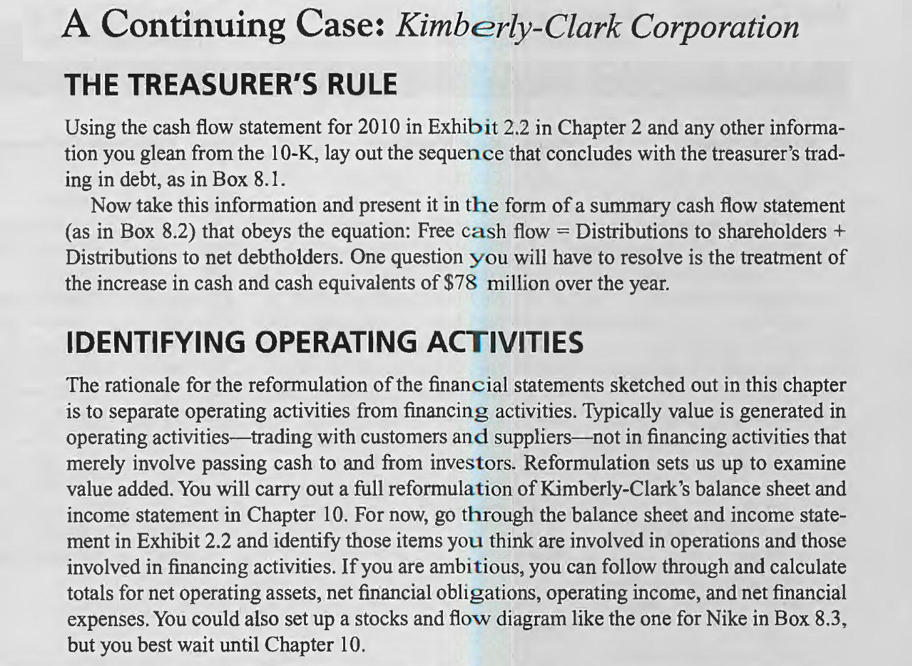

# Chapter 8

**Using the cash flow statement for 2010 in Exhibit 2.2 in Chapter 2 and any other information you glean from the 10-K, lay out the sequence that concludes with the treasurer's trading in debt, as in Box 8.1.**

<table><tr><td bgcolor=lightgrey>

$
\begin{array}{lr}
 \text{Cash flow from operations} & 2,888\\
 \text{Cash investment in operations} & 946\\
 \text{Free cash flow} & 1,942\\
 \text{Cash interest received (after tax)} &(144) \\
 \text{Cash available for shareholders} & 1,798\\
 \text{} & \\
 \text{Net dividend (net cash paid to shareholders):} & \\
 \text{Cash dividend} & 1,066 \qquad \qquad\\
 \text{Share repurchases} & 803 \qquad \qquad\\
 \text{Share issues} & (131) \qquad \qquad\\
 \text{Other} & 48 \qquad 1786\\
 \text{Net transactions in debt} & 12\\
\end{array}
$
</td></tr></table>

**Now take this information and present it in the form of a summary cash flow statement (as in Box 8.2) that obeys the equation: Free cash flow = Distributions to shareholders + Distributions to net debtholders. One question you will have to resolve is the treatment of the increase in cash and cash equivalents of $\text{\textdollar}$78 million over the year.**

<table><tr><td bgcolor=lightgrey>

$
\begin{array}{lr}
 \text{Cash flow from operations (C)} & 2,888\\
 \text{Cash investment (I)} & (946)\\
 \text{Free cash flow (C - I)} & 1,942\\
 \text{} & \\
 \mathbf{Equity financing flows (d):} & \\
 \text{Dividends and share repurchases} & 1,875\\
 \text{Share issues} & 0\\
 \text{} & 1,875\\
 &\\
 \mathbf{Debt financing flows (F):} & \\
 \text{Net purchase of financial assets} & (77)\\
 \text{Interest on financial assets (after tax)} & (24)\\
 \text{Net issue of debt} & (37)\\
 \text{Interest paid on debt (after tax)} & 157\\
 \text{} & 67\\
 &\\
 \mathbf{Total financing flows (d + F):} & 1,942\\
\end{array}
$
</td></tr></table>

**For now, go through the balance sheet and income statement in Exhibit 2.2 and identify those items you think are involved in operations and those involved in financing activities.**

1. Balance sheet:

| Items                                                      | activities|
| :--------------------------------------------------------- | :-------: |
| **Assets**                                                 |           |
| Cash and cash equivalents                                  | Financing |
| Accounts receivable, net                                   | Operating |
| Note receivable                                            | Financing |
| Inventories                                                | Operating |
| Deferred income taxes                                      | Operating |
| Property, plant and equipment, net                         | Operating |
| Investments in equity companies                            | Operating |
| Goodwill                                                   | Operating |
| Other intangible assets                                    | Operating |
| Long-term note receivable                                  | Financing |
| **Liabilities**                                            |           |
| Debt payable within one year                               | Financing |
| Redeemable preferred securities of subsidiary              | Financing |
| Trade accounts payable                                     | Operating |
| Accrued expenses                                           | Operating |
| Accrued income taxes                                       | Operating |
| Dividends payable                                          | Financing |
| Long-term debt                                             | Financing |
| Noncurrent employee benefits                               | Operating |
| Long-term income taxes payable                             | Financing |
| Deferred income taxes                                      | Operating |
| Redeemable preferred and common securities of subsidiaries | Financing |

2. Income statement:

|**Income**|           |
|:---------| :-------: |
| Net sales| Operating |
| Interest income| Financing |
| Provision for income taxes| Operating |
| Share of net income of equity companies| Operating |
| Net income attributable to noncontrolling interests| Financing |
| **Expense** |           |
| Cost of products sold| Operating |
| Marketing, research and general expenses | Operating |
| Interest expense | Financing |
| Extraordinary loss, net of income taxes,   attributable to Kimberly-Clark Corporation | Operating |
