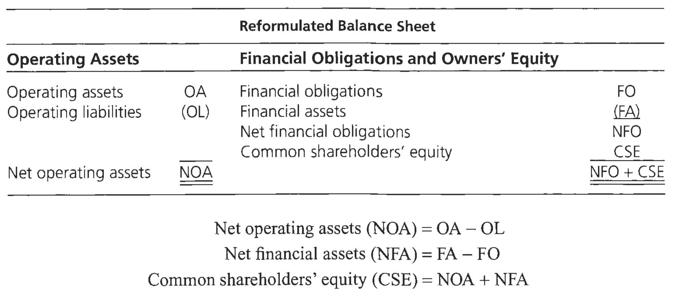

# Chapter 8

standard form of reformulated balance sheet

# 第13章

$$
\begin{array}{llll}
    (1) &ROCE &=& RNOA +[FLEV \times (RNOA-NBC)] \\
    \\
    (2)&FLEV &=& \dfrac{NFO}{CSE} \\
    \\
    (3)&NFO &=& Financial \ Obligations \ (FO) – Financial\ Assets\ (FA)\\
    \\
    (4)&RNOA &=& \dfrac{OI}{NOA}=\dfrac{Core\ OI\ from\ Sales}{NOA}+\dfrac{Core\ Other\ OI}{NOA}+\dfrac{UI}{NOA} \\
    \\
    (5)&RNOA&=& PM \times ATO
\end{array}
$$

&nbsp;
&nbsp;

$$
ROCE = RNOA +[FLEV \times (RNOA-NBC)] \tag{1}
$$

$$
FLEV = \dfrac{NFO}{CSE} \tag{2}
$$

$$
NFO = Financial \ Obligations \ (FO) – Financial\ Assets\ (FA) \tag{3}
$$

$$
RNOA=\dfrac{OI}{NOA}=\dfrac{Core\ OI\ from\ Sales}{NOA}+\dfrac{Core\ Other\ OI}{NOA}+\dfrac{UI}{NOA} \tag{4}
$$

$$
RNOA  =  PM \times ATO \tag{5}
$$

&nbsp;
&nbsp;

$$
\begin{array}{llll}
    (6)&\Delta RNOA_1 &=& \Delta CorePM_1 \times ATO_0 +\Delta ATO_1 \times CorePM_1 \\
    \\
    &&&+\Delta \lbrack \dfrac{Core\ other\ OI}{NOA}\rbrack + \Delta \lbrack \dfrac{UI}{NOA}\rbrack\\
    \\
    (7)&\Delta ROCE_1&=&\Delta RNOA_1 + \lbrack \Delta SPREAD \times FLEV_0 \rbrack + \lbrack SPREAD_1 \times \Delta FLEV_1\rbrack\\
    \\
    (8)&\Delta CSE &=& \Delta Sales \times \dfrac{1}{ATO} +Sales \times \Delta \lbrack \dfrac{1}{ATO}\rbrack -  \Delta NFO
\end{array}
$$

$\Delta SPREAD \times FLEV_0$

$\Delta FLEV \times SPREAD_1$

$\Delta CSE = \Delta Sales \times \dfrac{1}{ATO} +Sales \times \Delta \lbrack \dfrac{1}{ATO}\rbrack -  \Delta NFO$