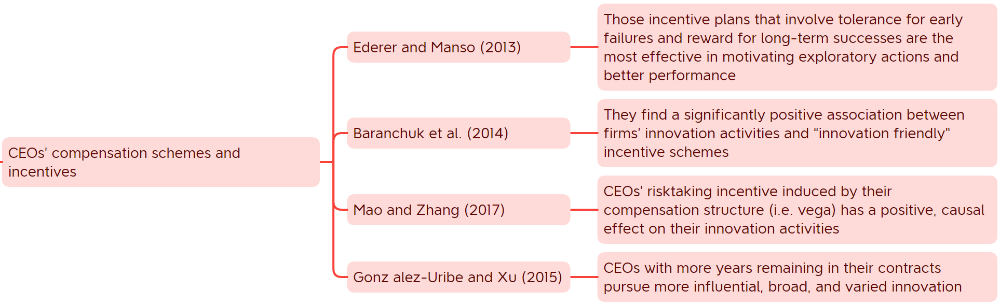
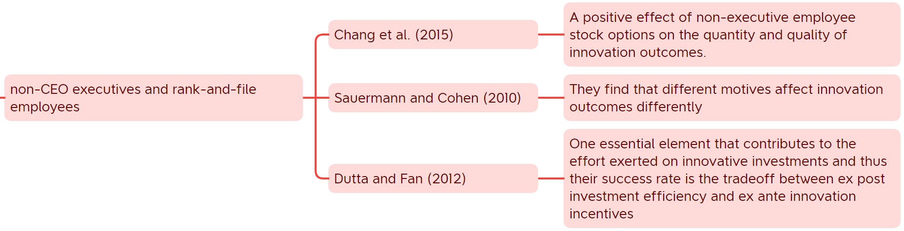
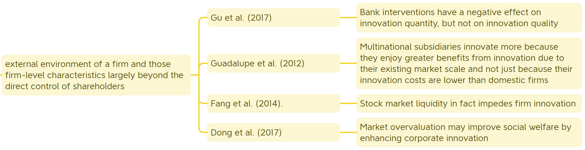

# Finance and Corporate Innovation: A Survey

## 2. Firm-Level Characteristics

### 2.1 Venture Capital and Entrepreneurship

* Venture Capital and Entrepreneurship
  * VC's tolerance for failure
  * Corporate venture capital (CVC)
  * Stage financing
  * “Exit” point

**Paper:** Kortum and Lerner (2000).Assessing the contribution of venture capital to innovation, Journal of Economics

**Content:**

* Examining 20 industries in the US manufacturing sector between 1965 and 1992
* They conduct two identification tests to address the concern regarding omitted variables, such as the arrival of technological opportunities.

**Contribution:**

* for the first time in the literature, document a positive association between VC and patenting
* they conclude that VC may have accounted for 8% of industrial innovations from 1983 to 1992, even though the average ratio of VC to R&D during the same period is $<$3%.

**Paper:** Tian and Wang (2014). Tolerance for failure and corporate innovation, Review of Financial Studies

**Content:**

* examine whether failure-tolerant venture capitalists enhance innovation by using a sample of VC-backed IPO firms between 1985 and 2006
* they adopt a number of identification strategies to show that these results are unlikely driven by the endogenous matching between failure-tolerant venture capitalists and entrepreneurial firms with greater innovative abilities.

**Contribution:**

* they find that IPO firms backed by more failure-tolerant VC investors tend to generate more patents and patents with more future citations, and that this pattern is more prominent for firms that face higher failure risk

**Paper:** Chemmanur et al. (2014).Corporate venture capital, value creation, and innovation, Review of Financial Studies

**Content:**

* Using a sample of 2129 VC-backed firms that went public between 1980 and 2004

**Contribution:**

* while CVC-backed firms are younger, riskier, and less profitable than IVC-backed firms, they are more innovative in the sense that they generate more patents and patents with higher future citations received.
* Further, their analysis identifies two possible channels through which CVCs benefit
innovation:
  * (i) the technological fit between CVCs’ parent firms and the start-up companies backed by them;
  * (ii) CVCs’ greater tolerance for failure than IVCs.

**Paper:** Mao et al.(2016).Unleashing innovation, Working Paper

**intuition:**

* Venture capital investment structure affects innovation as well

**Content:**

* examine a unique feature of VC financing, namely, stage financing, on the innovation output of the IPO firms it funds.

**Contribution:**

* They find that VC staging has a negative, causal effect on IPO firms’ patenting activities.
* They also find that staging hurts innovation more when the R&D task is harder to achieve and when VCs have less industry-related experience

**Paper:** Ferreira et al. (2014).Incentives to innovate and the decision to go public or private, Review of Financial Studies

**intuition:**

* managers in private firms, which are less transparent to outside investors than public firms, are more tolerant of early failures and thus more likely to engage in innovative projects.
* For public firms:
  * cash flow is observable, there is no tolerance for failure in public companies;
  * the stock prices react quickly to good news, which gives rise to <mark>myopic behavior</mark> that focuses on conventional projects given such projects’ higher probability of early success.

**Content:**

* They model the impact of public and private ownership structures on firms’ incentives to innovate
* They argue that the former is more beneficial for exploiting <mark>existing ideas</mark> while the latter is more conducive to the exploration of <mark>new ideas</mark>.

**Contribution:**

* the optimal ownership structure of a firm changes with its life cycle and depends on whether the exploitation of existing knowledge or the exploration of new territories is more desirable.2

### 2.2. Firms’ Internal Characteristics

* Publicly listed firms' Internal Characteristics
  * Chief executive officers (CEOs)
    * personal characteristics
    * incentives
    * management styles
  * Non-CEO executives and rank-and-file employees
  * Shareholders

**Paper:** Galasso and Simcoe (2011).CEO overconfidence and innovation, Management Science

**Content:**

* they classify a CEO as being overconfident if he or she holds highly in-the-money stock options after they are fully vested
* hypothesize that overconfident CEOs tend to underestimate the likelihood of failure and are thus more likely to pursue inherently risky and uncertain innovative projects

**Contribution:**

* they find that: 
  * firms run by overconfident CEOs have higher citation-weighted patent counts
  * this effect is more pronounced in more competitive industries

**Paper:** Hirshleifer et al. (2012).Are overconfident CEOs better innovators?, Journal of Finance

**Content:**

* they also find that firms with overconfident CEOs have greater return volatility, invest more in R&D projects, generate a larger number of patents and patent citations, and exhibit higher innovation productivity.
* In addition to the option-based measure of CEO overconfidence described above, they examine an alternative measure that is <mark>based on press coverage</mark>

**Contribution:**

* they find that overconfident CEOs not only pursue more innovative investment but are also better at translating external growth opportunities into firm value

**Paper:** Custodio et al. (2017).Do general managerial skills spur innovation?, Management Science

**intuition:**

* A CEO’s skill set, in addition to his or her personal attributes, could also contribute to the success of corporate innovation.

**Content:**

* They define generalist CEOs as those who gain general managerial skills over their lifetime working experience and examine how such CEOs influence the innovation activities of the firms they manage
* Using a sample of 2005 CEOs covering 1464 firms between 1993 and 2003

**Contribution:**

* generalist CEOs spur innovation by leading their firms to generate more patents with higher future citations, and to engage more in exploratory rather than exploitative innovation strategies.
* they find that the main reason for which generalist CEOs promote innovation is that such CEOs are more tolerant of failure due to their superior abilities to apply their general management skills elsewhere in the labor market when the innovative ventures happen to fail

**Paper:** Faleye et al. (2014).Do better-connected CEOs innovate more? Journal of Financial and Quantitative Analysis

**intuition:**

* a CEO’s network connection is important for his or her firm’s innovation as well.

**Content:**

* using a sample of 2366 CEOs and 1532 firms between 1997 and 2006.

**Contribution:**

* They find that firms with better-connected CEOs engage more in innovative activities and generate more and higher quality patents.

> Other than personal traits and skill sets, <mark>CEOs’ compensation schemes and incentives</mark> are also believed to be very important in regulating their behavior and influencing their management styles as well as the corporate strategies they design.

> Since innovation is a long, unpredictable, and risky process, it entails the effort not only from a firm’s CEO, but also from its non-CEO executives as well as its lower-ranked employees. Several recent papers have therefore examined how the incentives of non-CEO executives and rank-and-file employees shape a company’s investment policy in innovative projects

> Other than providing suitable incentives for innovation to top and divisional managers as well as rank-and-file employees, <mark>shareholders</mark> could directly influence the scale and scope of a firm’s innovation activities through changing the functional attributes of the board of directors, which plays a vital role in monitoring and advising corporate managers.

**Paper:** Balsmeier et al. (2017). Independent boards and innovation, Journal of Financial Economics

**intuition:**

* shareholders could directly influence the scale and scope of a firm’s innovation activities through changing the functional attributes of the board of directors, which plays a vital role in monitoring and advising corporate managers

**Content:**

* find that firms that transition to independent boards generate more and better-cited patents but focus on more crowded and familiar areas of technology in the sense that the citation increase comes mainly from incremental patents in the middle of the citation distribution.

**Contribution:**

* The paper concludes that greater oversight by the corporate board might improve the focus and productivity of managers but does not help investment in new, unexplored technologies.

### 2.3. Firms’ External Characteristics

* Firms’ External Characteristics
  * financial market intermediaries
    * financial analysts
    * institutional investors
    * hedge funds
  * stock market trading, prices, stakeholders

**Paper:** He and Tian (2013).The dark side of analyst coverage: The case of innovation, Journal of Financial Economics

**Content:**

* they make use of a difference-in-differences approach that relies on the quasi-natural experiment of brokerage mergers and closures, as well as an instrumental variable approach

**Contribution:**

* they find that the more a firm is being covered by financial analysts, the fewer patents it produces and the fewer future citations it receives for the generated patents

**Paper:** Brav et al. (2017).How does hedge fund activism reshape corporate innovation? Journal of Financial Economics

**Content:**

* They find that the main channels through which hedge funds induce innovation efficiency gains are the reallocation of innovative resources and the redeployment of human capital, which contribute to the refocusing of the innovation scope.

**Contribution:**

* They find that firms targeted by hedge fund activists are able to enhance their innovation efficiency following the intervention by reducing R&D expenditures while alsoo increasing innovation output.

## 3 Market Characteristics

* Market Characteristics
  * Market structure
  * The banking system
  * Taxes
  * Technological innovations

**Paper:** Autor et al. (2016).Foreign competition and domestic innovation: Evidence from US patents

**Content:**

* examine how import competition from China affects the innovation activities of US firms

**Contribution:**

* their findings suggest that the China trade shock reduces firm profitability in US manufacturing, inducing these firms to cut back on innovation and other economic activities.

**Paper:** Atanassov and Liu (2016).Corporate income taxes, pledgeable income and innovation

**Content:**

* They document that large state income tax increases (decreases) reduce (enhance) firms’ patenting activities

**Contribution:**

* They find that taxes affect new product introductions, higher corporate taxes hinder innovators’ incentives by discouraging risk-taking.

**Paper:** Sevilir (2017).Learning across peer firms and innovation waves

**intuition:**

* as innovations reach more and more peer firms, it becomes less profitable for each of them to expropriate the innovation but more profitable to invest in innovation on their own

**Content:**

* They develops a model in which firms learn from each other’s innovations. In the model, innovation by one firm incentivizes peer firms to make innovative investment in subsequent periods, generating an innovation wave

**Contribution:**

* Her analysis predicts that a series of consolidating mergers in an industry will reduce incentives to innovate