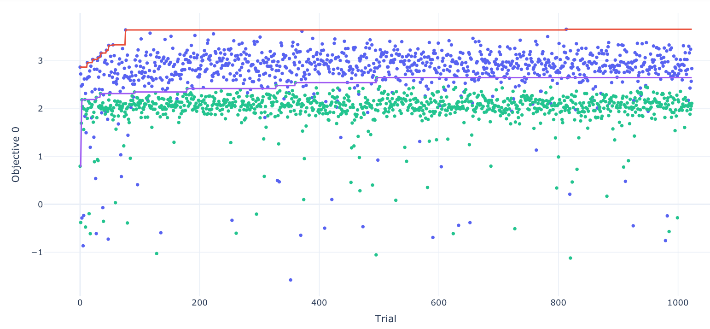

# 祝纪元20250425报告
## 使用 2012-2016 年作为 valid 数据集划分的表现

实验设置：
使用 variance preserving 初始化，其中 gain 的设置为通过我们数据集计算出的 alpha = 0.2501，数据集为 49 特征数据集，处理方式为 `clip(-0.2, 0.2)`。

下图绿色为 MLP 表现蓝色为 KAN 表现：

# A Bidirectional Differential Evolution-Based Unknown Cyberattack Detection System

IEEE Transactions on Evolutionary Computation, April 2025
[原文链接](https://ieeexplore.ieee.org/document/10433856)

## 本文提出的 BDE-IDS 中有关演化计算算子的细节

### A. Clustering of Self Antigens
使用 [Min-Max](https://en.wikipedia.org/wiki/Feature_scaling) 对原始数据归一化后，对 self antigens 进行 k-means 聚类，记为 $\mathbf{S}^{(1)}_{clu},\mathbf{S}^{(2)}_{clu},\dots ,\mathbf{S}^{(n_{clu})}_{clu}$，其中第 $k$ 个聚类对应的中心点记为 $\mathbf{c}^{(k)}_{clu}$，同时其对应的半径为：
$$
r^{(k)}_{clu}= \max_{g_s^{i_k} \in \mathbf{S}^{(k)}_{clu}} \parallel  c^{(k)}_{clu} - g_s^{i_k} \parallel_{2}
$$

### B. Bidirectional Differential Evolution for Nonself Antigens
BDE 算法旨在从已知的抗原中创造可能的未知非自身抗原。BDE 算法的初始种群为所有已知的非自身抗原集合的子集，即 $\mathbf{G}_{ini} \in \mathbf{N}_{tr}$，与此同时，我们希望新创造的抗原离已知的自身抗原尽可能远，离已知的非自身抗原尽可能进。

**突变 Mutation**
BDE 过程包含 FDE（forward differential evolution）与 RDE（reverse differential evolution）两个过程，其中 FDE 的目标为创造离已知抗原更近的抗原，RDE 的目标为创造离自身抗原和已知非自身抗原更远的抗原。

对于第 $k$ 个簇，即 $\mathbf{S}^{(k)}_{clu}$，定义第 $t$ 代的 RDE 和 FDE 的种群为 $\mathbf{P}^{(k)}_{fde}(t)$ 和 $\mathbf{P}^{(k)}_{rde}(t)$。注意到第一代即（$t=1$）时，$\mathbf{P}^{(k)}_{fde}(t)=\mathbf{P}^{(k)}_{rde}(t)=\mathbf{G}_{ini}$。

对于前向过程 FDE 和反向过程 RDE，二者的突变策略是分开的，但形式类似，均为从父辈种群的随机组合，其中 RDE 的突变向量为：
$$
\begin{align*} \boldsymbol {v}^{\left ({k,l_{\text {r}}}\right)}_{\text {rde}}(t)=&\lambda _{1} \times \left [{ \boldsymbol {p}^{\left ({k,l_{\text {r}}}\right)}_{\text {rde}}(t) - \boldsymbol {g}^{\left ({i_{k}}\right)}_{\text {s}} }\right] \\&{} + \lambda _{2} \times \left [{ \boldsymbol {p}^{\left ({k,l^{\prime }_{\text {r}}}\right)}_{\text {rde}}(t) - \boldsymbol {p}^{\left ({k,l^{\prime \prime }_{\text {r}}}\right)}_{\text {rde}}(t) }\right] \end{align*}
$$
其中 $\boldsymbol {p}^{\left ({k,l^{\prime }_{\text {r}}}\right)}_{\text {rde}}(t), \; \; \boldsymbol {p}^{\left ({k,l^{\prime \prime }_{\text {r}}}\right)}_{\text {rde}}(t)$ 为对应第 $k$ 个簇的 RDE 的父代种群中的两个随机个体。将突变向量加上父代个体得到突变抗原：
$$
\begin{equation*} \boldsymbol {m}^{\left ({k,l_{\text {r}}}\right)}_{\text {rde}}(t) = \boldsymbol {p}^{\left ({k,l_{\text {r}}}\right)}_{\text {rde}}(t) + \boldsymbol {v}^{\left ({k,l_{\text {r}}}\right)}_{\text {rde}}(t). \end{equation*}
$$
对于 FDE 来说，其突变向量服从类似规则：仅在第一项上符号相反：
$$
\begin{align*} \boldsymbol {v}^{\left ({k,l_{\text {f}}}\right)}_{\text {fde}}(t)=&\lambda _{3} \times \left [{ \boldsymbol {g}^{\left ({i_{k}}\right)}_{\text {s}} - \boldsymbol {p}^{\left ({k,l_{\text {f}}}\right)}_{\text {fde}}(t) }\right] \\&{}+ \lambda _{4} \times \left [{ \boldsymbol {p}^{\left ({k,l^{\prime }_{\text {f}}}\right)}_{\text {fde}}(t) - \boldsymbol {p}^{\left ({k,l^{\prime \prime }_{\text {f}}}\right)}_{\text {fde}}(t) }\right] \end{align*}
$$
其对应的突变抗原为：
$$
\begin{equation*} \boldsymbol {m}^{\left ({k,l_{\text {f}}}\right)}_{\text {fde}}(t) = \boldsymbol {p}^{\left ({k,l_{\text {f}}}\right)}_{\text {fde}}(t) + \boldsymbol {v}^{\left ({k,l_{\text {f}}}\right)}_{\text {fde}}(t). \end{equation*}
$$

**交叉 Crossover**
注意在 mutation 过程中得到的突变抗原仍非我们最终用于测试的个体，最终测试个体 $u$ 由以下过程交叉过程生成：
$$
\begin{align*} u^{\left ({k,l_{\text {r}},d}\right)}_{\text {rde}}(t)=&\begin{cases} m^{\left ({k,l_{\text {r}},d}\right)}_{\text {rde}}(t),& {\mathrm {if}} ~\rho _{\text {rand}} \le \rho _{\text {cr}} ~\text {or} ~d = d_{\text {rand}} \\ p^{\left ({k,l_{\text {r}},d}\right)}_{\text {rde}}(t),& {\mathrm {otherwise}} \end{cases} \tag{11}\\ u^{\left ({k,l_{\text {f}},d}\right)}_{\text {fde}}(t)=&\begin{cases} m^{\left ({k,l_{\text {f}},d}\right)}_{\text {fde}}(t),& {\mathrm {if}} ~\rho _{\text {rand}} \le \rho _{\text {cr}} ~\text {or} ~d = d_{\text {rand}} \\ p^{\left ({k,l_{\text {f}},d}\right)}_{\text {fde}}(t),& {\mathrm {otherwise}} \end{cases} \tag{12}\end{align*}
$$
其中 $d$ 的含义为第 $d$ 个维度，即第 $d$ 个位置的坐标。$\rho_{\text{cr}}$ 为超参数交叉率，$\rho_{\text{rand}}$ 为随机概率，随机整数 $d_{\text{rand}}\in [1, n_d]$ 保证至少有一个维度是来自于突变抗原。

**选择 Selection**
在设定 RDE 的目标函数时，一个朴素的想法是希望新个体与簇的中心距离越大越好，即：
$$
\begin{equation*} \mathcal {F}^{(k)}_{\text {rde}}\left ({\boldsymbol {x}}\right) = \| \boldsymbol {x} - \boldsymbol {c}^{(k)}_{\text {clu}} \|_{2} \tag{13}\end{equation*}
$$
需注意到先前数据已经做过 Min-Max 归一化，其所有坐标都在 $[0,1]$ 之间，因此二者最远的距离实际上为 $\sqrt{n_d}$，由此真正的满足 RDE 条件的个体应为：
$$
\begin{equation*} \mathcal {F}^{(k)}_{\text {rde}}\left ({\boldsymbol {p}^{(k,l_{\text {r}})}_{\text {rde}}(t)}\right) < \mathcal {F}^{(k)}_{\text {rde}}\left ({\boldsymbol {u}^{(k,l_{\text {r}})}_{\text {rde}}(t)}\right) < \rho _{\text {rde}} \times \sqrt {n_{\text {d}}} \tag{14}\end{equation*}
$$
其中 $\rho_{\text{rde}}$ 为调整系数，取值在 $[1,2]$。

对于 FDE 类似，其目标函数为 RDE 目标函数的倒数：
$$
\begin{equation*} \mathcal {F}^{(k)}_{\text {fde}}(\boldsymbol {x}) = 1 \div \| \boldsymbol {x} - \boldsymbol {c}^{(k)}_{\text {clu}} \|_{2}. \tag{15}\end{equation*}
$$
考虑归一化后的坐标，满足条件的个体为：
$$
\begin{equation*} \mathcal {F}^{(k)}_{\text {fde}}\left ({\boldsymbol {p}^{(k,l_{\text {f}})}_{\text {fde}}(t)}\right) < \mathcal {F}^{(k)}_{\text {fde}}\left ({\boldsymbol {u}^{(k,l_{\text {f}})}_{\text {fde}}(t)}\right) < 1 \div \left ({\rho _{\text {fde}} \times r^{(k)}_{\text {clu}}}\right) \tag{16}\end{equation*}
$$
将经过 $t$ 期的进化后的个体集合记为：
$$
\begin{equation*} \mathbf {G}^{(k)}_{\text {bde}}(t) = \mathbf {G}^{(k)}_{\text {rde}}(t) \bigcup \mathbf {G}^{(k)}_{\text {fde}}(t). \tag{17}\end{equation*}
$$
当某个 $t$ 期的进化个体集合为空集时，终止对第 $k$ 个簇的进化过程，同时开启对第 $k+1$ 个簇的进化。