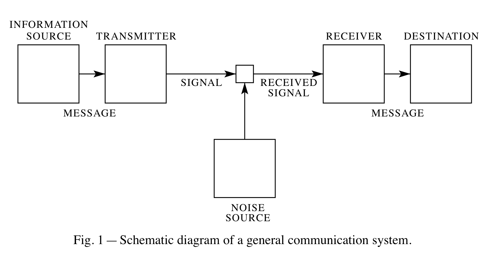

# A Mathematical Theory of Communication
- C.E. SHANNON
- The Bell System Technical Journal 1948

## Introduction
**Points:**

- 通信的基本问题: 在某个点完全或近似重构在另一个点选择的消息（message）。
- 【真实消息】是【可能消息】集合中的一个元素。
- 系统必须被设计为可以处理所有【可能消息】。
- 当在可能消息的集合中选择一个消息，就产生了【信息】，所有选择的可能性是相等的。
- 如果消息集合中的元素个数是 finite 的，那么这个个数或任何这个个数的单调函数都可以是信息的度量（measure of the information）。
- 使用对数度量有以下好处：
  1. 贴近实践
  2. 符合直觉
  3. 数学上的处理更加容易

### General Communication System:

*Information source* 产生消息（message）。消息的实例可以有：字母序列；关于时间的函数 $f(t)$；关于时间与其他变量的函数；多个关于多个变量的函数。

*Transmitter* 将消息（message）加工为信号（signal），使得其更适于在信道（channel）中传输。

*Channel* 用来传输信号的介质，如电线、光缆、射频带。

*Recevier* 从信号中重构消息。

*Destination* 这个消息所指向（intended）的人或实体

## Part 1: Discrete Noiseless Systems
### The Discrete Noiseless Channel
离散信道的实例可以是电报。

一般来说，离散信道（discrete channel）的含义为可以点对点传输对一个由基本符号 $S_1, \dots,S_n$组成的有限集合选择序列的一个系统。其中每一个信号 $S_i$ 都对应一个持续时间 $t_i$。

注意到每一个信号的持续时间不必相同，具体取决于如何编码，如 elementary signal 可以是固定长 5 秒，每一秒都携带 1 bit 的信息，也可以是不定长度。

> *Generally, a discrete channel means a system whereby a sequence of choices from a finite set of elementary symbols $S_1, \dots,S_n$ can be transmitted from one point to another.*

现考虑如下问题：如何度量这样的离散信道传输信息的容量（capacity）。对于固定持续时长的基本信号集合，且每个信号包含 $k$ bit 的信息，则对于一个可以每秒传输 $n$ 个基本信号的信道，其容量为 $kn$ bits 每秒。

在更一般的情形下，即信号的长度可以可以不同且仅允许特定可行的选择序列在信道中传输，如下定义信道容量：

 *Definition: The capacity $C$ of a discrete channel is give by:
 $$
 C=\lim_{T\rightarrow \infty}\frac{\log N(T)}{T}
 $$
 where $N(T)$ is the number of allowed signals of duration $T$.*

假设所有 sequence 都是可行的（allowed），那么经过 $t$ 时间，所有可能出现的信号序列的个数 $N(t)$ 为：
$$
N(t)=N(t-t_1)+N(t-t_2)+\cdots +N(t-t_n)
$$
其中 $N(t=t_i)$ 的含义显然为 $t$ 时期传输的序列以信号 $S_i$ 为结尾序列的所有可能的个数。对于一个较大的 $t$ 来说，$N(t)$ 将会渐近至 $X^t_0$，其中 $X_0$ 是如下特征方程的最大实数解：
$$
X^{-t_1}+X^{-t_2}+\cdots +X^{-t_n}=1
$$
在由 capacity 的定义可得到：
$$
C=\lim_{T\rightarrow \infty}\frac{\log N(T)}{T}=\log X_0.
$$

>[!TIP]此处假设了 $N(t)$ 与 $t$ 的关系是近似指数的，即 $N(t) \approx AX^t$，在线性递推关系中，尤其是具有固定形式的递推关系时，指数形式的解是自然的猜测。将解的指数形式带入递推关系有
$$
AX^t=AX^{t-t_1}+AX^{t-t_2}+\cdots+AX^{t-t_n}\\
\;\\
X^{-t_1}+X^{-t_2}+\cdots +X^{-t_n}=1.
$$

现设想一种稍微更复杂的情形，想象有存在一系列状态（state）$a_1, a_2, \dots,a_m$，对于每一个状态都存在对应的被允许在信道内传输的一个序列的集合。状态 $a_i$ 到状态 $a_j$ 的转移同时由状态 $a_i$ 与一个传输的特定信号所决定。

<em>**Theorem 1:** Let $b^{(s)}_{ij}$ be the duration of the $s^{th}$ symbol which is allowable in state $i$ and leads to state $j$. Then the channel capacity $C$ is allowed to $\log W$ where $W$ is the largest real root of the determinant equation:
$$
\lvert \sum_S W^{-b^{(s)}_{ij}} - \delta_{ij} \rvert = 0
$$
where $\delta_{ij}=1$ if $i=j$ and is zero otherwise.</em>

**Proof of Theorem 1** The Growth of the Number of Block of Symbols with a Finite State Condition

令 $N_i(L)$ 为以转移至状态 $i$ 为结尾且长度为 $L$ 的符号块（blocks of symbols）的所有可能的数量。则我们有如下递推关系，
$$
N_j(L)=\sum_{i,S}N_i(L-b^{(s)}_{ij})
$$
其中 $b^1_{ij},b^2_{ij},\dots ,b^m_{ij}$ 表示一些特别的符号（symbol）的长度，这些特别的符号在状态 $i$ 中是被允许的（allowed），并可以引导至状态 $j$。如上递推关系满足线性差分方程（linear difference equation），利用其性质可以得到当 $L\rightarrow \infty$ 时必有如下形式
$$
N_j=A_jW^L.
$$
带入有
$$
A_jW^L=\sum_{i,S}A_iW^{L-b^{(s)}_{ij}}\\
\;\\
A_j=\sum_{i,S}A_iW^{-b^{(s)}_{ij}}\\
$$
引入 Kronecker Delta：
$$
\delta_{ij}= \begin{cases}
1,\quad & i=j \\
0,\quad & i \neq j
\end{cases} 
$$
显然存在恒等式
$$
A_j=\sum_i \delta_{ij}A_i
$$
带入有
$$
\sum_i(\sum_SW^{-b^{(s)}_{ij}}-\delta_{ij})A_i=0.
$$
对于所有的状态 $j$，都满足该方程，对于这组方程可以被表示为一个矩阵方程
$$
\mathbf{M}\cdot \mathbf{A}=\mathbf{0}
$$
- $\mathbf{M}$ 为 $m\times m$ 的矩阵，$m$ 为状态的数量，其每一个元素为 $M_{ji}=\sum_SW^{-b^{(s)}_{ij}}-\delta_{ij}.$
- $\mathbf{A}$ 为 $m\times 1$ 的向量，其每一个元素为 $A_j.$
  
注意到该矩阵方程有非平凡（non-trivial）解的条件为 $det(\mathbf{M})=0$ ,也就是说 $\mathbf{M}$ 必须是奇异矩阵，若 $\mathbf{M}$ 为非奇异，只会存在平凡解 $\mathbf{A}=\mathbf{0}.$

由此条件，我们可以确定 $W$，也就是方程 $det(\mathbf{M})=0$ 的最大实数根。

回到 capacity，可以得到
$$
C=\lim_{L\rightarrow\infty}\frac{\log \sum A_jW^L}{L}=
\lim_{L\rightarrow\infty}(\frac{\log W^L}{L}+\frac{\log \sum A_j}{L})
=\log W.
$$

### The Discrete Source of Information

上方的讨论已经展示了，在离散情况下，一个信道中，所传输的所有可能的信号的个数的对数与时间呈线性关系。在本节中将讨论如何使用数学语言刻画信息源 information source，以及要回答这样一个问题：对于一个给定的信息源，每秒可以产生多少 bit 的信息。问题的关键在于如何有效利用信息源的统计特征，使得我们可以通过适当的编码，最大化利用信道的 capacity（reducing the required capacity of the channel）。

>[!NOTE]如在英文中字母 E 的出现频率最高，Q，X，Y，出现频率低，则可以使用较短的符号编码 E 这个消息，使用较长的符号编码 Q，X，Y。

任何可以从一个有限集合中产生符号序列的随机过程都可以被认为是一个信息源。该生成过程可以使用马尔可夫链中的状态转移矩阵描述。
> *Any stochastic process which produces a discrete sequence of symbols chosen from a finite set may be considered a discrete source.*

### The Series of Approximations to English

全部是举例，不再做笔记，可参阅原文。

### Graphical Representation of a Markoff Process

离散的信息源可以被一个马尔可夫过程描述，马尔可夫的状态转移可以用图表示。

### Ergodic and Mixed Sources

一个遍历过程（ergodic process）所产生的所有序列（sequence）都有相同的统计性质（same statistical properities）。

如果一个图（graph）存在如下性质，则其对应的过程（process）是遍历的：
1. 不存在两个孤立的部分（isolated parts），即不存在这样两个部分 A 与 B，使得任意在 A 部分的连接点（junction points）可以通过图中带方向的箭头抵达 B 部分中的任意连接点，B 部分的链接点也同样不能抵达 A 部分的连接点。
2. 图中所有回路（circuit）的长度的最大公约数为 1。回路的每条边都是同向并且是闭合的。实例：Fig 5 中的 BEBES series。

>[!NOTE]考虑这样一个序列，存在 *ac* 三种状态，$p_a(b)=1/3,\;p_a(c)=2/3,\;p_b(a)=p_c(a)=1$，则其一个典型的实例很可能是 *abacacacabacababacac*。显然该序列满足性质 1，但不满足性质 2。对于该序列如果固定采样间隔为 $2k$，则其该序列的采样的统计性质随着会随着起始点是否为 *a* 变化而变化，不存在统计同质性。

如果有一类信息源产生的序列不满足性质 1，但可以将其分成多个满足性质 1 的子图（subgraph），并且这些子图都满足性质 2。则定义该一类信息源为由一组纯净部分（pure components）组成的混合信息源（mixed source）。对于混合信息源 $L$ 及其组成成分 $L_1,L_2,L_3,\dots$，可以表示为
$$
L=p_1L_1+p_2L_2+p_3L_3\dots
$$
其中 $p_i$ 是 $L_i$ 的概率。

除非特意注明，本文所有讨论的信息源都为遍历信息源。对于一个遍历信息源，有如下性质。令 $P_i$ 为状态（state）$i$ 的概率，则在平稳时必有如下 equilibrium conditions：
$$
P_j = \sum_i P_ip_i(j).
$$
其展示了在 $N\rightarrow \infty$ 时，经过 $N$ 个符号（symbols）后处于状态 $j$ 的概率，即 $P_j(N)$。