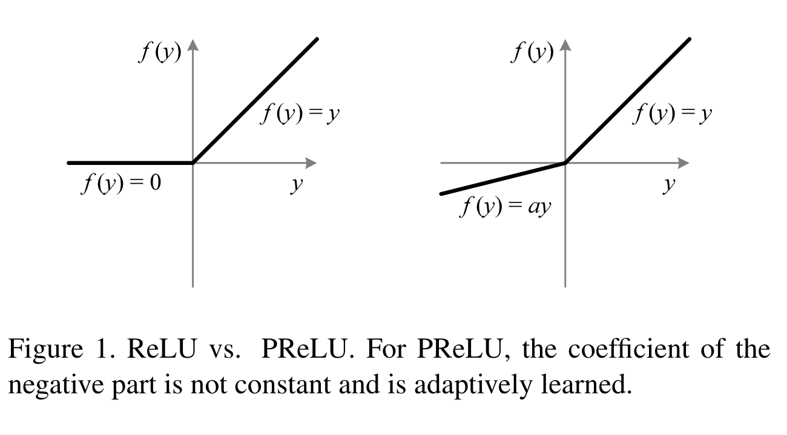

 # Delving Deep into Rectifiers: Surpassing Human-Level Performance on ImageNet Classification
ICCV 2015, Microsoft Research
- Kaiming He
- Xiangyu Zhang
- Shaoqing Ren
- Jian Sun

## Introduction
标题中的 Rectifiers 主要指的是 ReLU 等激活函数及其变体。本工作主要包含两部分：提出 Parametric ReLU，以及一个新的初始化方法。

与 sigmoid 类激活函数相比，Rectified Linear Unit（ReLU）加速了深度网络的收敛，并且可以得到更好的 solution。

本文提出的 *Parametric Rectified Linear Unit* （PReLU）可以自适应学习激活函数的参数，在只需要增加极小一部分参数量的情况下提高模型准确率。同时本文新提出的初始化方法可以加速非常深的网络（30 层）的收敛速度。

## Parametric ReLU
PReLU：
$$
f\left(y_i\right)= \begin{cases}y_i, & \text { if } y_i>0 \\ a_i y_i, & \text { if } y_i \leq 0\end{cases}
$$
其中 $a_i$ 是可学习的参数，如果 $a_i=0$，则其实际上为传统的 ReLU，如果 $a_i$ 是一个固定的且值比较小的数，则其实际上为 LeakyReLU。上式实际上也可以写为：
$$
f(y_i)=\text{max}(0, y_i)+ a_i \text{min}(0,y_i)
$$

使用 LeakyReLU 的目的为避免梯度为 0，而本文将 LeakyReLU 的小于 0 的部分的参数设置为可学习的参数，希望如此可以在端到端的训练中得到（每个任务专门）对应的激活。
> We hope for end-to-end training that will lead to more specialized activations.

## Initialization of Filter Weights for Rectifiers
本部分提出的初始化方法的中心思想在于 layer 输出的方差应保持不变。
> A proper initialization method should avoid or magnifying the magnitudes of input signals exponentially.

### Forward Propagation Case
对于一个卷积层，其在激活前的响应为：
$$
\mathbf{y}_l = W_l\mathbf{x}_l+\mathbf{b}_l.
$$
其中 $l$ 为 layer 的 index。$\mathbf{x}_l=f(\mathbf{y}_l)$，$f$ 为激活函数。假设 $\mathbf{x}_l$ 中的元素是互相独立的（mutually independent），则有：
$$
Var[y_l]=n_lVar[w_lx_l],
$$
其中 $n_l$ 为原文中写为 connection 的个数，实际上在线性全连接层中应该理解为输入维度 $d_in$。如令 $w_l$ 的均值为 0 则可以有：
$$
Var[y_l]=n_lVar[w_l]E[x_l]^2
$$
注意到由于使用的是 ReLU 激活函数，所以可以有 $E[x_l]^2=\frac{1}{2}Var[y_{l-1}]$，由此我们可以得到：
$$
Var[y_l]=\frac{1}{2}n_lVar[w_l]Var[y_{l-1}].
$$
先将两层之间的关系递推到所有层则有：
$$
\operatorname{Var}\left[y_L\right]=\operatorname{Var}\left[y_1\right]\left(\prod_{l=2}^L \frac{1}{2} n_l \operatorname{Var}\left[w_l\right]\right) .
$$
那么为满足方差不变需要有：
$$
\frac{1}{2} n_l \operatorname{Var}\left[w_l\right]=1,\;\; \forall l.
$$
那么现在可以得到初始化方法 $w\sim \mathcal{N}(0, \sqrt{2/n_l})$，且网络 bias 为 0。

### Backward Propagation Case
