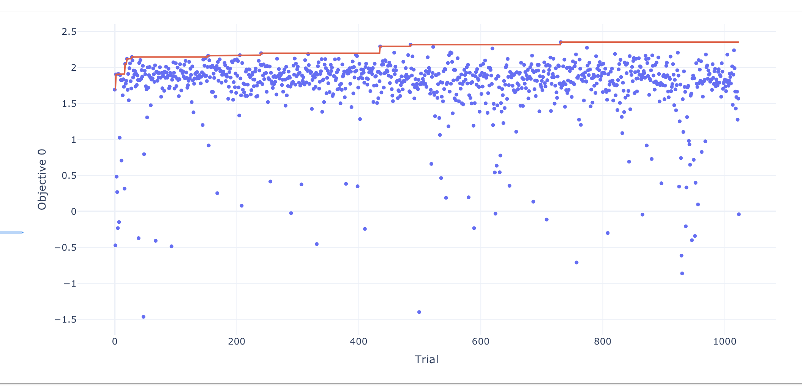
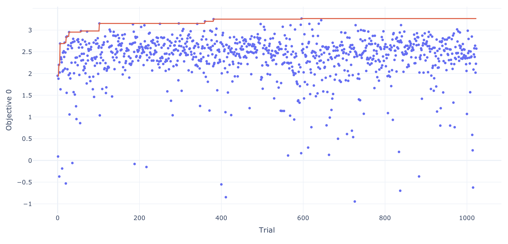
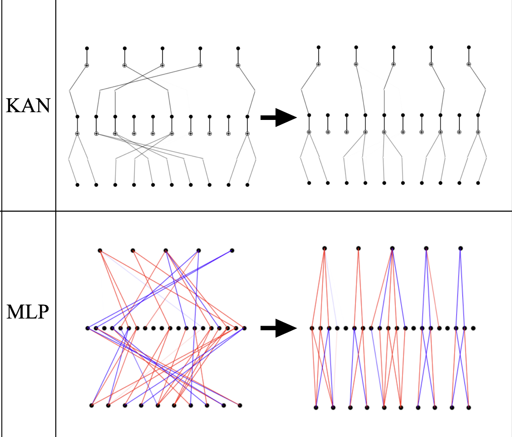

# 祝纪元20250307报告
## Empirically KAN 与 MLP 的表现差异
从 Sharpe 来看 MLP 集中在在 1.7 - 2 这个区间， KAN 集中在 2-3 这个区间，下图为这两天跑的 1024 次 trial，未做 permutation 特征选择的分布情况。MLP 分布更为集中，对超参数和随机种子更不敏感。

**MLP**

**KAN**

## Key Points on KAN 2.0 Part 3: Science to KANs
### 3.1 Adding important features to KANs
在网络中加入先验。如原始回归任务为找到 $f$ 有 $y = f(x)$，增加辅助变量 $a=a(x)$，则新任务为找到 $f$ 有 $y = f(x, a)$。注意到此处的 $a(x)$ 的形式已知。（跟特征工程有什么区别？）

### 3.2 Building modular structures to KANs
除了 KAN 的作者把每一个模块称呼为函数之外，没看出来跟 MLP 的模块化有啥区别。

### 3.3 Compiling symbolic formulas to KANs
将用符号表示的方程编译为 KAN，同时可以使用 `expand_width` 和 `expand_depth` 方法增加编译后的网络的弹性。

## Part 4: KANs to Science
### 4.1 Identifying important features from KANs
在 KAN 1.0 中定义激活值的标准差作为节点和边的 importance 存在缺陷。即可能存在这样一种情况，一个有大标准差的节点的输出值输入进的是一个恒为 0 的函数，显然此时使用标准差作为重要性的度量有失偏颇。

对其进行修正有：
$$
B_{l-1, i, j}=A_{l, j} \frac{E_{l, j}}{N_{l+1, j}}, \quad A_{l-1, i}=\sum_{j=0}^{n_l} B_{l-1, i, j}, \quad l=L, L-1, \cdots, 1 .
$$
其中:
- $A$ 为节点 score
- $B$ 为边 score
- $E$ 为边标准差
- $N$ 为节点标准差

并设定最后一层（即 $L$ 层）的所有节点 score 为 1，由此便可由上式递推得到各节点与边的 score。

### 4.2 Identifying modular structures from KANs

#### 4.2.1 Anatomical modularity
通过画一个更好的图，可以让人的肉眼（原文就是 visually）看出网络中模块化的成分。（reveals the modular struture）。注意到这是个对 MLP 和 KAN 都适用的方法。有意思的是作者刘子鸣 et al. 在文中举例说 KAN 画出来的图更简单，实际上 KAN
 的激活函数中大量 learnable parameters 没有被画出来。

#### 4.2.2 Functional modularity
用数学语言形式化定义了 3.1 和 3.2 中的内容。

### 4.3 Identifying symbolic formulas from KANs

**Trick A: discover and leverage modular structures** 
先使用 4.2 中的画图，肉眼瞪出可能存在的模块化结构，然后再以此作为先验知识设计个新的模块化网络并训练。

**Trick B: Sparse initialization**
利用 symbolic formula 对应的 KAN 结构通常是稀疏的，所以初始化 KAN 的时候直接稀疏初始化。

**Trick C: Hypothesis Testing**
用于测试 3.1 中的先验 $a(x)$ （我愿称之为特征工程）选的对不对，方法（这算方法吗？）就是都测试一边，看哪个 loss 更小。