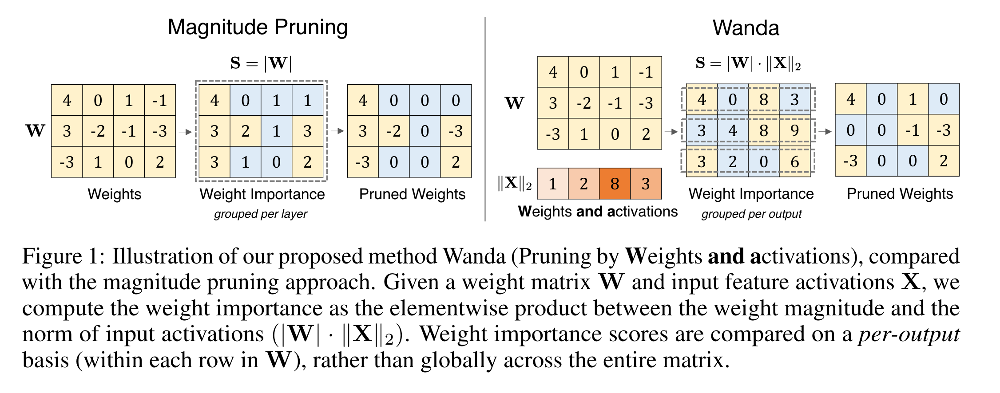

# Mini Survey on Prune Methods

## The Lottery Ticket Hypothesis: Finding Sparse, Trainable Neural Networks
- MIT CSAIL
- ICLR 2019
- Cite: 4000+

#### Hypothesis
一个训练好的网络中存在一个子网络（subnetworks），其能力不弱于完整网络。

#### Identifying winner subnetworks
1. 随机初始化参数 $\theta_0$，
2. 迭代 j 次至 $\theta_j$，
3. 根据权重的绝对值，取每一层的 low-k 个权重剪枝，
4. 修剪后的模型重新初始化参数至 $\theta_0$，
5. 重新训练并重复上述步骤

#### Findings
必须要求修剪后参数初始化保持一致，如果重新随机初始化，模型表现将偏离原始模型。

## A Simple and Effective Pruning Approach for Large Language Models
- CMU, Meta, Bosch
- ICLR 2024
- Cite: 500+

#### Contribution
- 传统方法根据权重绝对值大小进行剪枝，然而较小的权重不一定对预测的影响小，这是由于输出等于权重乘以输入值，因此本文根据此指标构建对权重参数新的剪枝依据。
- 在稀疏操作的分组上，本文将输出的 tensor 的每一个 item 所对应的参数分为一组。如果系数比率设定为 0.5，则按照计算出的 score 大小将该组中一半的参数设置为 0。

计算 score：
$$
\mathbf{S}_{ij}=| \mathbf{W}_{ij} | \cdot \left \| \mathbf{X}_j \right \|_2
$$
其中 $\mathbf{X}$ 为输入。

