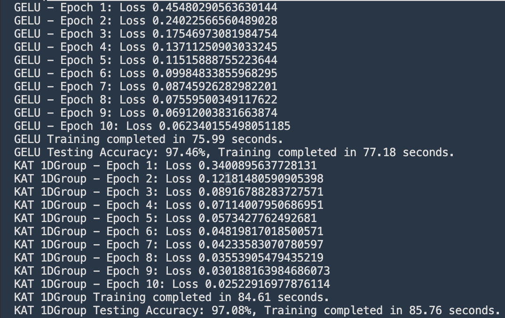

# 祝纪元20250325报告
## Kolmogorov-Arnold Transformer
ICLR 2025
- Xingyi Yang, NUS
- Xinchao Wang, NUS

本文主要工作为将 KAN 改进为 GRKAN，其不同的特性为边共享参数（group）和有理数激活函数（rational）。并将 GRKAN 代替 Transformer 中最后的 MLP 层。

## Why original KAN fails to scale?

#### B-spline is not GPU friendly.
KAN 中使用 B-spline 函数需要递归计算，与现代 GPU 的并行计算架构并不兼容。

#### Parameter and Computation Inefficiency.
参数量：KAN 所需的参数量 $O(G+K)$ 倍于 MLP，其中 $G$ 为 grid 的数量，$K$ 为阶数。

计算量：KAN 所需的计算量 $O(GK)$ 倍于 MLP。

#### Weights are not Properly Initialized
综合 LeCun，Bengio，Kaiming He 等人的观点，初始化模型参数的一个基本原则是保证 *variance-preserving*，也就是说，不论在前向还是后向过程中，信号的方差在不同层之间的转播应该保持不变。该基本原则目的也是为了保证激活值和参数在不同 layer 之间传递的稳定性。

原始的 KAN 并不满足该基本准则。初始的 B-spline 系数 $c_i$ 从 $\mathcal{N}(0, \sigma^2)$ 分布中采样，其中 $\sigma = 0.1$，而 base function 和 B-spline 函数的权重初始化则依据 Xavier 初始化，分别为 $w_s=1$ 和 $w_b \sim U \left [-\frac{6}{\sqrt{d_{in}+d_{out}}}, \frac{6}{\sqrt{d_{in}+d_{out}}} \right ]$，那么由此可以得到
$$
{Var}[\phi(x)]={Var}\left[w_b \operatorname{silu} (x)\right]+{Var}\left[w_s \operatorname{spline}(x)\right]=3 \mathbb{E}\left[\operatorname{silu}^2(x)\right]+\mathbb{E}\left[\operatorname{spline}^2(x)\right]
$$
>[!attention] 要推导出上式，隐含假设为 $d_{in}+d_{out}=4$.

现假设输出 $x\sim \mathcal{N}(0,\sigma_x^2)$，且 B-spline 的阶数 $k=0$，则有：
$$
\mathbb{E}[\text{spline}^2(x)]=\sum_i c^2_i Var[B_i(x)]=\sigma^2\sum_i Var[B_i(x)]=\sigma^2=0.01
$$
对于基函数也就是 SiLU，其方差可以由数值方法得到为 $\mathbb{E}(\text{silu}^2(x))\approx 0.355\sigma^2_x$. 那么结合基函数和样条函数的方差可以得到 $Var[\phi(x)]\approx 0.01+1.064\sigma_x^2 \neq Var[x]$

## Kolmogorov-Arnold Transformer
本文工作只是把 vision transformer 中最后的 MLP 模块更换为 GRKAN 模块。
#### Rational Base Functions
将边的连接从 B-spline 函数更换为如下的多项式基函数：
$$
\phi(x)=w F(x)=w \frac{P(x)}{Q(x)}=w \frac{a_0+a_1 x+\cdots+a_m x^m}{b_0+b_1 x+\cdots+b_n x^n}
$$
其中 $a_m$，$b_n$，$w$ 是要通过反向传播学习的参数。在具体实现细节上，使用的是来自 2020 ICLR *End-toend learning of flexible activation functions in deep networks* 中的 Safe Pade Activation Unit (PAU)：
$$
F(x)=\frac{a_0+a_1 x+\cdots+a_m x^m}{1+ | b_1 x+\cdots+b_n x^n |}.
$$

除了 GPU 友好之外，有两篇数学期刊上的成果（American Mathematical Soc. 1935 和 Journal of Mathematical Analysis and Applications 1961）表明在面对奇异和陡峭的函数时，有理基函数比多项式函数有更好的拟合效率和准确性。

#### Group KAN
将两层之间所有的链接分为 $g$ 个 group，相同 group 中的链接参数相同。也就是说两层之前原来需要学习 $d_{in}\times d_{out}$ 个激活函数，现在只需要学习 $g$ 个。

#### Variance-Preserving Initialization
在这一部分工作中，作者将 Kaiming 初始化的思想引入到 KAN 中，即 variance-preserving，输出层方差等于输入层方差：
$$
Var[y]=d_{in}Var[w]\mathbb{E}[F(x)^2]=Var[x]
$$
显然，$Var[y]$ 由两个部分决定，即 $w$ 和 $F(x)$ 的参数 $a$，$b$。具体来看，本工作先初始化 $a$，$b$ 使 $F(x)$ 拟合传统上的 ReLU、SiLU 等激活函数，此时得到 $a$，$b$ 后计算增益量（gain）$\alpha = \frac{\mathbb{E}[F(x)^2]}{Var[x]}$，并从分布 $\mathcal{N}(0, \frac{\alpha}{d_{in}})$ 初始化参数 $w$.

>[!NOTE]上方的推导包含的假设有：模型存在 Layernorm 即 $x\sim \mathcal{N}(0,1)$，$x$ 的分量即 $x_i$ 之间互相独立，$x_i$ 服从均匀分布。

除此之外，作者还使用预训练的 ViT 模型初始化。

## 实验部分
我自己在 mnist 数据集上跑不知道为什么不论是时间还是准确率都不如 GELU。。。
