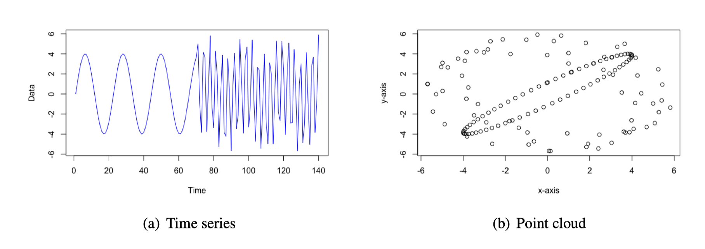

### 正弦波变换成椭圆了吗？

(a) 子图中先出现的正弦波在 $x$ 时刻与 $lag=T$ 时的采样分别记为：
$$
m=\sin(ax+b),\;n=\sin(ax+b +T)
$$
不妨令：$ax+b=f$ 则有，
$$
m=\sin{f},\;n=\sin(f+T)\\
$$
展开可得到：
$$
\sin(f+T)=\sin{f}\cos{T}+\cos{f}\sin{T}=m\cos{T}+\cos{f}\sin{T}=n \\
\;\\
\cos f = \frac{n-m\cos T}{\sin T}
$$
注意到 $\sin^2f+\cos^2f=1$，
$$
m^2+(\frac{n-m\cos T}{\sin T})^2=1
$$
化简得到
$$
m^2+n^2-2\cos T mn-\sin^2 T=0
$$
由此可以得到 $m,n$ 满足椭圆一般方程 
$$
Ax^2+By^2+Cxy+Dx+Ey+F=0
$$
### 什么时候是个圆？
当选取的 lag 与正弦波的 $a$ 满足如下条件时，
$$
T=\frac{\pi}{2a}+\frac{k\pi}{a}
$$
即$-2\cos T=0$ 时，$m,n$ 在一个圆上。

### 时序增强

**CNN平移不变性：** 在原始架构中，其平移不变性来源于两方面，一是卷积核对特征提取位置信息的不敏感，二是 Maxpooling，其会提取感受野内的最大值作为下一层的输入。其平移不变性的能力主要受制于 Maxpooling 的感受野。

在本任务中，输入为一个包含时序信息的图像，实证结果表明，输入长度为 5 天的图像效果大于 20 天，20 天的又要优于 60 天的。这也一定程度上符合直觉。尝试对输入图像进行增强，对 $H\times W$ 的输入，乘以一个 $W\times 1$ 的可学习参数，即从时序上增强。

**实证结果：**
**benchmark (eca)：**
| {}   | Ret   | Std  | SR    |
|------|-------|------|-------|
| Low  | -0.33 | 0.17 | -1.98 |
| 2    | -0.03 | 0.18 | -0.17 |
| 3    | 0.03  | 0.18 | 0.18  |
| 4    | 0.09  | 0.18 | 0.51  |
| 5    | 0.13  | 0.19 | 0.70  |
| 6    | 0.16  | 0.19 | 0.85  |
| 7    | 0.19  | 0.19 | 1.00  |
| 8    | 0.22  | 0.19 | 1.18  |
| 9    | 0.26  | 0.19 | 1.42  |
| High | 0.48  | 0.18 | 2.66  |
| H-L  | 0.81  | 0.12 | 6.55  |
    
**benckmark (og)**
| {}   | Ret   | Std  | SR    |
|------|-------|------|-------|
| Low  | -0.33 | 0.16 | -2.01 |
| 2    | -0.04 | 0.18 | -0.22 |
| 3    | 0.04  | 0.18 | 0.21  |
| 4    | 0.09  | 0.19 | 0.49  |
| 5    | 0.13  | 0.19 | 0.68  |
| 6    | 0.15  | 0.19 | 0.82  |
| 7    | 0.18  | 0.19 | 0.97  |
| 8    | 0.22  | 0.19 | 1.17  |
| 9    | 0.27  | 0.19 | 1.47  |
| High | 0.49  | 0.18 | 2.73  |
| H-L  | 0.81  | 0.12 | 6.62  |

**"ts_attention"**
| {}   | Ret   | Std  | SR    |
|------|-------|------|-------|
| Low  | -0.33 | 0.17 | -1.95 |
| 2    | -0.04 | 0.18 | -0.22 |
| 3    | 0.04  | 0.18 | 0.20  |
| 4    | 0.09  | 0.18 | 0.49  |
| 5    | 0.13  | 0.19 | 0.68  |
| 6    | 0.15  | 0.19 | 0.82  |
| 7    | 0.19  | 0.19 | 1.02  |
| 8    | 0.22  | 0.19 | 1.17  |
| 9    | 0.27  | 0.18 | 1.45  |
| High | 0.49  | 0.18 | 2.70  |
| H-L  | 0.81  | 0.12 | 6.61  |

  <h2>简单的折叠</h2>
  
点击按钮内容会再显示与隐藏之间切换。

  <button type="button" class="btn btn-primary" data-bs-toggle="collapse" data-bs-target="#demo">展开</button>
  

hhhhh
  

