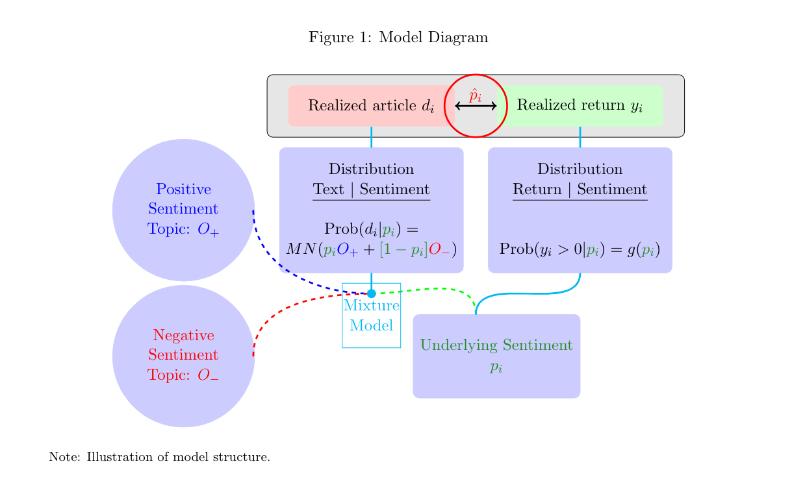
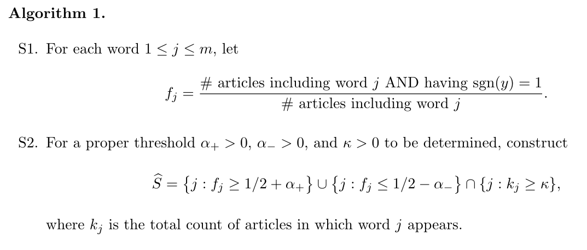

# Predicting Returns with Text Data

**Journal:**

NEBR working paper(Posted: 03 Sep 2019 Last Revised: 21 Jul 2023)

**Authors:**

- Zheng Tracy Ke:

  Harvard University

- Bryan T. Kelly:

  Yale SOM; AQR Capital Management, LLC; National Bureau of Economic Research (NBER)

- Dacheng Xiu:

  University of Chicago - Booth School of Business

## Abstract

We introduce a new text-mining methodology that extracts sentiment information from news articles to predict asset returns. Unlike more common sentiment scores used for stock return prediction (e.g., those sold by commercial vendors or built with dictionary-based methods), our supervised learning framework constructs a sentiment score that is specifically adapted to the problem of return prediction. Our method proceeds in three steps: 1) isolating a list of sentiment terms via predictive screening, 2) assigning sentiment weights to these words via topic modeling, and 3) aggregating terms into an article-level sentiment score via penalized likelihood. We derive theoretical guarantees on the accuracy of estimates from our model with minimal assumptions. In our empirical analysis, we text-mine one of the most actively monitored streams of news articles in the financial system|the Dow Jones Newswires|and show that our supervised sentiment model excels at extracting return-predictive signals in this context.

作者引入了一种新的文本挖掘方法，该方法从新闻文章中提取情感信息以预测资产回报。与用于股票回报预测的更常见的情感分数不同（例如，那些由商业供应商出售或使用基于词典的方法构建的情感分数），作者的监督学习框架构建了一个专门适用于回报预测问题的情感分数。方法分为三个步骤：1）通过predictive screening分离出一个情感词的表，2）通过topic modeling为这些词分配sentiment weights，3）通过penalized likelihood将词语聚合到文章级别的sentiment score。作者从模型中得出对估计准确性的理论保证，同时做出最小的假设。在实证分析中，作者使用道琼斯新闻社的文本数据，结果显示作者提出的有监督的sentiment model在提取回报预测信号方面表现出色。

## Introduction

> While the natural language processing and machine learning literature is growing increasingly sophisticated in its ability to model the subtle and complex nature of verbal communication, usage of textual analysis in empirical finance is in its infancy.

在机器学习与自然语言模型大行其道的当下，作者形容文本分析在金融实证研究的应用还是个婴儿。

Document sentiment scores在之前的研究中被用作一个辅助模型，用于分析例如金融市场中的信息传递现象的研究（Tetlock, 2014）。其他在这个领域比较有影响力的论文如Tetlock在2007年的工作和Loughran and McDonald在2011年的工作虽然取得了一些成果，但他们都还是用的过去的语料库去分析。

> In contrast with this literature, we develop a machine learning method to build context-specific sentiment scores. We construct and evaluate the performance of trading strategies that exploit our sentiment estimates, and find large economic gains, particularly out-of-sample. Finally, our analysis of the speed of news assimilation in asset prices contributes to the literature on information transmission in finance, as surveyed by Tetlo ck (2014).

这篇文章的主要贡献有：

- 使用机器学习方法构建特定上下文的sentiment scores构建投资组合，并且样本外收益效果拔群
- 分析了资产价格对新闻的吸收速度

模型优点有：

- 可解释性，作者提出的有监督模型是*”entirely white box“*
- 计算复杂度低，百万数量级的文档在笔记本长处理完只需几分钟
- 可自定义性，该模型允许其他使用者根据自己使用的文本数据进行调试，让研究者不再依赖第三方库

## Methodology

### Notation

考虑$n$ news articles 和 a dictionary of $m$ words。组成一个$n\times m$的矩阵$D = [d_1,\dots,d_n]'$。其中$d_{i,j}$表示第$i$篇文章中词语$j$出现的次数。文中有时还会用到 $D$ 的列的子集，这些列的索引的集合被定义为 $S$ 。分别定义这些子矩阵与子矩阵中第 $i$ 个列向量为$D._{,[S]}$和$d_{i,[S]}$ 。

作者使用的新闻数据中自带公司的tag，在这篇文章中，作者也只研究了含有该公司tag的新闻对该公司收益 $y_i$ 的影响。

同时作者假设所有的文章都具有一个情感分数 sentiment score $p_i \in [0,1]$ 。当 $p_i = 1$ 时认为是最积极，当$p_i=0$ 时认为其最消极。同时作者假设 $p_i$ 是文章对股票回报的充分统计量，换句话说，在给定$p_i$的条件下，$d_i$ 与 $y_i$ 是独立的。

### Model Setup

$sgn(x)$ 表示的是符号函数，当 $x>0$ 时 $sng(x)=1$ 其他情况时等于0，下面这个表达式实际上说的是 sentiment score 越高就越有可能实现一个正收益。
$$
\mathbb{P}(sgn(y_i)=1)=g(p_i), for\;a\;monotone\;increasing\;function\;g(\cdot)
$$
注意到这个表达式的假设是很弱的，我们并不需要知道 $y_i$ 的具体分布或者是 $g(\cdot)$ 的具体形式。

同时假设词典 $dictionary$ 有如下的分割：
$$
\{1,2,\dots,m\}=S\,\cup\, N
$$
其中 $S$ 是sentiment-charged words的索引的集合，维度为$|S|$，$N$ 则是情感中性词sentiment-neutral words的索引的集合,维度为 $m-|S|$。$\{1,2,\dots,m\}$ 为所有在词典中的词的索引的集合。

作者假设 $d_{i,[S]}$ 与 $d_{i,[N]}$ 之间互相独立，且认为中性词无关紧要而且维度过高，因此本文不对中性词进行建模。

作者假设还包括 $d_{i,[S]}$ 服从混合多项式分布mixture multinomial distribution：
$$
d_{i,[S]}\sim Multinomial(s_i,\;p_iO_++(1-p_i)O_-)
$$
其中 $s_i$ 表示在文章 $i$ 中情感词sentiment-charged words的个数， $s_i$ 决定了该多项式分布的scale。$O_+$ 是单词的概率分布，其形式为长度为 $|S|$ ，$l^1$ 范数为1，所有元素非负的向量。$O_+$ 描述了在一个极端积极（$p_i=1$）时词语的期望频率。$O_-$ 同理。$O_+$ 被称为positive sentiment topic，$O_-$ 被称为negative sentiment topic。

一般情况下 $0<p_i<1$ ，此时单词的频率为positive和negative topic的convex combination。举例：词语“up”在一个极端积极的新闻中出现的频率期望为0.8，在一个极端消极的新闻中出现的频率期望为0.1，则其在一篇sentiment score为0.6的文章中出现的期望频率为 $0.6\times0.8+(1-0.6)\times0.1=0.52$ 。

这个模型的关键在于估计 $O_+$，$O_-$ ，$p_i$。具体来说，SESTM有三个步骤：

- 分离出sentiment-charged words
- 估计 $O_+$，$O_-$ 
- 预测一片新文章的sentiment score $p_i$

## Screening for Sentiment-Charged Words

Sentiment-neutral words很坏，因为它们的维度很高且在文中的占比很大，因此需要剔除它们，分离出sentiment-charged words。

作者使用了一个有监督的方法去找出sentiment-charged words。Intuitively，就是如果一个词与正收益经常一起出现，那么可以认为这个词携带了一定的积极情绪。这个筛选机制的第一步是计算频率：
$$
f_j=\frac
{\# articles\; \;including\; \;word\;\; j\;\;AND\;\;having\;\;sgn(y)=1}
{\# articles\;\;including\;\;word\;\;j}
$$
这种方法在统计学中被称作marginal screening，与其他更复杂的方法相比该方法在信噪比低的情况下有理论优势。

第二步设置三个阈值：$\alpha_+,\alpha_-,\kappa$。如果$f_j>1/2+\alpha_+$，那么认为词 $j$ 为积极词postive sentiment words，如果$f_j<1/2-\alpha_-$则认为其为消极词negative sentiment words。$\kappa$ 则是对 $f_j$ 的分母起到了限制作用。

在给定$(\alpha_+,\alpha_-,\kappa)$的情况下，可以构造出list of sentiment-charged words，也就是 $S$：
$$
\hat{S}=\{j:f_j\geq1/2+\alpha_+,or\;f_j\leq1/2+\alpha_-\}\cap\{j:k_j\geq\kappa\}
$$
上面过程可以总结为Algorithm 1：

## Learning Sentiment Topics

把两个topic vector合并为一个矩阵 $ O=[O_+,O_-]$ 。定义 $vactor \;of\;frequency,F$ 与 $ vector\;of\;tone, T$：
$$
F=\frac{1}{2}(O_++O_-),\qquad T=\frac{1}{2}(O_+-O_-)
$$
如果一个词语在 $F$ 的值比较大，说明其在总体水平上出现频率很高；如果其 $T$ 值较高，则说明其情感色彩更为积极。