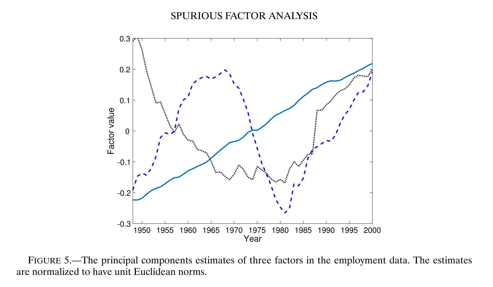

# Spurious Factor Analysis

 **Journal:**

Econometrica (2021.3)

 **Authors:**

* Alexei Onatski:

  Faculty of Economics, University of Cambridge

* Chen Wang:
  
  Department of Statistics and Actuarial Science, University of Hong Kong

## Abstract

This paper draws parallels between the principal components analysis of factorless high-dimensional nonstationary data and the classical spurious regression. We show that a few of the principal components of such data absorb nearly all the data variation. The corresponding scree plot suggests that the data contain a few factors, which is corroborated by the standard panel information criteria. Furthermore, the Dickey– Fuller tests of the unit root hypothesis applied to the estimated “idiosyncratic terms” often reject, creating an impression that a few factors are responsible for most of the nonstationarity in the data. We warn empirical researchers of these peculiar effects and suggest to always compare the analysis in levels with that in differences.

## Introducion

这篇文章认为，实证研究中去寻找因子的方法不一定正确。
This paper is intended as a warning to the empirical researchers tempted by arguments
advocating factor estimation in levels

All in all, the results of the principal components analysis of the levels of nonstationary data may be very misleading.

We recommend to always compare the first differences of factors estimated from the levels with factors estimated from the first-differenced data. A mismatch indicates a spurious factor analysis in levels.

## Methodology

Consider an N-dimensional integrated system：

$$
X_t = X_{t-1} + \Psi(L) \varepsilon_t \tag{1}
$$

$X_t$ 是 $N \times T$ 维矩阵，$X=[X_1,X_2,\dotsb,X_T]$

(1)式可能不包含因子结构，例如如果 $\Psi(L)$ 是对角矩阵，那么数据在截面上是独立的，因此没有影响这些收益率的共同因子

$$
X-\bar{X} = \land F' + e \tag{2}
$$

$$
\hat{\Sigma}=(X-\bar{X})'(X-\bar{X})/N \tag{3}
$$

PCA方法常用来求解(2)式中的因子F以及因子载荷$\land$，写方差矩阵 $\hat{\Sigma}$ 前r个主成分因子定义为前r个最大的特征值 $\hat{\lambda}_1 \geq \hat{\lambda}_2 \geq \dotsb \geq \hat{\lambda}_r$ 对应的特征向量 $\hat{F}_1, \hat{F}_2, \dotsb ,\hat{F}_r$

$\dfrac{\hat{\lambda}_j}{tr\hat{\Sigma}}$：第j个主成分因子对于数据方差的解释力

>[TIP|label:提示]
>$A \backsim B \Longrightarrow tr(A) = tr(B)$

但是这样的主成分分析可能提取出虚假因子，因为虽然 $\Sigma$ 的前几个特征值占很大的解释比重，但是这几个特征值对应的特征向量可能不代表任何驱动数据动态的潜在经济因素

### Assumptions

ASSUMPTION A1: Random variables $\varepsilon_{it}$ with $i\in\mathbb{N}$ and $t\in \mathbb{Z}$ are independent and such that $\mathbb{E}\varepsilon_{i i}=0,\mathbb{E}\varepsilon_{i t}^{2}=1$ ,and $\sup_{i\in\mathbb{N},t\in\mathbb{Z}}\mathbb{E}\varepsilon_{i t}^{4}<\infty$.

ASSUMPTION A2: As $N\rightarrow\infty$, $\begin{aligned}\sum_{k=0}^\infty(1+k)\|\boldsymbol\Psi_k\|=O(N^\alpha)\end{aligned}$ for some $\alpha \geq 0$, where $\|\cdot\|$ denotes the spectral norm.

>[TIP|label:the spectral norm]
>aa

$\begin{aligned}N^{2\alpha}(T+N_\varepsilon)/\bigl(T^2\:\text{tr}\:\Omega\bigr)\to0\end{aligned}$

## The “Number Of Factors”

Bai (2004) 提出通过最小化如下目标函数来估计非平稳面板中的因子数量：

$$
\mathrm{IPC}(k)=V(k)+k\hat{\sigma}^2p(N,T)
$$

$k=\:0,1,\ldots,k_{\mathrm{max}}$

$V(k)=\mathrm{tr}\:\hat{\Sigma}/T-\sum_{j=1}^{k}\hat{\lambda}_{j}/T$

$\hat{\sigma}^{2}=V(k_{\mathrm{max}})$

$p(N,T)$ 是惩罚函数，它有如下三种形式：

$$
\begin{aligned}
p_1(N,T) &= \alpha_T\dfrac{N+T}{NT}\log\dfrac{NT}{N+T}  \\
\\
p_2(N,T)&=\alpha_T\dfrac{N+T}{NT}\log\delta_{NT} \\
\\
p_3(N,T)&=\alpha_T\dfrac{N+T-k}{NT}\log NT
\end{aligned}
$$

其中，

$\alpha_T=T/(4\log\log T)$

$\delta_{NT}=\min\{N,T\}$

## How to detect spurious results

figure 5 显示了三个因子的PCA估计值的时间序列图，可以看出，它们的时间趋势和余弦函数很相似

另一种更为正式的问题检测策略是：将数据中的因子估计值与差异数据中的因子估计值进行比较：

* 如果数据中的所有非平稳性都来自于因子，那么在Bai(2004)的假设下，PCA方法估计的因子 $\hat{F}$ 与真实因子 F 相一致；

* 在Bai and Ng(2004)的假设下，对差分数据使用PCA方法估计的因子 $\hat{f}$ 应当与真实因子的差分 $\Delta F$ 相一致。这种情况下，$\Delta \hat{F}$ 应当与 $\hat{f}$ 相一致

如果上述结果出现不一致，表明可能存在虚假因子

