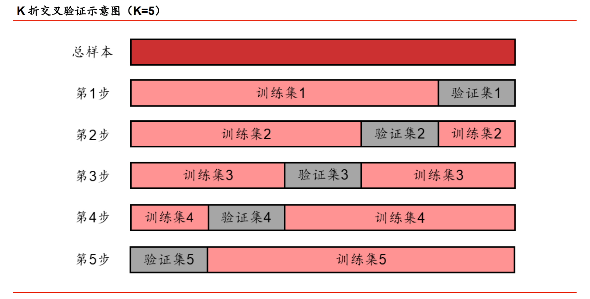
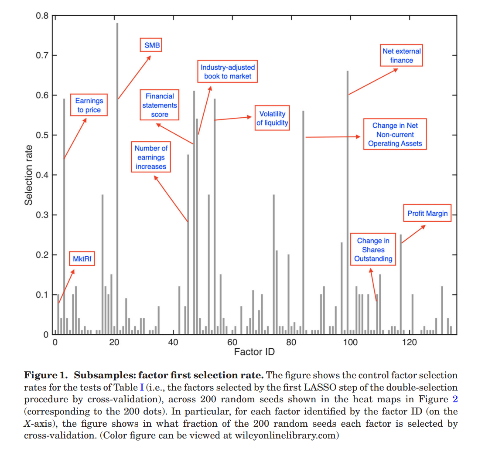
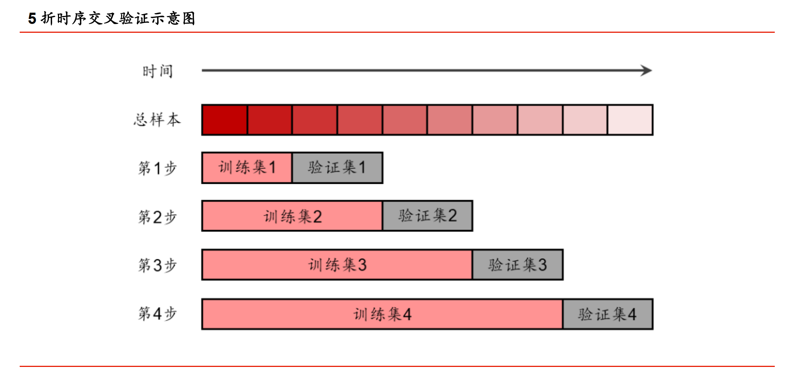
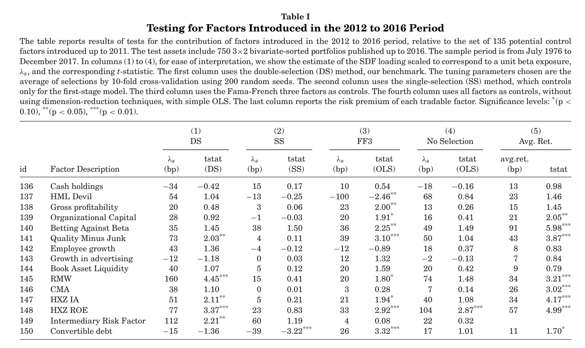
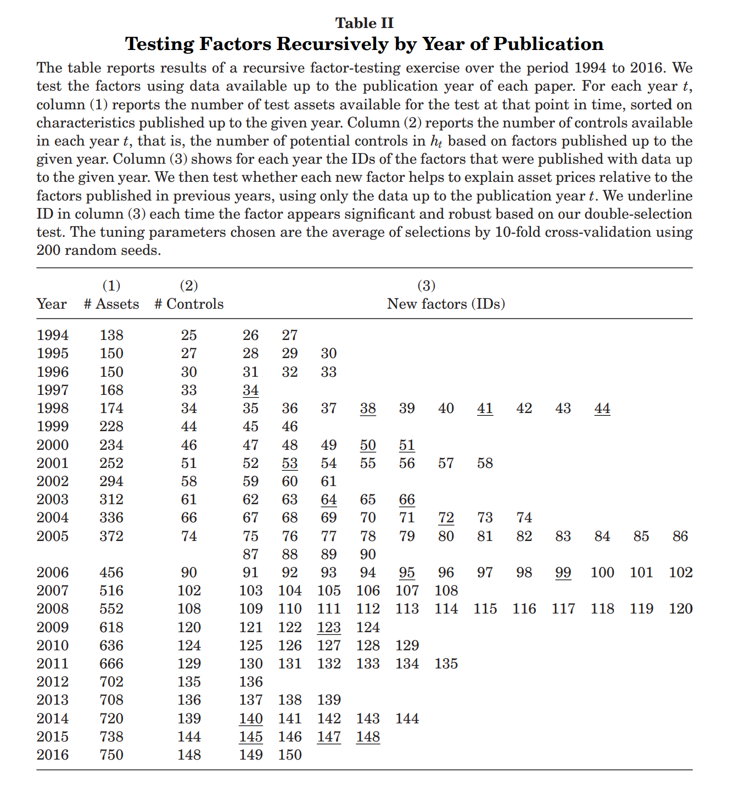
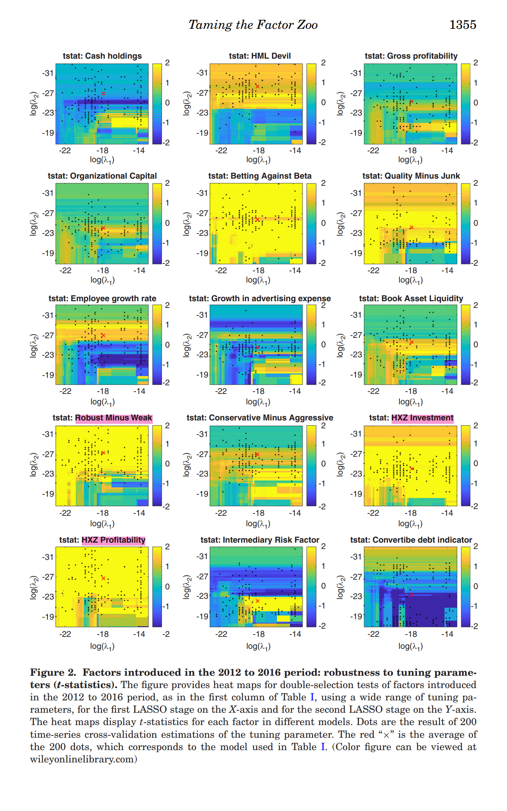
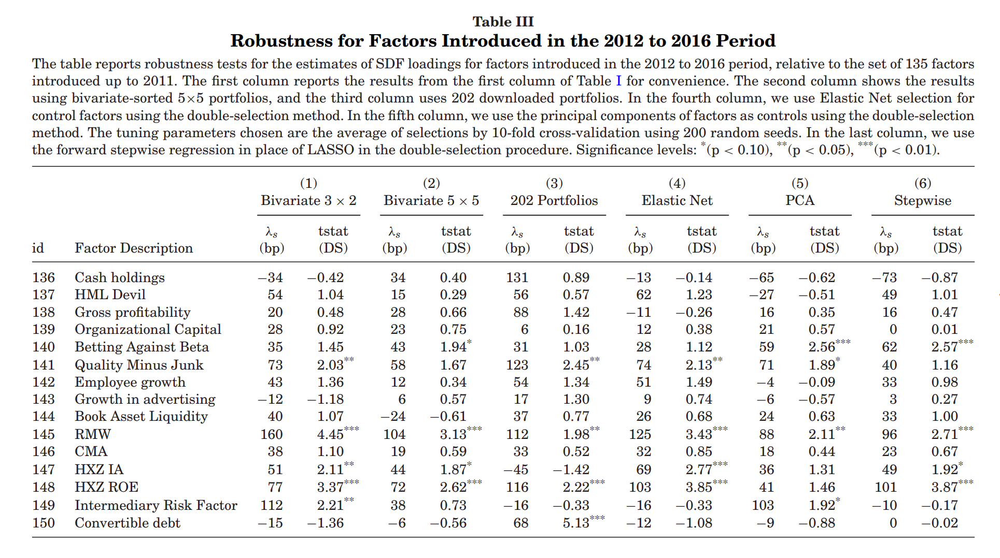

# Taming the factor zoo: A Test of New Factors

 **Journal:**

Journal of Finance (2020.1)

 **Authors:**

* Guanhao Feng:
  
  City University of Hong Kong College of Business
* Stefano Giglio:
  
  Yale School of Management, NBER, and CEPR
* Dacheng Xiu:
  
  University of Chicago Booth School of Business

## Abstract

We propose a model selection method to systematically <mark>evaluate the contribution to asset pricing of any new factor, above and beyond what a high-dimensional set of existing factors explains</mark>. Our methodology accounts for model selection mistakes that produce a bias due to omitted variables, unlike standard approaches that assume perfect variable selection. We apply our procedure to a set of factors recently discovered in the literature. <mark>While most of these new factors are shown to be redundant relative to the existing factors, a few have statistically significant explanatory power beyond the hundreds of factors proposed in the past</mark>.

## Introducion

想要解决的关键问题：相对于文献迄今产生的数百个因子，如何判断一个新因子是否为资产定价模型增加了解释力？

新的待测试的因子：$g_t$

已有的因子：$h_t$

$g_t$ 和 $h_t$ 都是可交易或不可交易的

>[!TIP|label:提示]
>tradable factors：可由可交易资产组成的因子，例如 FF3 中的 SMB  
>nontradable factors：宏观市场层面的因子，例如 inflation

稀疏性：假设真实的资产定价模型是近似低维的

实例：

Heston和Sadka(2008)提出了季节因子(seasonality factor)，在 FF3 模型评价体系下存在显著的alpha(t统计量为2.06)。如果根据此基准模型进行评估，则可以得出结论:季节性是一个有效的因子

$$
seasonality = \alpha + \beta_1\big(E(R_M)-R_F\big) + \beta_2\big(E(SMB)\big) + \beta_3\big(E(HML)\big)
$$

然而，季节因子和动量因子高度相关(例如，与 Carhart 动量因子的相关性为0.63)，如果采用包含动量因子的基准模型进行评估，则alpha 会变小且在统计上不显著(t 统计量=-0.87)

$$
seasonality = \alpha + \beta_1\big(E(R_M)-R_F\big) + \beta_2\big(E(SMB)\big) + \beta_3\big(E(HML)\big) + \beta_4\big(E(UMD)\big)
$$

这个例子说明基准模型的选择在评估新因子的有效性方面十分重要。然而，大多数关于新因子研究的文献，都存在潜在的数据挖掘偏差，即对于基准模型的选择具有一定随意性。而本文方法可以系统化构建最低维度的基准模型，用于评价新因子 $g_t$

## 1. Methodology

### 1.1 Model

$$
\begin{aligned}m_t:=\gamma_0^{-1}-\gamma_0^{-1}\lambda_v^{\intercal}v_t:=\gamma_0^{-1}\bigl(1-\lambda_g^{\intercal}g_t-\lambda_h^{\intercal}h_t\bigr)\end{aligned} \tag{1}
$$

$$
\boxed{m=1-b'[f-E(f)]}
$$

$\gamma_0$：$E(m)=\gamma_0$，通常我们会对 m 标准化，使其期望为1

$g_t$：待测试因子组成的 $d\times 1$ 维向量

$h_t$：potentially confounding factors 组成的 $p\times 1$ 维向量

$g_t$ 和 $h_t$ 都进行 demean 处理，因此 $E(g_t) = E(h_t) = 0$

$\lambda_g$ 和 $\lambda_h$ 分别是 $g_t$ 和 $h_t$ 的 SDF loadings

**本文的主要目的是评估 $g_t$ 相对于高维基准模型 $h_t$ 的边际贡献**

$h_t$ 本身可能也有问题：

* 冗余因子(redundant factors)：SDF loading为零，和收益率 $r_t$ 的协方差与收益率  $r_t$ 和 SDF 的协方差相关，这些因子无法增加模型的解释力

* 无效因子(useless factors)：SDF loading为零，和收益率 $r_t$ 的协方差与收益率  $r_t$ 和 SDF 的协方差无关，这些因子完全没有解释能力

因此我们需要去除这两部分，从而提取合适的 $h_t$，作为对 $g_t$ 的估计

---

预期收益率 $\mathrm{E}(r_t)$ 满足如下形式：

$$
\mathrm{E}(r_t)=k\gamma_0+C_v\lambda_v=k\gamma_0+C_g\lambda_g+C_h\lambda_h \tag{2}
$$

$$
\boxed{b=\Sigma^{-1}\mu}
$$

$k: n\times1$ 维向量

$C_g: Cov(r_t,g_t)$

$C_h: Cov(r_t,h_t)$

收益率 $r_t$ 满足如下形式：

$$
r_t=\mathbf{E}(r_t)+\beta_g g_t+\beta_h h_t+u_t \tag{3}
$$

&nbsp;

$$
\mathbb{E}(r_t)=k\gamma_0+\beta_g\gamma_g+\beta_h\gamma_h \tag{4}
$$

>[!NOTE|label:risk premium 和 SDF loading 的区别]
>因子的 risk premium 告诉我们，投资者是否愿意为对冲某一风险因子而付费，但并不能告诉我们该因子对收益的横截面定价是否有用。例如，一个因子可能会要求非零风险溢价，而不会出现在SDF中，这仅仅是因为它与真实因子相关。
>
>Cochrane (2009)：要了解一个因子是否对资产的横截面定价有用，我们应该查看其 SDF loading 而不是其 risk premium

本文的模型假设风险暴露和风险溢价都是恒定的，因此选取以特征排序(characteristic-sorted)的资产组合进行研究，而非个股，因为投资组合的特征相对来说更稳定，且信噪比更高

the projection of $g_t$ on $h_t$ as:

$$
g_t=\eta h_t+z_t,\quad\text{where}\quad\mathrm{Cov}(z_t,h_t)=0 \tag{5}
$$

Finally, for the estimation of $\lambda_g$, it is essential to characterize the cross-sectional dependence between $C_g$ and $C_h$, so we write the cross-sectional projection of $C_g$ onto $C_h$ as:

$$
C_g=k\xi^\intercal+C_h\chi^\intercal+C_e \tag{6}
$$

$\xi: d\times1$ 维向量

$\chi: d\times p$ 阶矩阵

$C_e: n\times d$ 阶矩阵，代表回归残差

### 1.2 Challenges with Standard Two-Pass Methods in High-Dimensional Settings

传统的资产定价理论中两步回归法，例如 Fama-MacBeth:

* 第一步：通过资产收益率和因子收益的时间序列回归估计每一个因子的因子载荷 $\beta$
* 第二步：通过期望收益和因子载荷的横截面回归估计风险溢价 $\gamma$

根据前面的分析，我们更需要关注因子的 SDF loading $\lambda$，因此需要将第一步中的因子暴露改为因子和收益率的协方差。Cochrane (2009)证明了这种改进在低维度情况下的可行性

但是，随着大量资产定价文献中新因子的提出，因子的协方差矩阵的维数变得很高，因子的维度可能大于资产的维度，传统的 Fama-MacBeth 难以适用

改进：

为了解决高维度问题，本文采取了稀疏性假设：$h_t$ 中具有横截面解释里的因子个数是有限的

这一假设使得我们可以仅考虑最有影响力的因子

### 1.3 Two-Pass Regression with Double-Selection LASSO

Double Selection strategy：

第一步选择：利用 Lasso 回归，在 $h_t$ 中搜索与收益的协方差对整个横截面预期收益率有较强解释力的因子

$$
\min\limits_{\gamma,\lambda}\left\{n^{-1}\left\|\bar{r}-k\gamma-\widehat{C}_h\lambda\right\|^2+\tau_0n^{-1}\left\|\lambda\right\|_1\right\} \tag{7}
$$

$\widehat{C}_h = \widehat{Cov}_(r_t,h_t)$

$\{\widehat{I}_1\}$: the set of indices corresponding to the selected factors in this step

这一步是最小化等式(2)的残差，去除了冗余因子和无效因子，OLS+LASSO:

>[!TIP|label:矩阵的相关知识点]
>$\left\|A\right\|$：矩阵A的算子范数(operator norm)，计算方法：$\sqrt{\lambda_{\text{max}}(A^TA)}$，$\lambda_{\text{max}}$ 代表矩阵的最大特征值。这里A不一定是方阵，也可以是向量
>
>$\left\|\cdot\right\|_{1}$：L1范数是指向量中各个元素绝对值之和
>
>$A_{i,\cdot}$：矩阵A的第i行
>
>$A_{\cdot,j}$：矩阵A的第j列

向量的算子范数具有 “OLS 作用”，L1范数具有 LASSO 作用，L2范数同样具有OLS 作用

第二步选择：利用 Lasso 回归，搜索 $h_t$ 中可能在第一步中遗漏的因子，这些因子如果被省略，会导致较大的遗漏变量偏差

本文提出在有限的样本中，LASSO的“oracle property”(在样本比较大的时候可以把有效的predictor给取出来，而且估计出来的系数和真实值差不多)可能会失效。<strong>LASSO的选择可能会排除一些 SDF loading 较小的因子，但其实这些因子与收益率的协方差和 $g_t$ 的暴露在横截面上高度相关。</strong>因此如果我们无法从 $h_t$ 中选取正确的基准模型，那么就可能会导致关于 $g_t$ 的结论无效。

$$
\min\limits_{\xi_j,\chi_j,}\left\{n^{-1}\left\|\left(\widehat C_{g,\cdot,j}-k\xi_j-\widehat C_h\chi_{j,\cdot}^{T}\right)\right\|^2+\tau_j n^{-1}\|\chi_{j,\cdot}^{T}\|_1\right\} \tag{8}
$$

这一步是最小化等式(6)的残差，OLS+LASSO

$\{\widehat{I}_{2,j}\}$: the set of indices corresponding to the selected factors in the j-th regression

$\widehat{I}_{2}= \bigcup_{j=1}^{d}\widehat{I}_{2,j}$

从DS过程的两个阶段中，第一阶段的 LASSO 排除的因子 ($h_t$因子) 具有较小的 SDF loading，第二阶段排除的因子和收益率 $r_t$ 的协方差与收益率  $r_t$ 和 $g_t$ 的协方差有很低的相关性。这些因子可以以最小的遗漏变量偏差被排除

为了得到可靠的 $g_t$ 的渐进估计，进行第二步的因子选择至关重要。在第一步所选出因子的基础上，增加因子与收益协方差和 $g_t$ 之间高度相关的因子(此步骤同样使用LASSO)。**直观上，我们希望能够将样本中 SDF loading 较小的因子也包括在内，如果省略它们又可能会出现遗漏变量偏差**。从第二阶段中选择的某些变量可能是多余的，甚至是无用的，但是将它们包括在内不会导致效率的损失

#### Post-selection estimation

Run an OLS cross-sectional regression using covariances between the selected factors from both steps and returns:

$$
(\widehat{\gamma}_0,\widehat{\lambda}_g,\widehat{\lambda}_h)=\text{arg}\operatorname*{min}_{\gamma_0,\lambda_g,\lambda_h} \bigg\{\left\|\bar{r}-\iota_n\gamma_0-\widehat{C}_g\lambda_g-\widehat{C}_h\lambda_h\right\|^2: \\ \qquad \qquad \qquad \qquad \qquad \qquad \qquad \qquad \qquad \lambda_{h,j}=0,\quad \forall j\notin\widehat{I}=\widehat{I}_1\bigcup\widehat{I}_2 \bigg\} \tag{9}
$$

这一步是最小化等式(2)的残差，OLS

**如果只有第一步选择+Post-selection estimation，则这个过程被称作Single selection Strategy**

## 2. Empirical Analysis

monthly frequency from July 1976 to December 2017

150 risk factors

* 15个公开的因子
  * P´astor and Stambaugh(2003)：流动性因子
  * Hou, Xue, and Zhang (2015)：q-factors
  * He, Kelly, and Manela (2017)：中间资产定价因子
  * Betting-Against-Beta, HML Devil, and Quality-Minus-Junk etc.
* 135个多空市值加权投资组合作为因子代理

### 2.1 Test Portfolios

本文共使用750个投资组合作为测试资产

* 36个基础投资组合
  * 按规模和账面市值比例排序得到的3×2个投资组合
  * 按规模和盈利利润得到的3×2个投资组合
  * 按规模和投资排序的3×2投资组合
  * 按规模和过去一个月收益的短期反转的3×2投资组合
  * 按规模和过去2-12个月收益排序的3×2投资组合
  * 根据规模和过去（13-60）个月收益的长期反转排序的3×2投资组合
* 从因子库获得的714个其他投资组合加入到这36个基础投资组合中,这714个投资组合涵盖了其他因子

### 2.2 The First Lasso

$\tau_0$ 的取值会影响Lasso回归的结果，本文认为当 $\tau_0$ 变化时，如果结果没有发生较大改变，则检验结果是稳健的

在机器学习中，我们通常不会将所有数据用于训练，而是将整个数据集分为两部分：训练集（training set）和测试集（test set）

$x: [x_1,x_2,x_3,x_4,x_5]$

$y: [y_1,\ y_2,y_3,y_4,\ y_5]$

在这一基础上，使用不同的训练模型，比较它们在测试集上的 MSE 大小，从而选择合适的模型和参数

但这种方法有两个缺陷：

* 对于训练集和测试集的划分会影响模型的选择
$\\$
$x: [\textcolor{red}{x_1,x_2,x_3},x_4,x_5] \\$
$y: [\textcolor{red}{y_1,\ y_2,y_3},y_4,\ y_5]$
$\\$
$\qquad \qquad\text{vs}$
$\\$
$x: [x_1,x_2,\textcolor{red}{x_3,x_4,x_5}] \\$
$y: [y_1,\ y_2,\textcolor{red}{y_3,y_4,\ y_5}]$
&nbsp;
* 只有部分数据参与模型的训练，当训练量越大，模型的样本外表现一般会相应越好

**K-fold Cross Validation**

将所有数据平均随机分成 $K$ 份

取第 i 份数据作为测试集$(i=1,2,\dotsb,K)$，其他 $K-1$ 份数据作为训练集，计算每一次的 $MSE_i$

取 $K$ 次 $MSE_i$ 的平均值得到 $MSE$：

$$
\mathrm{CV}_{(K)}=\dfrac{1}{K}\sum_{i=1}^K\mathrm{MSE}_i.
$$

本文进行了 200 次 10-fold Cross Validation

如果 LASSO 能够完美地选择真实的模型，我们应该发现少数因子(比如说3到5个)在大部分的时间被选中，而其余因子在很少的时间被选中。与之相反，figu1显示了 LASSO 显然很难确定哪些因子是正确的。广义而言，任何机器学习方法都不能稳健地确定真正的低维因子模型

**K-fold Cross Validation 的缺陷**

K-fold Cross Validation 成立的前提是样本服从独立同分布。而当样本是时间序列时，数据随时间演进的过程生成，可能包含周期性、过去和未来数据间相互关系等信息，并不满足交叉验证中数据独立同分布的基本假设。此时如果依然采用传统交叉验证方法，可能会将未来时刻的数据划入训练集，历史时刻的数据划入验证集，进而出现用未来规律预测历史结果的“作弊”行为。因此需要一种既能保证数据利用率，又能保留时序数据之间相互关系的交叉验证方法，这就是时序交叉验证方法（time-series cross-validation）

假设样本时间跨度为 10 个月，采用 5 折时序交叉验证，那么首先将样本等分成 5 个部分。以第 1\~2 月数据作为训练集，第 3\~4 月作为验证集，进行第 1 次验证。再以第 1\~4 月数据作为训练集，第 5\~6 月为验证集，进行第 2次验证。以此类推，第 4 次验证以第 1\~8 月数据作为训练集，第 9\~10 月作为验证集。再将总共 4 次验证的模型评价指标取平均数。时序交叉验证避免了使用未来信息的可能，对于时序数据的机器学习而言是较为合理的选择

### 2.3 The Second Lasso

第二阶段从 $h_t$ 中选择的因子数量与模型中真实的资产定价因子数量之间并没有理论关系。任何可能导致 $\lambda_g$ 估计偏差的因子都应该被第二个 LASSO 保留下来，即使是redundant factors

第一阶段 LASSO 平均选择因子数量为四个，而在第二阶段中 LASSO 平均所选因子个数在20-80个之间。这种差异主要由于两个 LASSO 目标的不同

### 2.4 The Double-Selection Estimator

### 2.5 Evaluating Factors Recursively

Drawback: publication year may not equal to discovery year

### 2.6 Robustness

#### 2.6.1 Robustness to the Choice ofTuning Parameters

#### 2.6.2 Robustness to Test Assets and Regularization Method

## 3. Conclusion

本文提出的方法在四个重要的方面不同于已有文献：

* 首先，文章明确解决了遗漏变量偏误的问题，这是因为在推断因子对资产价格的贡献时可能存在模型选择错误
* 其次，本文考虑了因子之间的相关性，而不是单独考虑因子
* 第三，本文的方法是专门设计用于控制数百个因子，利用模型选择中的计量经济学进展来减少因子集的维数
* 最后，本文选择因子的标准是基于 SDF loading，而不是因子的风险溢价，因为 SDF loading 是评估一个因子对解释资产价格的贡献的正确指标