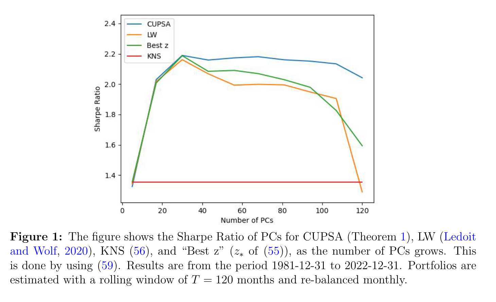
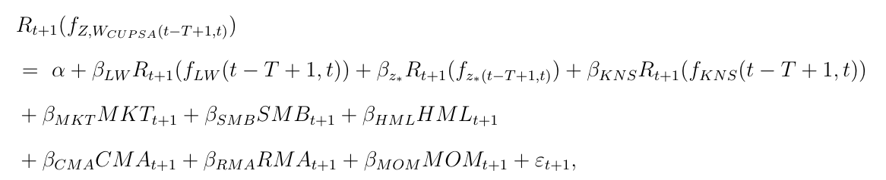
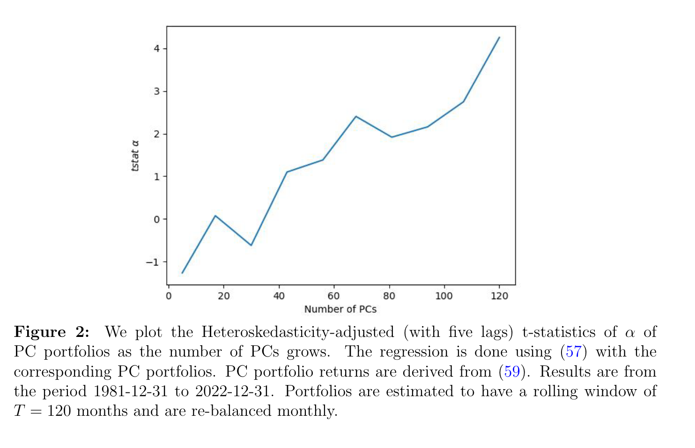
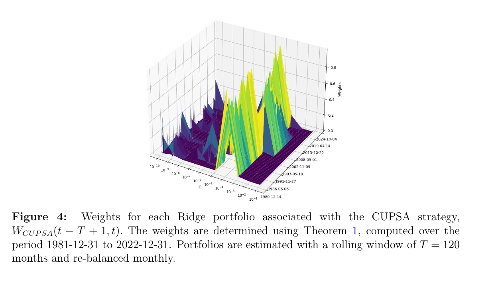

# Universal Portfolio Shrinkage
- Byran Kelly
- Semyon Malamud
- Mohammad Pourmohammadi
- Fabio Trojani

## Description of the problem
（一个很常规设定）考虑 $N$ 个资产（当然也可以是因子）。其超额收益是一个随机过程 $F_t \in \mathbb{R}^N$，$t>0$。在一个*有完美信息*的环境中，一个 economic agent 会去最大化如下的二次效用函数：
$$
U(R^\pi_t)=R^\pi_t-\frac{1}{2}(R^\pi_t)^2
$$
其中：
$$
R^\pi_t=\pi'F_t
$$
可以解出：
$$
\pi_*=E[FF']^{-1}E[F]
$$
> [!NOTE]
> 易见 $R^\pi_t=1=\pi'F_t$ 时效用函数取得最大值
> $$
\pi'F_t=1 \\
(\pi'F_t)'=1 \\
F'_t\pi=1\\
F_tF'_t\pi=F_t\\
\pi = (F_tF'_t)'F_t
$$

对于一个处于*真实世界*的 economic agent，假设他只能观察到过去 $T$ 时期的样本，（而且这人是个频率派），则他的估计为：
$$
\bar{E}[FF']=\frac{1}{T}\sum^T_{t=1}F_tF_t'\\
\bar{E}[F] = \frac{1}{T}\sum^T_{t=1}F_t
$$
其样本外效用为：
$$
u^{OOS}=E[U(R^{\pi_t}_t)],\;t>T
$$
当 $N/T \neq 0$ 的情况出现时，作者认为这时候 *complexity* 就出现了，并会导致用像上面一样用矩来估计会不准确，产生 divergence。

## Shrinkage of the covariance matrix

对协方差矩阵做 PCA 并生成 principal component portfolios 被认为是一种有效的降噪方法（如取 top-k 个主成分做 shrinkage）。

延续上小节的 notations，在 real world 中，我们观测到的 empirical covariance matrix 不妨记为 $\bar{E}[FF']$，并对其做特征值分解得到 $\bar{E}[FF']=Udiag(\lambda)U'$。利用其互相正交的特征向量构造出正交的主成分投资组合，不妨将第 $i$ 个主成分资产的预估的收益记作 $\bar{R}^{PC}_{i,t}=U'F_t$。

这时候，我们已经从原来 $N$ 维的资产空间（$F_t \in \mathbb{R}^N$）转移到了 $K$ 维的资产空间（$F^{PC}_t \in \mathbb{R}^K$）中，这里每一个资产都是正交的（太好了）。虽然资产空间略有不同，但是我们的 economic agent 不变，仍然遵循
$$
U(R^\pi_t)=R^\pi_t-\frac{1}{2}(R^\pi_t)^2
$$
的二次效用函数，那么我们做一样的计算可以得到最优权重为：
$$
\bar{\pi}_*=E[F^{PC}{F^{PC}}']^{-1}E[F^{PC}]
$$
注意到 $E[F^{PC}{F^{PC}}']$ 是一个对角阵，那么我们很容易将我们的 $\bar{\pi}_*$ 带入到我们的策略中得到组合收益为：
$$
R^{\bar{\pi}}_t=\bar{\pi}_*\cdot F^{PC}\\
\:\\
R^{\bar{\pi}}_t = \sum_{i=1}^{N} \frac{\overline{R}_i^{PC}}{\lambda_i} R_{i,t}^{PC}
$$
>[!tip]
>$E[F^{PC}{F^{PC}}']^{-1}=diag(\frac{1}{\lambda})$

显然，有效组合的权重将完全被对每个 PC 组合的 risk-return tradeoff（$ \frac{\overline{R}_i^{PC}}{\lambda_i} $）的估计确定。

这个估计方式并不完美，从实证的结果来看，对于 $\lambda$ 较低的 PC 来说，其权重 $\frac{\overline{R}_i^{PC}}{\lambda_i}$ 经常会被高估，导致较差的样本外表现。一个常见的解决该样本内外表现不稳定的途径是使用带 Ridge 惩罚的协方差矩阵，并得到权重为：
$$
\bar{\pi}(z)=\left(z I+\bar{E}\left[F F^{\prime}\right]\right)^{-1} \bar{E}[F]
$$

>[!NOTE]
>在 *COMPLEXITY IN FACTOR PRICING MODELS* 这篇文章中指出 Ridge 惩罚的目标函数及其解为如下形式：
>$$\hat{\lambda}(z)=\hat{\lambda}(z ; P ; T)=\left(z I+\hat{E}\left[F_t F_t^{\prime}\right]\right)^{-1} \hat{E}\left[F_t\right]=\arg \min _\lambda\left\{\sum_{t=1}^T\left(1-\lambda^{\prime} F_t\right)^2+z\|\lambda\|^2\right\}$$

那么我们把上述的解带入到我们正交的主成分资产空间中，可以得到如下组合回报：
$$
R_t^{\bar{\pi}(z)}=\sum_{i=1}^N \frac{\bar{R}_i^{P C}}{\lambda_i+z} R_{i, t}^{P C}=\sum_{i=1}^N \frac{\bar{R}_i^{P C}}{\lambda_i} \frac{1}{1+z / \lambda_i} R_{i, t}^{P C}
$$

当 Rigde 惩罚项趋向于 0 时，其对资产权重向量的估计值将会等价于 Markowitz portfolio，而当 Rigde 惩罚项趋向于正无穷时，其对权重的估计将会收敛到一个类似于动量组合上，其完全忽略协方差矩阵，并根据样本内的均值分配投资权重。
$$
\lim _{z \rightarrow 0} \bar{\pi}(z)=\left(\bar{E}\left[F F^{\prime}\right]\right)^{+} \bar{E}[F]\\
\;\\
\lim _{z \rightarrow \infty} z \bar{\pi}(z)=\lim _{z \rightarrow \infty}\left(I+z^{-1} \bar{E}\left[F F^{\prime}\right]\right)^{-1} \bar{E}[F]=\bar{E}[F]
$$

Rigde 惩罚项是一种 soft threshold，使用 top-k 的方法选取特征值最大的 PC 组合则是一种 hard threshold，但是如此一刀切的方式很有可能是不够有效的。

在理想中，作者希望有一个这样的估计器，可以基于估计的样本外 risk-return tradeoff 去最优地估计每一个 PC 的贡献。本文的目的就是去开发这样一种算法。

形式上，一个只对 PC 的权重做 shrinkage 操作而不该本 PC 本身构造的估计其被称为 *spectral shrinkage estimator*。此类估计器最早是由是一篇 1986 年发表于苏维埃数学期刊的文章 *Lectures on the theory of estimation of many parameters* 引入。

一个一般的 spectral shrinkage estimator 由一个作用于协方差矩阵的函数 $f$ 定义，$\bar{E}\left[F F^{\prime}\right]$ 将会被替代为 *shrunk inverse covariance matrix*：
$$
f(\bar{E}\left[F F^{\prime}\right])=Udiag(f(\lambda))U'
$$

定义:
$$
\bar{\pi}(f)=f(\bar{E}\left[F F^{\prime}\right])\bar{E}[F]
$$
为 *f-spectral shrinkage estimator of the (feasible) efficient portfolio* (which is $E[FF']^{-1}E[F]$)。那么很容易，我们也可以写出最终的组合的回报 $R_f(f)=R^{\bar{\pi}(f)}_t$ 为：
$$
R_t(f)=\bar{\pi}(f)^{\prime} F_t=\sum_{i=1}^N \underbrace{f\left(\lambda_i\right) \bar{R}_i^{P C}}_{\text {shrunk PC weights }} R_{i, t}^{P C}
$$
那么现在开始，我们终于可以开始形式化定义 *optimal spectral shrinkage estimator*。

**Definition 1 (Optimal Non-linear Shrinkage)** *Let $F_{IS}=\{F_1,\dots,F_t\}$ be the in-sample factor returns. The optimal spectral  shrinkage estimator is a function $f$ : $\mathbb{R}\times\mathbb{R}^{N\times T}\rightarrow \mathbb{R}$, such that $f(\lambda;F_{IS})$ solves the **OOS** utility maximaization problem:*
*$$
\max _f E\left[U\left(R_t(f)\right)\right], t>T .
$$*

Optimal spectral estimator 的一个关键特性在于其在对 $\lambda$ 做变换的同时依赖于 $F_{IS}$，也就是样本内的信息，所以尽管其是作用于 $\lambda$ 的函数，其实际参数量为 $NT+1$。

要找到 optimal shrinkage，我们首先得有计算 $E\left[U\left(R_t(f)\right)\right]$ 的能力，但是这似乎有点不可能，因为我们似乎永远不能观测到 $E[F]$ 或 $E[FF']$ 的真实值。为了克服这一困难，本文使用 Leave-One-Out (LOO) 方法的估计作为真实值的近似。LOO 方法可以保证在 *$F_t$ are independent and identically distributed* 的条件下可以得到 OOS 的无偏估计。具体来说，LOO 工作方法可以理解为 k 的取值为样本大小的 k-fold。每次使用不含 $t$ 时刻的样本估计，得到：
$$
\begin{aligned}
& \bar{E}_{T, t}\left[F F^{\prime}\right]=\frac{1}{T} \sum_{\tau \neq t, 1 \leq \tau \leq T} F_\tau F_\tau^{\prime} \\
\;\\
& \bar{E}_{T, t}[F]=\frac{1}{T} \sum_{\tau \neq t, 1 \leq \tau \leq T} F_\tau \\
\:\\
& \bar{\pi}_{T, t}(f)=f\left(\bar{E}_{T, t}\left[F F^{\prime}\right]\right) \bar{E}_{T, t}[F]
\end{aligned}
$$

**Lemma 1** *Suppose that $F_t$ are interchangeable/exchangeable sequence. Let*
*$$
R_{T,t(f)}=\bar{\pi}_{T,t}(f)\cdot F_t,\;t=1,\dots,T .
$$*
*Then,*
*$$
U^{OOS}_{LOO}(f)=\frac{1}{T}\sum^T_{\tau=1}U(R_{t,\tau}(f))
$$*
*is an unbiased estimator of OOS expected utility:*
*$$
E[U(R_t(f))]=E[U^{OOS}_{LOO}(f)],
$$*
*where, $t>T$.*

>[!NOTE]
>Interchangeability implies that the joint distributions $((F_i)_{i\neq\tau,1\leq i\leq T}, F_{\tau})$ and $((F_i)_{i\neq\tau,1\leq i\leq T}, (F_t)_{t>T})$ are the same.

通过 LOO 这个工具，我们可以继续定义。

**Definition 2 (Optimal Non-Linear Feasible Shrinkage)** *The optimal **feasible** spectral shrinkage estimator is a function $f$ solving the unitility maximization problem*
*$$
\max_f U^{OOS}_{LOO}(f)
$$*

## Universal Portfolio Shrinkage Approximator
对于 Ridge 而言，$f_z(\lambda)=\frac{1}{z+\lambda}$。

>[!tip]
>**Sherman-Morrison Formula**
>Suppose $A\in \mathbb{R}^{n\times n}$ is an invertible square matrix and $u,v \in \mathbb{R}^{n}$ are column vectors. Then $A+uv'$ is invertible if $1+v'A^{-1}u\neq0$,in this case,
$$
\left(A+u v^{\prime}\right)^{-1}=A^{-1}-\frac{A^{-1} u v^{\prime} A^{-1}}{1+v^{\prime} A^{-1} u}
$$

通过 LOO 方法计算 $t=\tau$ 时的收益为：
$$
R_{T, \tau}\left(f_z\right)=F_\tau^{\prime} \bar{\pi}_{T, t}\left(f_z\right)=F_\tau^{\prime}\left(z I+\bar{E}_{T, \tau}\left[F F^{\prime}\right]\right)^{-1} \bar{E}_{T, \tau}\left[F_t\right] .
$$
将 $ \bar{E}_{T, \tau}\left[F_t\right]$ 展开得到下式：
$$
F_\tau^{\prime}\left(z I+\bar{E}_{T, \tau}\left[F F^{\prime}\right]\right)^{-1} \bar{E}_{T, \tau}\left[F_t\right]=\frac{1}{T} \sum_{t \neq \tau}^T F_\tau^{\prime}\left(z I+\bar{E}_{T, \tau}\left[F F^{\prime}\right]\right)^{-1} F_t .
$$
注意到由于资产空间 $F$ 中的资产相互正交我们可以有：
$$
\left(z I+\bar{E}_{T, \tau}\left[F F^{\prime}\right]\right)^{-1}=\left(z I+\bar{E}\left[F F^{\prime}\right] -\frac{1}{T}F_\tau F'_\tau \right)^{-1}
$$
令 $A=\bar{E}[FF']+zI$，$u=F_\tau$，$v=-\frac{1}{T}F_\tau$，代入 Sherman-Morrison Formula，可以得到：
$$
\left(z I+\bar{E}_{T, \tau}\left[F F^{\prime}\right]\right)^{-1}=\left(z I+\bar{E}\left[F F^{\prime}\right]\right)^{-1}+\frac{1}{T} \frac{\left(z I+\bar{E}\left[F F^{\prime}\right]\right)^{-1} F_\tau F_\tau^{\prime}\left(z I+\bar{E}\left[F F^{\prime}\right]\right)^{-1}}{1-\frac{1}{T} F_\tau^{\prime}\left(z I+\bar{E}\left[F F^{\prime}\right]\right)^{-1} F_\tau}
$$
对上式同时左乘 $F'_\tau$ 得到：
$$
\begin{aligned}
F_\tau^{\prime}\left(z I+\bar{E}_{T, \tau}\left[F F^{\prime}\right]\right)^{-1} & =F_\tau^{\prime}\left(z I+\bar{E}\left[F F^{\prime}\right]\right)^{-1}+\frac{1}{T} \frac{F_\tau^{\prime}\left(z I+\bar{E}\left[F F^{\prime}\right]\right)^{-1} F_\tau F_\tau^{\prime}\left(z I+\bar{E}\left[F F^{\prime}\right]\right)^{-1}}{1-\frac{1}{T} F_\tau^{\prime}\left(z I+\bar{E}\left[F F^{\prime}\right]\right)^{-1} F_\tau} \\
& =\frac{F_\tau^{\prime}\left(z I+\bar{E}\left[F F^{\prime}\right]\right)^{-1}}{1-\frac{1}{T} F_\tau^{\prime}\left(z I+\bar{E}\left[F F^{\prime}\right]\right)^{-1} F_\tau} .
\end{aligned}
$$
由此我们可以得到
$$
\frac{1}{T} \sum_{t \neq \tau}^T F_\tau^{\prime}\left(z I+\bar{E}_{T, \tau}\left[F F^{\prime}\right]\right)^{-1} F_t=\frac{1}{T} \sum_{t \neq \tau}^T \frac{F_\tau^{\prime}\left(z I+\bar{E}\left[F F^{\prime}\right]\right)^{-1} F_t}{1-\frac{1}{T} F_\tau^{\prime}\left(z I+\bar{E}\left[F F^{\prime}\right]\right)^{-1} F_\tau}
$$
令 $\psi_\tau(z)=\frac{1}{T} F_\tau^{\prime}\left(z I+\bar{E}\left[F F^{\prime}\right]\right)^{-1} F_\tau$，可以得到 Lemma 2。

**Lemma 2**
*We have*
*$$
R_{T, \tau}\left(f_z\right)=\underbrace{\frac{1}{1-\psi_\tau(z)}}_{\text {complexity multiplier }}(R_\tau\left(f_z\right)-\underbrace{\psi_\tau(z)}_{\text {overfit }}),
$$*
*where $R_\tau(f_z)=\bar{\pi}(f_z)'F_\tau$ is the in-sample return at time $\tau$.*

*Overfit* 项解释了为什么样本内的均值总是高于真实值，*complexity multiplier* 项解释了为什么估计出的风险总是偏低，通过 Sherman-Morrison Formula 可以计算出 $\psi_\tau(z)\in (0,1)$，所以 $\frac{1}{1-\psi_\tau(z)}>1$。

**Definition 3** *Let $Z=(z_i)^L_{i=1}$ be a grid of Ridge penalties, and $W=(w_i)^L_{i=1}$ a collection of weights.*
*$$
f_{Z, W}(\lambda)=\sum_{i=1}^L \underbrace{\left(z_i+\lambda\right)^{-1}}_{\text {Ridge }} \underbrace{w_i}_{\text {weight }} .
$$*
*We refer to $\mathcal{F}(Z)=\{ f_{Z, W}(\lambda):W\in \mathbb{R}^L \} $ as the Ridge ensemble, where $\mathcal{S}^L_+=\{ W\in \mathbb{R}^L,\sum^N_{i=1}w_i/c_{z_i}=1 \}$*

>[!NOTE]
>$c_{z}$ 是一个 normalize 项，其作用为消除 $z$ 的 scale 的异质性。
>$$
 c_z=\frac{\frac{1}{N} \operatorname{tr}\left(\bar{E}\left[F F^{\prime}\right]\right)+z_i}{\frac{1}{N} \operatorname{tr}\left(\bar{E}\left[F F^{\prime}\right]\right)}
$$
>$$
c_z f_z\left(\bar{E}\left[F F^{\prime}\right]\right)=c_z\left(z I+\bar{E}\left[F F^{\prime}\right]\right)^{-1} \approx \frac{\frac{1}{N} \operatorname{tr}\left(\bar{E}\left[F F^{\prime}\right]\right)+z_i}{\frac{1}{N} \operatorname{tr}\left(\bar{E}\left[F F^{\prime}\right]\right)}\left(z I+\frac{1}{N} \operatorname{tr}\left(\bar{E}\left[F F^{\prime}\right]\right) I\right)^{-1}=\frac{1}{\frac{1}{N} \operatorname{tr}\left(\bar{E}\left[F F^{\prime}\right]\right)}
$$

我们现在可以得到基于 LOO 和 Rigde 估计出的 OOS 的均值和协方差
$$
\begin{align*}
\bar{\mu}(Z) &= \left( \frac{1}{T} \sum_{t=1}^{T} R_{T,t}(f_{z_i}) \right)_{i=1}^{L} \in \mathbb{R}^{L} \\[10pt]
\bar{\Sigma}(Z) &= \left( \frac{1}{T} \sum_{t=1}^{T} R_{T,t}(f_{z_i}) R_{T,t}(f_{z_j}) \right)_{i,j=1}^{L} \in \mathbb{R}^{L \times L}
\end{align*}
$$
同时，我们还可以通过简单的乘法交换律发现，$t=\tau$ 时刻的组合回报为：
$$
R_{T, \tau}(f_{Z, W}) = \sum_{i=1}^{L} w_i R_{T, \tau}(f_{z}).
$$
并且我们可以重写样本外效用的 feasible estimator 为：
$$
U^{\text{OOS}}_{\text{LOO}}(f_{Z, W}) = W' \bar{\mu}(Z) - 0.5 W' \bar{\Sigma}(Z) W.
$$

终于，我们可以解出 UPSA 和 CUSPA了，其目标函数为：
$$
\begin{align*}
f_{UPSA} &= \arg \max_{f \in \mathcal{F}(Z)} U^{OOS}_{LOO}(f) \\[10pt]
f_{CUPSA} &= \arg \max_{f \in \mathcal{F}_C(Z)} U^{OOS}_{LOO}(f)
\end{align*}
$$
就像 Markowitz 求解权重一样，只不过我们现在实在 L 维的资产空间中，可以解得：
$$
\begin{align*}
W_{UPSA} &= \bar{\Sigma}(Z)^{-1} \bar{\mu}(Z) \\[10pt]
W_{CUPSA} &= \arg \max_{W \in \mathcal{S}_{+}^{L}} \left( W' \bar{\mu}(Z) - 0.5 \, W' \bar{\Sigma}(Z) W \right).
\end{align*}
$$

## Empirics

**资产空间：**特征排序的 managed portfolio，$N=153$，（Is There a Replication Crisis in Finance 这篇文章的数据）。时间跨度为 1970-11-30 至 2022-12-31，频率为月频。

**策略：** 使用 rolling window，$T=120\;months$（十年），月度再平衡。

**Benchmarks：** 
- LW：Ledoit-Wolf，一种非参数化非线性 shrinkage 方法，改方法试图最小化真实与实证的 covariance matrix 之间的距离。
- Best $z$：基于 LOO 估计出来的最优 Ridge 惩罚项 $$z_*(t - T + 1, t) = \arg \max_{z \in Z} U^{\text{OOS}}_{\text{LOO}}(f_z).$$
- KNS：只对协方差矩阵的 top-5 PC 做 Ridge shrinkage $$R_{t+1}(f_{KNS}(t - T + 1, t)) = R_{t+1}^{PC}(5, f_{z_*}(t - T + 1, t)).$$

Figure 1 展示了随着 PC 数量的增加，只有 CUPSA 能在饱和后能保持稳定。

作者使用如下方式构建对基于 CUPSA 的策略的 alpha 的检验：

如 Figure 2 所示，随着 PC 的增加，基于 CUPSA 的策略所带来的 alpha 逐渐显著。

Figure 3 展示了权重 $W$ 随时间与 $z$ 取值的变化谱图。
