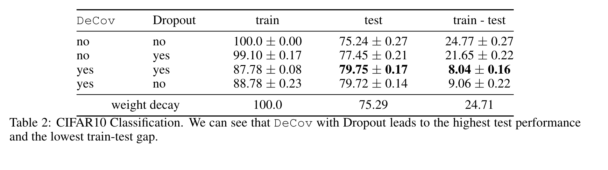

# Reducing Overfitting in deep Networks by Decorrelating Representations

Published as a conference paper at ICLR 2016

- Michael Cogswell: Virginia Tech
- Faruk Ahmed: Université de Montréal
- Ross Girshick: Facebook AI Research (FAIR)
- Larry Zitnick: Microsoft Research
- Dhruv Batra: Virginia Tech

## Introduction

Srivastava 和 Hinton 2014 年关于 dropout 的工作的 motivation 是想要降低神经元之间 co-adapted 的程度，但是其通过随机 dropout 神经元的方法与降低 co-adaptation 的目标之间的关系并不直接。

本文研究的核心问题：直接对神经网络的神经网络的隐藏层做 decorrelation 处理是否可以得到一个更不 correlated representation？这样的 decorrelated representation 是否具有更好的泛化能力？

>[!NOTE]
>Co-adaptation occurs when two or more hidden units rely on one another to perform some function which helps fit training data, thus becoming highly correlated. Co-adaptation is reduced by Dropout using an approximate model averaging technique that sets a randomly selected set of activations to zero at training time.
## DeCov Loss

为了形式化表示冗余的（redundant）或者说 co-adapted 的特征，作者引入了关于隐藏层激活值的损失函数（loss on the activations of a chosen hidden layer）。从单层来看：设定 $\mathbf{h}^n \in \mathbb{R}^n$ 为隐藏层输出的激活值。$n \in \{1, \dots , N\}$ 为每次训练的一个 batch 中的一个 size 为 N 的 batch 中的 example 的 index。有次得到任意两个 example i 和 j 的协方差为：
$$
C_{i,j}=\frac{1}{N} \sum_n(h^n_i-\mu_i)(h^n_j-\mu_j)
$$
此处 $\mu_i=\frac{1}{N}\sum_nh^n_i$ 为第 i 个 sample 对应的激活值的均值。

那么本文的目的是想要惩罚不同 feature 之间的协方差，那么就要惩罚函数就要将激活值的自身的方差给排除在外，由此得到如下的 DeCov loss 函数。其中 $
\|\cdot\|_F$ 表示 frobenius 范数。
$$
\mathcal{L}_{\text {DeCov }}=\frac{1}{2}\left(\|C\|_F^2-\|\operatorname{diag}(C)\|_2^2\right)
$$

## Experiment

本文提出的 DeCov 方法实际上只是修改了惩罚函数，与 dropout 方法并不冲突，在，在网络中可以同时加入 DeCov 惩罚函数和 dropout 模块。其实验结果表明同时使用 DeCov 和 dropout 方法的模型样本外表现最好且训练集与测试集之间的 gap 最小。

