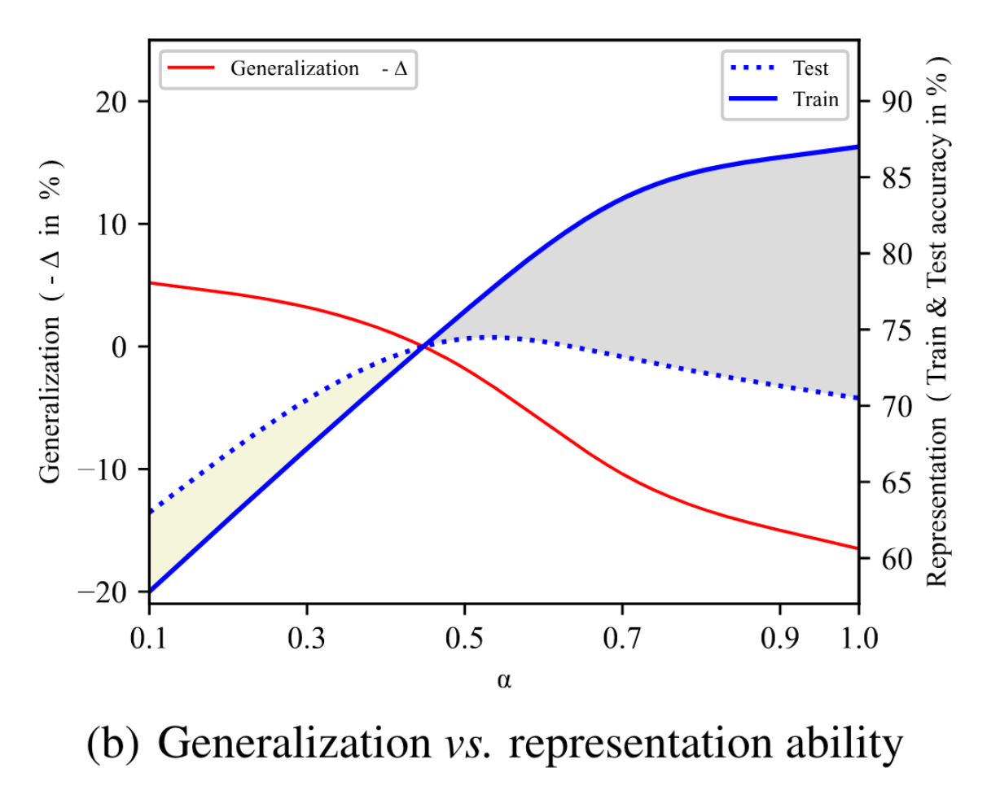

# DropCov: A Simple yet Effective Method for Improving  Deep Architectures

NeurIPS 2022

- Qilong Wang
- Mingze Gao
- Zhaolin Zhang1
- Jiangtao Xie
- Peihua Li
- Qinghua Hu

## What‘s going on here?
- 任务：在寻找一个更好的 representation
- 环境： 在使用 GCP 的 CNN 网络中

## Representation Decorrelation and Information Preservation

在将一张图片嵌入为一个模型可识别的 representation 的时候我们希望这个 representation 内部的相关性要底，如果其相关性较高，则说明representation 可能存在某种冗余的表达，那么就存在消除这种 co-adapation 的动机，但是在 decorrelation 的过程中也要对 information preservation做一个权衡。

举个例子，设想这样一种情形：$\mathbf{X} \in \mathbb{R}^{N\times d}$，其中 N 为每个 feature map 拉直之后的长度，d 为 feature map 的个数，在做 representation decorrelation 之前我们的 covariance representaion 将会是 $\mathbf{Z}=\mathbf{X}^T\mathbf{X}$。但是如果使用 matrix power normalization 的方法来去相关性，其 representation 将会是：
$$
\mathbf{Z}=\left(\mathbf{X}^T \mathbf{X}\right)^\alpha=\mathbf{U} \boldsymbol{\Lambda}^\alpha \mathbf{U}^T
$$
这里的 $\alpha$ 是 normalization 的超参数，其控制了 decorrelation 的程度。
$$
\left\{\begin{array}{l}
\mathbf{Z} \longmapsto \mathbf{I}, \quad \text { if } \quad \alpha \longmapsto 0 \quad: \text { Representation Decorrelation \& Information Loss, } \\
\mathbf{Z} \longmapsto \mathbf{X}^T \mathbf{X}, \quad \text { if } \alpha \longmapsto 1 \quad \text { : Information Preservation \& Strong Correlation. }
\end{array}\right.
$$
实验结果表明，当超参数 $\alpha$ 取 0.5 的时候将会达到最有的权衡点（训练集测试集的准确率一致程度最高）。

## DropCov
与上面的 matrix power normalization（MPN）方法一样，本文提出的 DropCov 也是从 strutural 的角度做 Representation Decorrelation 和 Information Preservation 的 trade-off。

同时 MPN 方法也面临严重的计算复杂度的问题，由于涉及到特征值分解，MPN 的计算复杂度为 $O(d^3)$ 而本文的 DropCov 方法的复杂度为 $O(d)$。

与 MPN 的alpha 类似，可以设定一个 dropout 的概率 $\rho$ ，当其趋近于 1 的时候，认为其更倾向于 representation decorrelation，当其趋近于 0 的时候，更倾向于 information preservation。当然，这里作者使用的肯定不是一个固定的概率，而是一个自适应的概率。这里作者权衡的是这两个指标：

- feature correlation: $\mathbf{\pi}=SUM_{row}(X^TX)$
- feature importance: $\omega=\sigma(C1D_3(GAP(X)))$

由此得到自适应概率：
$$
\rho=1-\frac{D}{log(d)}(\frac{\omega^T\pi}{||\omega||||\pi||})
$$

> [!NOTE]
>
> - $\sigma$：softmax
> - GAP：global average pooling

此处的 feature importance 向量实际就是 ECA 中的 channel attention。当特征重要性和特征相关性重度耦合时，很难选择扔掉哪个特征，所有需要谨慎drop，选择较小的dropout率。反之，可以适当选择较大的dropout率。

那么最终我们可以得到加入了 DropCov 模块后的 representation 为：
$$
\mathbf{z}=\mathbf{V}\left(\mathbf{Y}^T \mathbf{Y}\right), \mathbf{Y}=\delta_\rho(\mathbf{X})
$$
其中 $\delta_\rho$ 为 channel dropout operation。V 为拉直操作。需要提醒的是，与 Hinton（2014）的方法一样，这里 dropout 操作只会发生在训练过程。在 dropout 时仅将该通道值设置为0，并不改变特征维度。