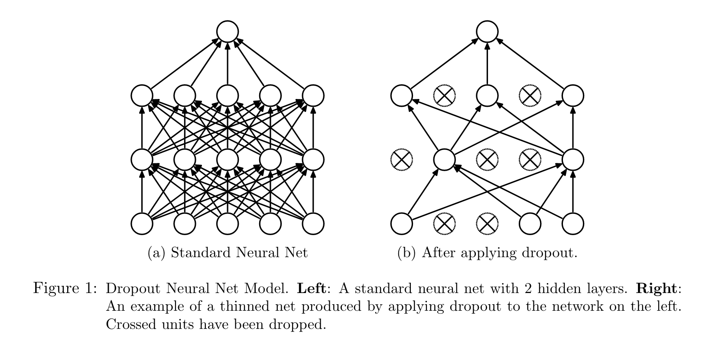
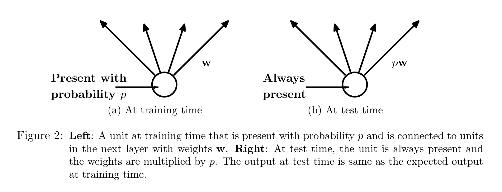
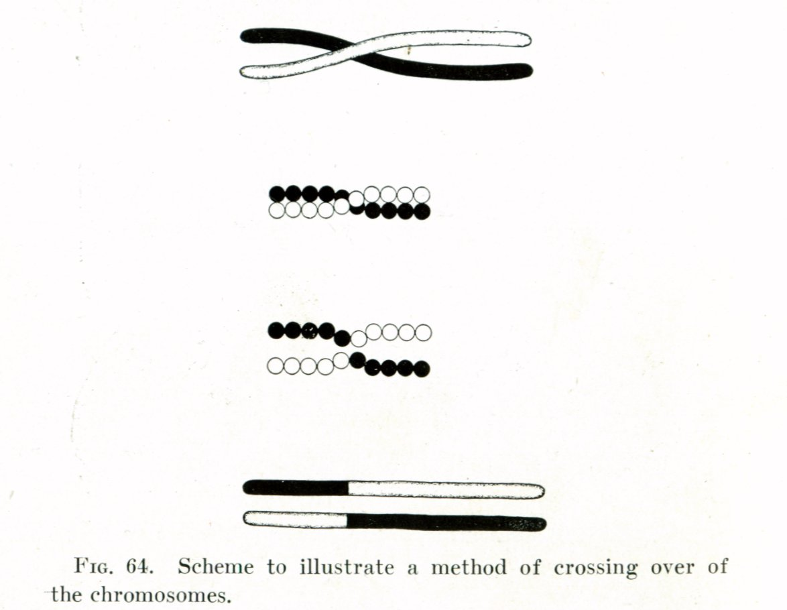

# Dropout: A Simple Way to Prevent Neural Networks from Overfitting

Journal of Machine Learning Research 15 (2014) 1929-1958

- Nitish Srivastava nitish@cs.toronto.edu 
- Geoffrey Hinton hinton@cs.toronto.edu 
- Alex Krizhevsky kriz@cs.toronto.edu 
- lya Sutskever ilya@cs.toronto.edu 
- Ruslan Salakhutdinov rsalakhu@cs.toronto.edu

## Introduction

含有大量参数的深度神经网络面临着严重的过拟合的问题。使用 dropout 方法将改善过拟合问题。

Dropout 方法的 idea 其实就是通过随机关闭一些神经元以及其对应的链接，得到一个更加“稀释”"thinned"的网络。

当进行 Dropout 操作时，会将与该神经元有关的所有的包括 incoming 和 outcoming 的链接全部关闭。如下图所示。
> [!NOTE]  
> 实际上 Yann LeCun 等人在 2013 年的文章 *Regularization of Neural Networks using DropConnect* 中提出了 DropConnect 方法，该方法的 drop 的对象为 connection

在实操上，随机关闭神经元这个操作实际上只发生在训练参数的过程中，在模型参数通过Dropout训练好之后，一个测试样本进来，Dropout 操作不会发生。

经过实验发现，分别以50%和20%的概率对隐藏层和输入层进行 dropout 操作将会使得模型表现达到一个 optimal 的水平。

## Motivation

这篇文章提出的 dropout 方法的一个动机来源于进化中的有性繁殖。无性繁殖对基因的保存更加稳定，但是现实确是有性繁殖的生物的适应性更好，并最终统治了地球。

从基因的角度来看，无性繁殖的生物的基因在繁殖的过程中受到的扰动处于一个很低的水平，

有性繁殖的生物在繁殖的过程中，基因会重新组合，那么这对基因片段在执行功能时的独立性就提出了更高的要求。设想这样一个场景：如果分辨食物这个功能必须同时依赖基因片段 A 和 基因片段 B 时，那么在有性繁殖时，下一代如果丢失了基因 B 那么这个个体将会失去分辨食物这个功能，而无性繁殖则不会面临基因重组的问题，因此其一个功能可以同时依赖很多个基因片段完成。

在进化这个巨大的训练过程中，基因之间 co-adpated 程度较低的有性繁殖生物表现出了更好的面对外部环境改变的适应能力或者说泛化能力。而有性繁殖的生物则表现地过拟合。

这篇文章在 hidden layer 找到的 optimal dropout rate 为 0.5 这与有性繁殖继承父母各一半的基因也存在某种耐人寻味的相似（intriguing similarity）。