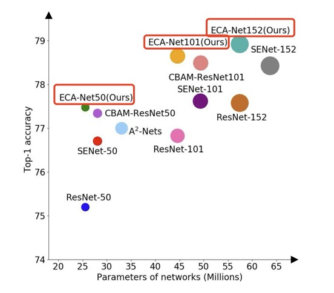
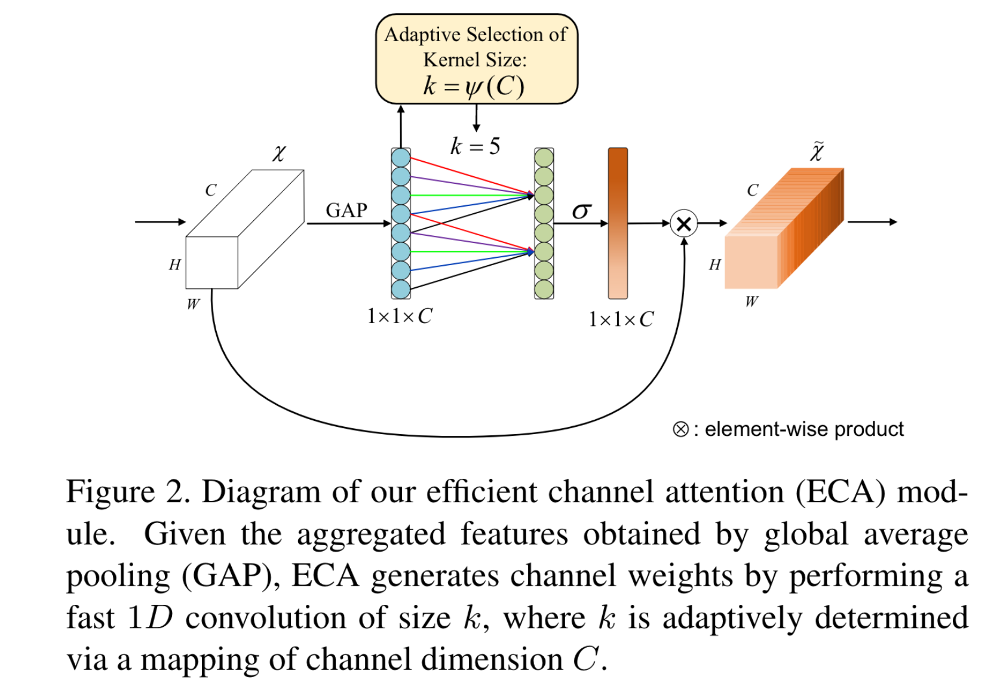
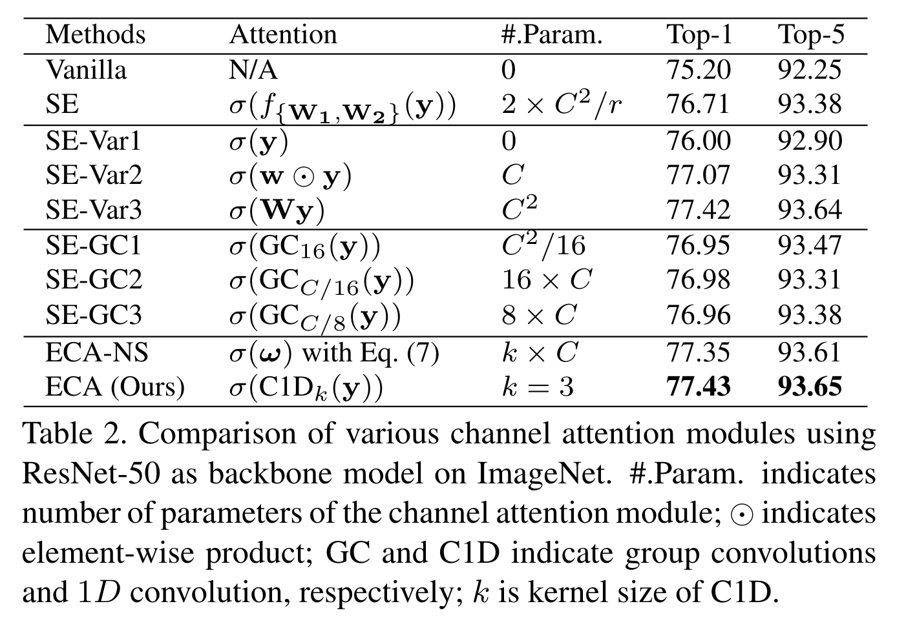

# ECA-Net: Efficient Channel Attention for Deep Convolutional Neural Networks

CVPR 2020

- Qilong Wang
- Banggu Wu
- Pengfei Zhu
- Peihua Li
- Wangmeng Zuo
- Qinghua Hu

## Introduction

在 Deep CNN 网络中，通道注意力权重机制（channel attention mechanism）已经被证明具有很大的应用潜力。但是现存的获得注意力的方法，本文提出的 ECA-net（efficient channel attention）在保证效果的前提下降低了训练的复杂度。与其它模型的比较如下图，横轴为网络参数量，纵轴为准确率。

ECA 模块的工作原理如下图：

ECA 模块的位置在卷积层之后，输入为 C 个 feature map，对每一个 feature map 做全局平均池化 GAP 得到一个长度为 C 的一维向量，在通过一个一维的卷积之后通过 softmax 激活成一个 attention 向量，再把这个 attention 的权值赋给不同 channel，赋予的方法就是将 attention 的值和对应的 feature map 中每一个元素做 element wise product。

- ECA 模块中的一维卷积核中的参数为网络训练的出来的
- 由于卷积本身的特性，其实 ECA 只考虑到了局部的 cross-channel interaction。
## Small Survey of Cross-channel Interaction

第一个引入 channel attention 的是 SE-Net（2018 CVPR），之后对于 attention 模块的工作主要可以分为两个方面：

- enhancement of feature aggregation：整合 feature 信息的方法，像 wql 的 ECA 就是用的 GAP 全局平均池化
- combination of channel and spatial attentions：对 channel attention 的挖掘方式，wql 的 ECA 用的是一维卷积

具体来看：

- CBAM：同时使用了 max 和 average 两种 pooling 方法去 aggregate features，同时使用了二维的卷积用于计算 spatial attention，spatial attention 指的是对于一个 feature map 上，不同空间位置的 attention
- GSoP：引入了一种二阶的（second-order）的 pooling 方法用于 feature aggregation
- GE：使用了 depth-wise convolution 去做 feature aggregation，这种卷积与常规的卷积区别在于 depth-wise convolution 对不同通道是分开来做卷积，然后重新拼在一起

## Comparison of SE Block and ECA

### SE block

SE 是 squeeze 和 excitation 的缩写，squeeze 代表的是对 feature map 信息的聚合（e.g. GAP），目的是得到每一个通道的全局表达，而 excitation 指的则是捕获通道与通道之间的关系（全链接层）。

具体来说，对于卷积层的输出 $\mathcal{X}\in \mathbb{R}^{H\times W \times C}$，SE block 通过如下方法计算权重：

$\mathbb{\omega}=\sigma(f_{\{\mathbf{W_1},\mathbf{W_2}\}}(g(\mathcal{X})))$

此处 $g(\mathcal{X})=\frac{1}{WH}\sum^{W,H}_{i=1,j=1}\mathcal{X}_{ij}$（全局平均池化），$\sigma$ 为 sigmoid 函数，

同时 $f_{\{\mathbf{W_1},\mathbf{W_2}\}}(y) = \mathbf{W_2}ReLU(\mathbf{W_1}y)$

在 SE block 的结构中，权重矩阵 $\mathbf{W_1},\mathbf{W_2}$ 的维度被分别设计为 $C\times \frac{C}{r}$ 和 $\frac{C}{r} \times C$，这里的 $r$​ 为超参数代表了降维的比例。

由于 SE block 有降维，所以其 channel 和 weight 之间的关系可能并不直接。同时，存在如下的观察（详细结果在 Table 2 中）：

- 对于没有参数的变种（直接把GAP得到的向量扔进 sigmoid 函数） SE-Var1，其表现还是比没有 SE block 的网络表现好
- 对于通道独立训练的变种 SE-Var2 来说（也就是说没有把通道特征混合到一起再分开这样训练），其表现仍然优于没有 SE block 的网络
- 对于只有一层全链接的变种 SE-Var3 来说，其表现比原始的两层有降维的 SE block 要好

