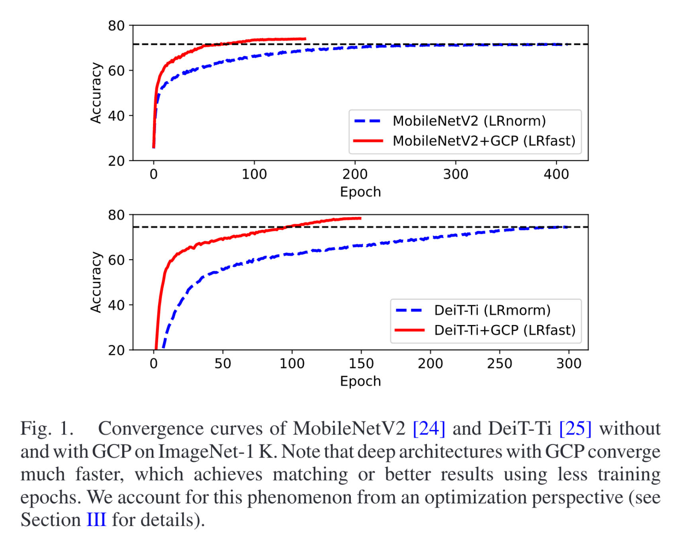
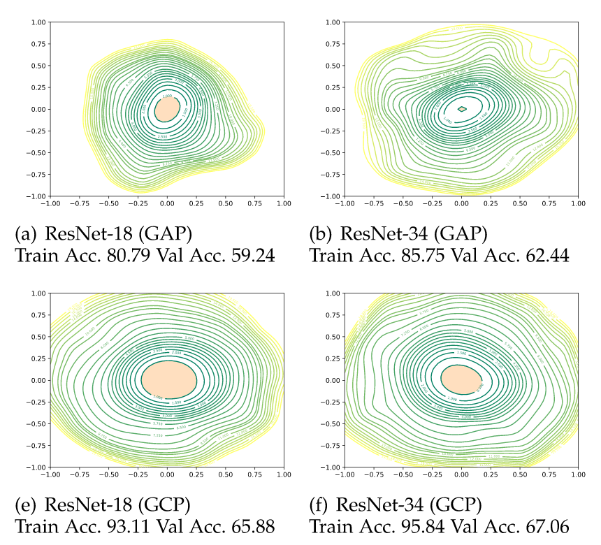

# Towards a Deeper Understanding of Global Covariance Pooling in Deep Learning: An Optimization Perspective

IEEE-PAMI 2023

Qilong Wang , Member, IEEE, Zhaolin Zhang , Mingze Gao , Jiangtao Xie , Pengfei Zhu , Member, IEEE, Peihua Li , Member, IEEE, Wangmeng Zuo , Senior Member, IEEE, and Qinghua Hu , Senior Member, IEEE

## Convolutional Neural Network
一般来说，CNN是这样处理一张图片的：

1. 用filter扫一遍图片，得到相应的feature map
2. 使用池化层（pooling），将feature map进行降维
3. 对经过池化层后得到的矩阵进行flatten处理，也就是将一个 $h\times w$ 的矩阵变成一个 $[h\times w, 1]$的向量，然后将这个向量输入进一个全链接的神经网络，最后输出一个长度为class的个数的向量，用于判断这个张图片改分到哪一个class里

那么在 CNN 训练的网络中训练的参数实际上主要包括两部分，一部分是卷积核的参数，另一部分则是分类层中的参数，其通常为全链接的神经网络。

### 池化层
一般来说，这里的池化层并不会是一个需要训练的参数（parameter），而是一个固定的operator，经常见的有：

- max pooling：使用该区域的最大值作为该区域的特征
- average pooling：使用该区域的平均值作为该区域特征
- 其他

## 全局协方差池化 Global Covariance Pooling
Remember 我们之前提到，池化的目的是为了降维，这个池化之前的两个定语的含义将是什么呢？
- 全局：使用了所有 feature map 之间的关系，并是没有只考虑一部分特征图之间的局部关系
- 协方差：使用协方差矩阵描述所有 feature map 之间的关系

设想这样一种情形：有64个filter，那么这64个filter扫过一遍之后会有64个256*256的 feature map。

**传统池化：** 在单个的feature map上比如进行max处理 将其压缩成16*16的矩阵

**全局协方差池化：** 将这个64个矩阵拉直后计算协方差矩阵，得到64*64的协方差矩阵，然后将其flatten也就是拉直。拉直以后可以直接输入进最后的全链接神经网络中，也可以接入原来传统池化后 $[64 \times16\times 16, 1]$ 的向量中再输入进用于分类的全链接神经网络。

## Why GCP？

### Faster Convergence

在使用相同的backbone网络时，使用GCP模块生成的image representation会使得模型训练收敛的速度加快。

### Stronger Model Robustness

如何验证 GCP 网络的鲁棒性，作者主要从 loss landscape 的视角给出了解释。

设想一个这样的情形：我们现在有个 well-trained model，它的参数是 $\theta$，我们现在为其添加两个扰动，观察其 loss function 的变化，设扰动向量分别为 $\delta$ 与 $\eta$，其采样自高斯分布。

$$
f(\alpha, \beta)=\mathcal{L}(\boldsymbol{\theta}+\alpha \cdot \boldsymbol{\delta}+\beta \cdot \boldsymbol{\eta})
$$

