# Shrinking the cross-section 实证部分

 **Journal:**

Journal of Financial Economics (2020.2)

 **Authors:**

* Serhiy Kozak:

  University of Maryland, 7621 Mowatt Lane, College Park, MD 20742, United States

* Stefan Nagel:
  
  University of Chicago, NBER, and CEPR, 5807 S Woodlawn Ave, Chicago, IL 60637, United States

* Shrihari Santosh:
  
  University of Colorado at Boulder, 995 Regent Dr, Boulder, CO 80309, United States

[理论部分详解1](https://leetah666.github.io/Notes/#/papers/shrinking_the_cross-section) $\qquad$ [理论部分详解2](https://hbs2000.github.io/Gpaper/#/factor_zoo/Shrinkage)

## 4. Empirical analysis

### 4.1 Preliminary analysis: Fama-French ME/BM portfolios

日频数据，1926年7月 - 2017年12月

做法：

1. ME/BM 双重排序 $5\times5$

$$
F_{i,t}=\tilde{F}_{i,t}-\beta_i R_{m,t}
$$

$\qquad \tilde{F}_{i,t}$：组合原收益率

$\qquad \beta_i$：全样本数据回归得到

2. 测试这25个资产的 SDF loading

这一步骤相当于先在低维的情况下验证模型的可行性、合理性，然后再将模型应用于高维

期望的结果：25个组合收益(相对于市场指数收益正交化)接近于SMB和HML因子的线性组合

Kozak(2018)的研究表明：SMB 和 HML 因子本质上匹配FF25(市场中性)投资组合回报的第一个和第二个principal component。因此，当我们使用 FF25 投资组合收益的 pc 作为基础资产进行分析时，我们应该会发现更稀疏的情况: 至多两个 pc 就足以很好地描述 SDF

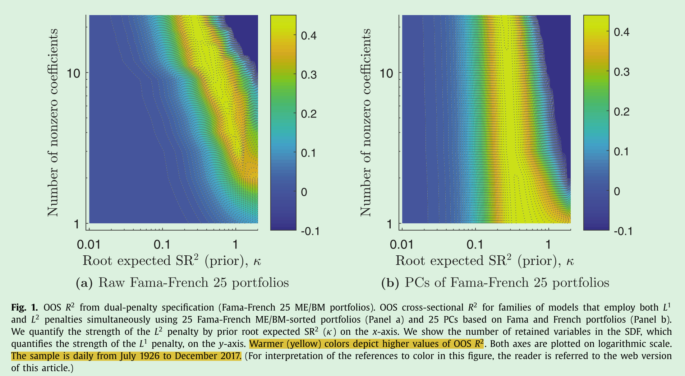

横轴代表 $L^2$ -shrinkage 的程度，由于 $\gamma=\dfrac{\tau}{\kappa^2T}$，所以 <strong>$\kappa$ 越大，代表收缩程度越小</strong>

竖轴代表 $L^1$ -shrinkage 的程度，数值越小，代表稀疏性压缩越大(下文的图的横纵坐标与此处含义相同)

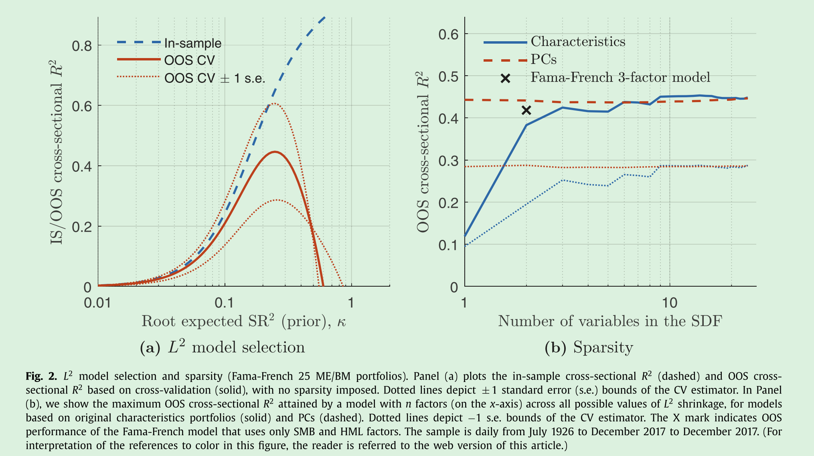

### 4.2 Large sets of characteristics portfolios

作者构建了两个独立的特征集

* 第一个特征集聚焦于文献中常见的“异象”，汇编了50个特征
  * 日频数据，1973年11月 - 2017年12月 

* 第二个特征集基于70个财务比率，这70个特征可以分为七类：capitalization, efficiency, financial soundness/solvency, liquidity, profitability, valuation, and others
  * 日频数据，1964年9月 - 2017年12月
  * 这70个特征里，有两个由于时间序列很短被去除
  * 作者又根据 t-1 至 t-12 个月的过去月度回报排序，补充了12个特征，最后共有80个特征

作者对特征进行了某些标准化处理，以定义基于特征的因素

1. 首先，对每个特征进行 rank transformation

$$
rc^{i}_{s,t}=\dfrac{\text{rank}\big(c^{i}_{s,t}\big)}{n_{t}+1}
$$

* $c^{i}_{s,t}$: t时刻，股票 s 的第 i 个特征

* $\text{rank}\big(c^{i}_{s,t}\big)$: 截面上排序

* $n_t$: 在 t 时刻具有这个特征的股票数量

$\qquad \dfrac{1}{n_t + 1},\dfrac{2}{n_t + 1},\cdots,\dfrac{n_t}{n_t + 1}$

$\qquad$ 平均值 $\bar{rc}^i_t$：$\dfrac{1}{n_t}\sum_{s=1}^{n_t}rc^i_{s,t} = \dfrac{n_t(n_t + 1)/2}{n_t + 1}\times \dfrac{1}{n_t} = \dfrac{1}{2}$

$\qquad \dfrac{n_i}{n_t + 1} - \dfrac{1}{2} \in (-0.5,0.5)$

2. 接下来，对每个排序后的特征进行标准化：

$$
z^i_{s,t}=\dfrac{\left(rc^i_{s,t}-\bar{rc}^i_t\right)}{\sum_{s=1}^{n_t}\left|rc^i_{s,t}-\bar{rc}^i_t\right|}
$$

这样做法的好处：

* 构造了关于转换特征 $z^i_{s,t}$ 的零投资多空组合
* 这个投资组合对异常值反应不敏感

3. 最后，将所有转换特征 $z^i_{s,t}$ 组成一个矩阵 $Z_t$，构造因子：$F_t=Z'_{t-1}R_t$

**为了确保结果不是由非常小的流动性不足的股票驱动，作者排除了每个时间点市值低于股票总市值0.01% 的小盘股**

#### 4.2.1 Fifty anomaly characteristics

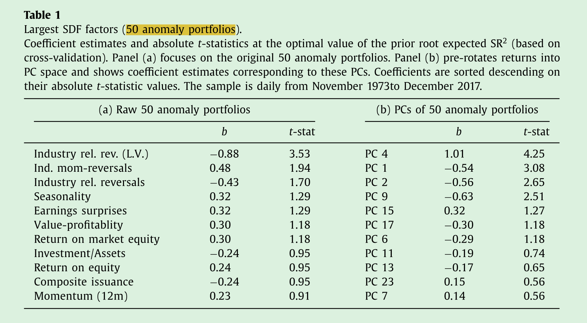

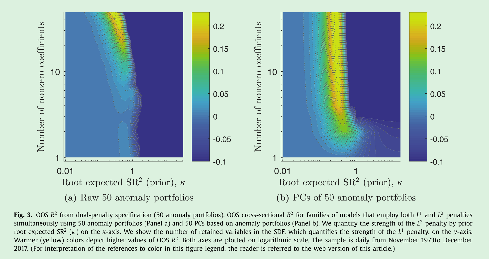

panel (a):

为了获得最大的 OOS $R^2$，数据需要较大的 $L^2$ 收缩，但基本上不存在稀疏性，这表明在这50个异象中几乎没有冗余，characteristics-sparse SDF 不存在

panel (b):

情况相反，4个主成分特征便能有较好的 OOS $R^2$，10个主成分特征能达到最大的 OOS $R^2$，因此 PC-sparse SDF 能够对异象数据很好地定价

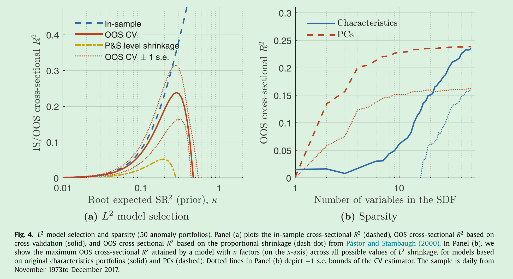

$k\approx0.30$ 时，OOS $R^2$ 达到最大

本文对 $\mu$ 的先验参数是 $\eta = 2$，本部分对比了 $\eta = 1$ 的情况，即 (a) 中的 P&S level shrinkage (Pástor and Stambaugh.2000)

#### 4.2.2 WRDS financial ratios (WFR)

第一组资产回报并没有使该方法面临从高维数据中识别新的定价因子的挑战

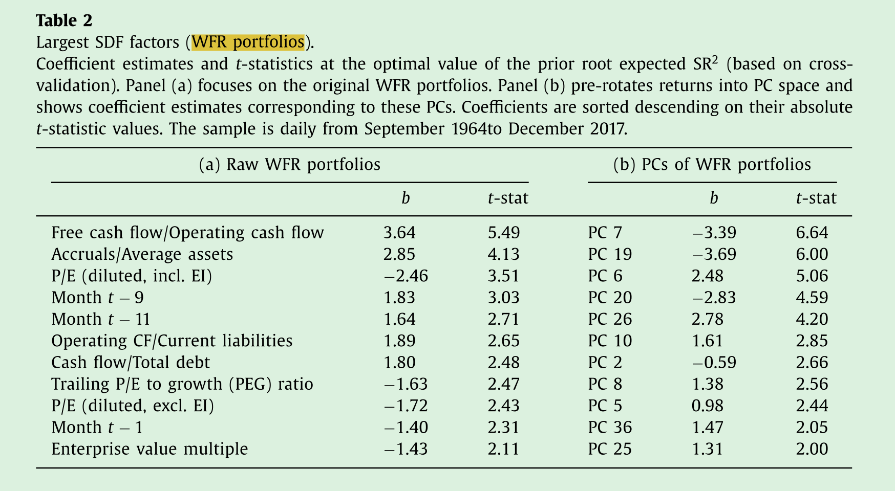

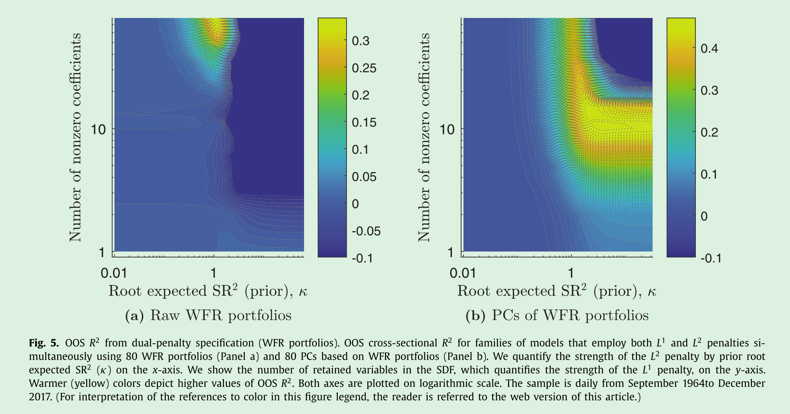

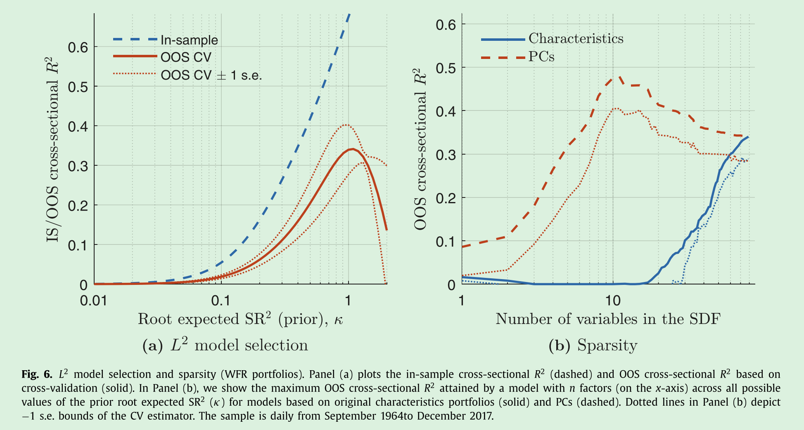

$k\approx1$ 时，OOS $R^2$ 达到最大

这部分实证表明，本文的方法可以很好地解决将与定价相关的因子和与定价无关的因子混合在一起的数据集

### 4.3 Interactions

为了应对统计上的挑战，作者选择了高维度的数据集：在原有的两组数据集基础上补充了基于特征的二次幂、三次幂和线性一阶交互项

例如对于50个特征来说，在这种设定下，特征的数量变为：$\dfrac{1}{2}n(n-1) + 3n = 1375$ 个

构造非线性的交互项：

$$
z_{s,t}^{ij}=\dfrac{\left(z_{s,t}^{i}z_{s,t}^{j}-\frac{1}{n_t}\sum_{s=1}^{n_t}z_{s,t}^{i}z_{s,t}^{j}\right)}{\sum_{S=1}^{n_t}\left|z_{s,t}^{i}z_{s,t}^{j}-\frac{1}{n_t}\sum_{s=1}^{n_t}z_{s,t}^{i}z_{s,t}^{j}\right|}
$$

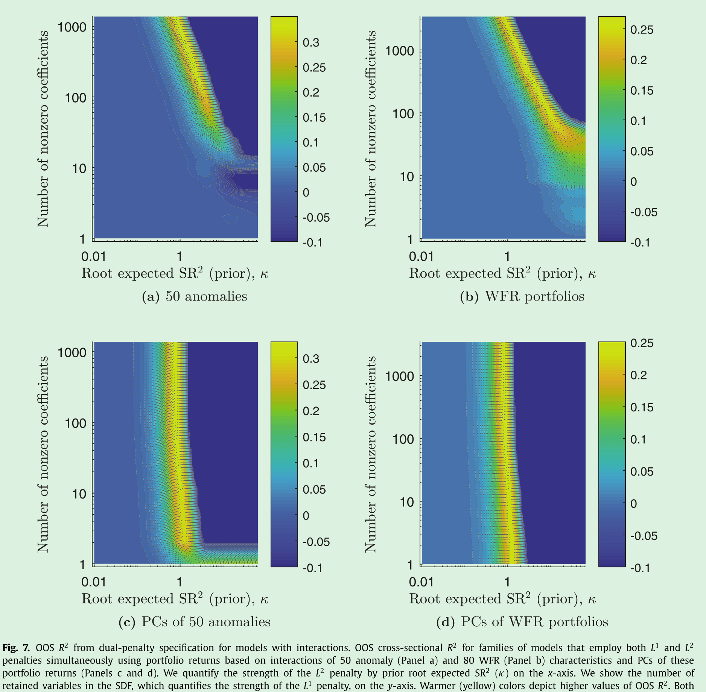

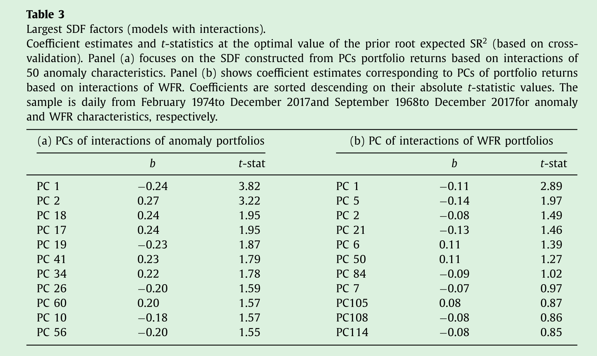

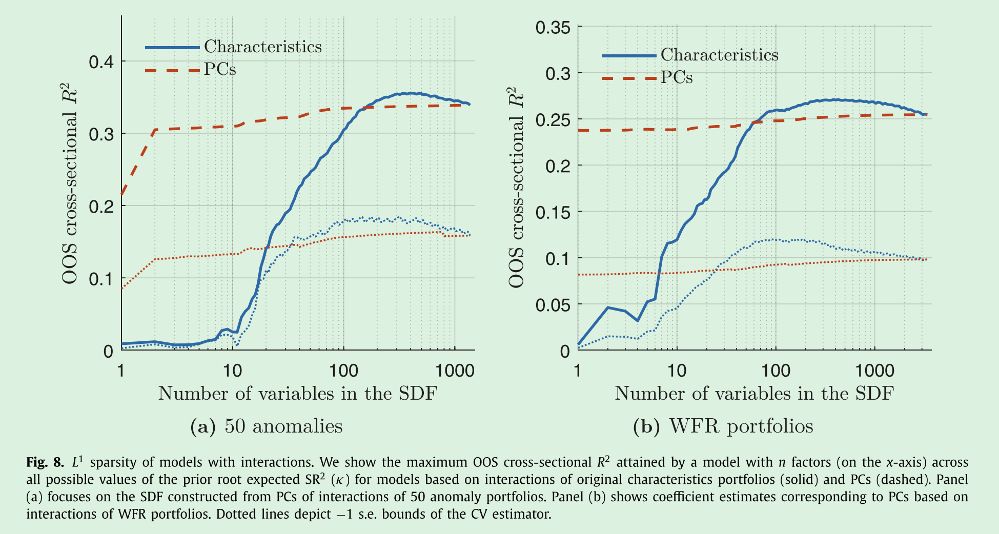

## 5. Asset pricing tests: performance compared with sparse models

前面部分使用了交叉验证方法，即选择一部分数据来估计SDF，然后将估计出的SDF放入另一部分数据进行样本外测试。这种方法的局限性在于：没有使用所有数据来估计SDF，$L^1$ 和 $L^2$ 正则项都应当基于全部数据得出

为了解决这一问题，本部分使用2004年末之前的数据作为测试集，2004年之后的数据作为验证集，以进行纯样本外测试

根据2004年年末之前的数据估计出 $\hat{b}$，然后在2005-2017构造时间序列的 有效前沿组合：$P_t=\widehat{b}'F_t$，将这些组合的收益率回归到不同的模型上，以评估不同的模型 (评估每个模型的截距项 $\alpha$ 的大小，$\alpha$ 越小越好)

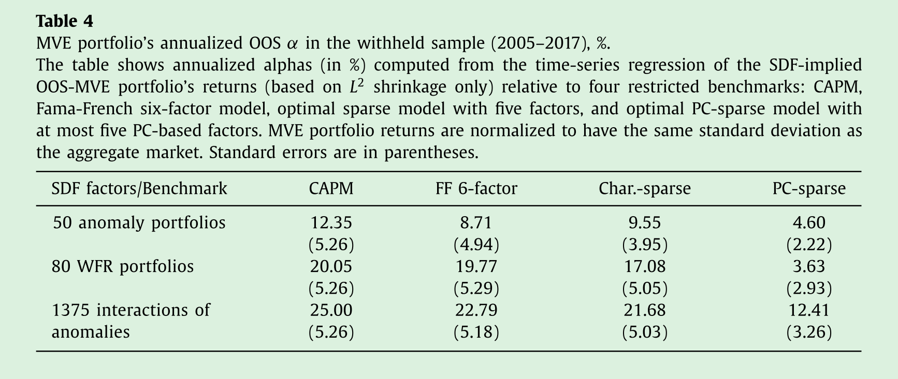

## 6. Replication

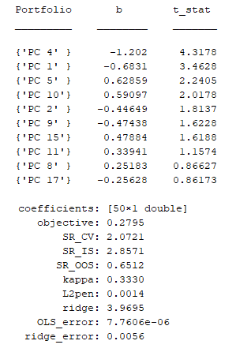

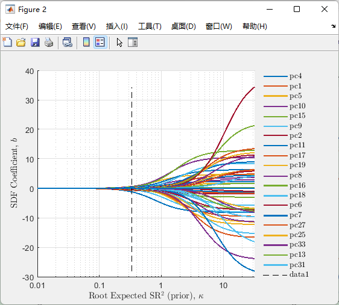

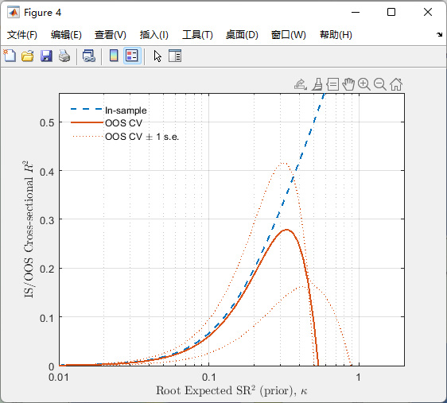

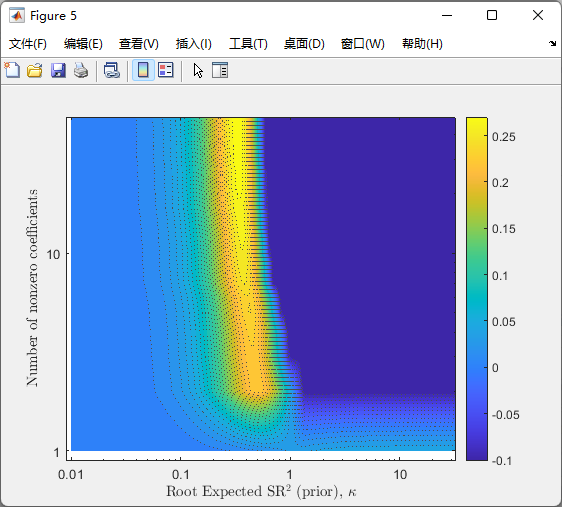