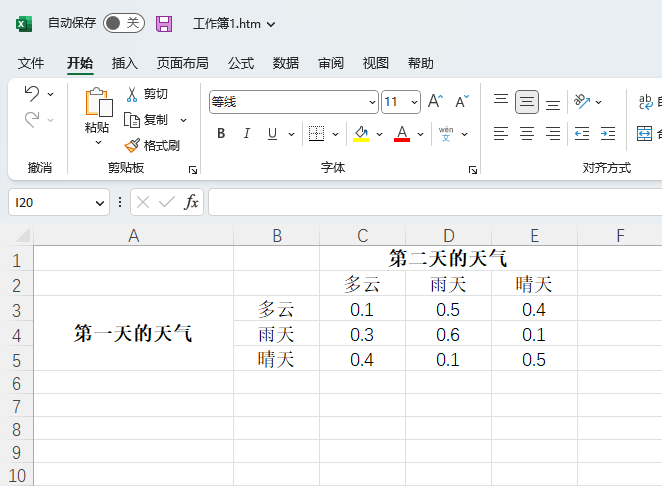
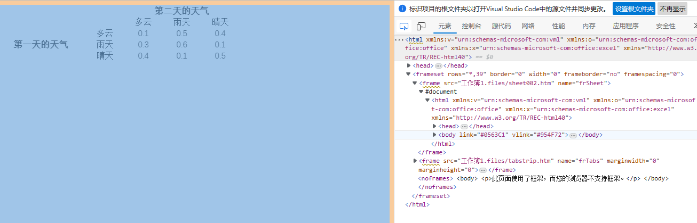
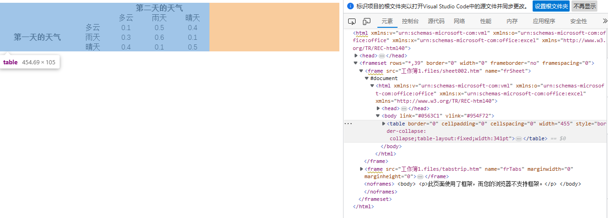
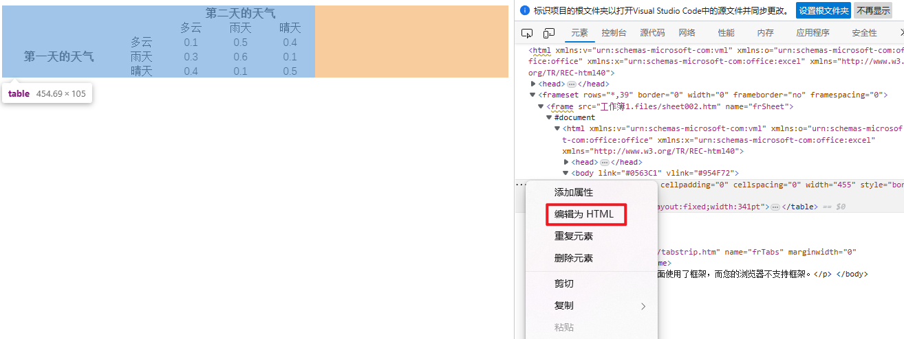
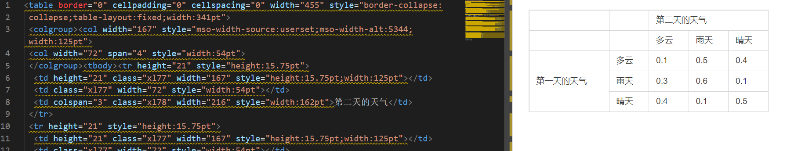

# 如何用excel写Markdown表格

### 第一步，将表格内容先写入Excel中：

### 第二步，另存为html格式 (wps、office都支持)，生成一个文件夹和一个htm文件：

### 第三步，双击用浏览器打开工作簿1.htm这个文件，并按F12调出开发者工具：

### 第四步，点击上图中标红的按钮，并将鼠标放在左边表格上，这时右边会显示对应的元素：

### 第五步，点击展开右侧元素中的\<body>，选中\<table>：

### 第六步，点击\<table>靠左的三个点，选择“编辑为HTML”，全选所有内容，复制到Markdown文件中，图表就生成了：

